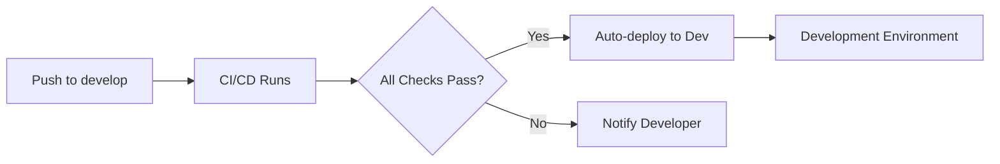
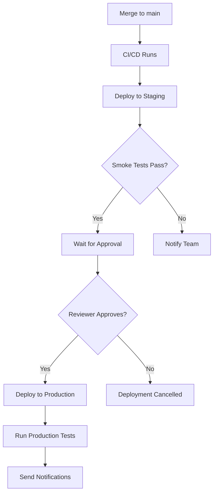

# CI/CD Automation - Implementation Complete ✅

## Summary

Comprehensive CI/CD automation has been implemented for the Legal Form Application, including workflows for Node.js, Python pipeline, documentation, and monitoring stack deployment.

## What Was Implemented

### 1. Main CI/CD Pipeline (`.github/workflows/ci-cd-main.yml`)

**7 automated stages**:
- ✅ Code Quality & Linting
- ✅ Automated Testing (Playwright E2E)
- ✅ Security Scanning (npm audit, Trivy, secret detection)
- ✅ Multi-environment Builds (dev, staging, prod)
- ✅ Development Auto-deployment
- ✅ Staging Auto-deployment
- ✅ Production Deployment (manual approval required)

**Key Features**:
- Parallel test execution with PostgreSQL
- Docker image scanning
- Build artifacts for all environments
- Environment-specific configurations

### 2. Python Pipeline CI/CD (`.github/workflows/python-pipeline-ci.yml`)

**4 automated stages**:
- ✅ Python code quality (Black, Flake8, mypy)
- ✅ Python testing with pytest
- ✅ Docker image building
- ✅ Cloud Run deployment

**Key Features**:
- FastAPI normalization pipeline
- Coverage reports
- Independent deployment from Node.js service

### 3. Enhanced Documentation Deployment (`.github/workflows/deploy-docs.yml`)

**Enhanced with**:
- ✅ Documentation structure validation
- ✅ JSDoc API documentation generation
- ✅ Mermaid diagram validation
- ✅ Build report generation
- ✅ Auto-deployment to GitHub Pages

**Triggers on**:
- Documentation changes (`docs/`)
- Code changes (`server.js`, `api/`, `*.js`)
- Package updates

### 4. Monitoring Stack Deployment (`.github/workflows/deploy-monitoring.yml`)

**3 automated stages**:
- ✅ Configuration validation (Prometheus, Docker Compose)
- ✅ VM deployment via SSH
- ✅ Health check validation

**Deploys**:
- Prometheus metrics collector
- NGINX exporter
- Docker Compose stack

### 5. Automated Dependency Updates (`renovate.json`)

**Renovate Bot Configuration**:
- ✅ Auto-merge devDependencies
- ✅ Auto-merge TypeScript types
- ✅ Auto-merge patch updates
- ✅ Security vulnerability auto-merge
- ✅ Grouped package updates (ESLint, Playwright, VitePress)
- ✅ Manual review for major updates

**Schedule**:
- Weekday nights (10pm-5am EST)
- Weekends
- Security updates: anytime

## Architecture

```
┌─────────────────────────────────────────────────────────┐
│                     Git Push Event                      │
└────────────────┬────────────────────────────────────────┘
                 │
     ┌───────────┼───────────┬──────────────┬─────────────┐
     │           │           │              │             │
     ▼           ▼           ▼              ▼             ▼
┌─────────┐ ┌─────────┐ ┌───────────┐ ┌──────────┐ ┌──────────┐
│Node.js  │ │Python   │ │Documentation│ │Monitoring│ │Renovate  │
│CI/CD    │ │CI/CD    │ │Build      │ │Deploy    │ │Updates   │
└────┬────┘ └────┬────┘ └─────┬─────┘ └────┬─────┘ └────┬─────┘
     │           │            │            │            │
     ▼           ▼            ▼            ▼            ▼
┌─────────┐ ┌─────────┐ ┌───────────┐ ┌──────────┐ ┌──────────┐
│Cloud Run│ │Cloud Run│ │GitHub     │ │GCP VM    │ │Auto PR   │
│3 Envs   │ │Pipeline │ │Pages      │ │Prometheus│ │Creation  │
└─────────┘ └─────────┘ └───────────┘ └──────────┘ └──────────┘
```

## Directory Structure

```
.github/workflows/
├── ci-cd-main.yml              # Main Node.js CI/CD pipeline
├── python-pipeline-ci.yml      # Python FastAPI pipeline
├── deploy-docs.yml             # VitePress documentation (enhanced)
└── deploy-monitoring.yml       # Monitoring stack deployment

renovate.json                   # Dependency update automation

docs/operations/
└── CI_CD_WORKFLOWS.md         # Comprehensive workflow documentation
```

## Quick Start

### View Workflows

1. Go to **Actions** tab in GitHub
2. See all workflow runs and statuses
3. Click on any run to see detailed logs

### Manual Deployment

```bash
# Deploy to development
git push origin develop

# Deploy to staging
git push origin main

# Deploy to production
1. Push to main (or merge PR)
2. Go to Actions → CI/CD Pipeline
3. Wait for staging deployment
4. Review and approve production deployment
```

### Testing Locally

```bash
# Install act (GitHub Actions local runner)
brew install act  # macOS

# Run workflows locally
act push                    # Simulate push event
act -j quality             # Run quality checks job
act -j test                # Run tests job
```

## Workflow Triggers

| Workflow | Automatic Trigger | Manual |
|----------|------------------|--------|
| Main CI/CD | Push to `main`/`develop`, PRs | ✅ |
| Python CI/CD | Changes in `api/` or `normalization work/` | ✅ |
| Documentation | Changes in `docs/`, code files | ✅ |
| Monitoring | Changes in `monitoring/` | ✅ |
| Renovate | Schedule (nights/weekends) | ❌ |

## Required Setup

### GitHub Secrets

Add these in **Settings → Secrets and variables → Actions**:

```bash
GCP_SA_KEY          # Required: Google Cloud service account JSON
SLACK_WEBHOOK_URL   # Optional: For deployment notifications
```

### Repository Settings

1. **Actions permissions**:
   - Settings → Actions → General
   - ✅ Read and write permissions
   - ✅ Allow creating and approving PRs

2. **GitHub Pages**:
   - Settings → Pages
   - Source: GitHub Actions

3. **Environment Protection**:
   - Settings → Environments → production
   - ✅ Required reviewers
   - Add team members who can approve production deployments

## Key Features

### 🔒 Security

- Automated vulnerability scanning (npm audit)
- Docker image security scanning (Trivy)
- Secret detection in code
- SARIF upload to GitHub Security tab

### 🧪 Testing

- Playwright E2E tests
- Python pytest with coverage
- PostgreSQL integration tests
- Smoke tests after deployment

### 📊 Monitoring

- Build status badges
- Test result artifacts
- Coverage reports
- Deployment notifications

### 🚀 Deployment

- Multi-environment support (dev, staging, prod)
- Zero-downtime deployments
- Automatic rollback capability
- Manual approval for production

### 📚 Documentation

- VitePress interactive docs
- Auto-generated API docs
- Mermaid diagram support
- Search functionality

## Deployment Flow

### Development



### Production



## Integration with VitePress

The documentation deployment workflow integrates seamlessly with your VitePress setup:

### Features

- ✅ Builds from `docs/.vitepress/config.mjs`
- ✅ Outputs to `dist/docs`
- ✅ Clean URLs enabled
- ✅ Full search functionality
- ✅ Mermaid diagrams rendered
- ✅ Last updated timestamps
- ✅ Navigation breadcrumbs
- ✅ Dark mode support

### Access Documentation

After first deployment:
```
https://your-username.github.io/legal-form-app/
```

## Monitoring & Observability

### Workflow Status

- **Real-time**: GitHub Actions tab
- **Commit status**: Badges on commits/PRs
- **Email**: GitHub notifications (configurable)

### Build Artifacts

Uploaded after each run:
- Test results and reports
- Coverage reports
- Build artifacts
- Docker images (GCR)

### Metrics

Track these metrics in Actions:
- Build duration
- Test pass rate
- Deployment frequency
- Failed deployment rate

## Best Practices

### Commit Messages

Use conventional commits for automated workflows:

```bash
feat: add new feature       # Triggers full CI/CD
fix: bug fix               # Triggers full CI/CD
docs: update docs          # Triggers documentation only
chore: update deps         # Minimal CI/CD
test: add tests           # Triggers testing
ci: update workflows      # No deployment
```

### Branch Strategy

```
main (production)
  ├── develop (staging)
  │   ├── feature/new-feature
  │   ├── bugfix/fix-issue
  │   └── hotfix/urgent-fix
  └── release/v1.2.0
```

### Pull Request Checklist

Before merging PR:
- ✅ All CI checks pass
- ✅ Tests pass
- ✅ Code reviewed
- ✅ Documentation updated
- ✅ No security vulnerabilities
- ✅ Build succeeds

## Troubleshooting

### Workflow Fails

1. **Check logs**: Actions → Failed run → Job → Step logs
2. **Common issues**:
   - Missing secrets
   - Syntax errors in YAML
   - Failed tests
   - Docker build failures
   - GCP authentication issues

### Tests Fail

```bash
# Run tests locally:
npm test

# Debug mode:
npm run test:debug

# Check specific test:
npx playwright test tests/your-test.spec.js
```

### Deployment Fails

```bash
# Check GCP authentication:
gcloud auth list

# Manual deployment:
gcloud run deploy node-server \
  --image=gcr.io/docmosis-tornado/node-server:latest \
  --region=us-central1
```

## Next Steps

### Recommended Enhancements

1. **Add Slack/Email Notifications**:
   - Set up webhook URLs
   - Configure in workflow files

2. **Enable Renovate Bot**:
   - Install from GitHub Marketplace
   - Auto-merge strategy configured

3. **Set Up Monitoring**:
   - Deploy monitoring stack to VM
   - Configure alerts

4. **Environment Protection Rules**:
   - Add required reviewers for production
   - Configure deployment windows

5. **Performance Testing**:
   - Add load testing workflow
   - Lighthouse CI for performance budgets

## Documentation

**Comprehensive Guide**: [`docs/operations/CI_CD_WORKFLOWS.md`](docs/operations/CI_CD_WORKFLOWS.md)

Includes:
- Detailed workflow explanations
- Setup instructions
- Troubleshooting guide
- Manual deployment procedures
- Best practices

## Support

### Getting Help

- **Workflow Documentation**: [CI_CD_WORKFLOWS.md](docs/operations/CI_CD_WORKFLOWS.md)
- **GitHub Actions Docs**: https://docs.github.com/en/actions
- **VitePress Docs**: https://vitepress.dev/

### Common Commands

```bash
# View workflow runs
gh run list

# View specific workflow
gh run view <run-id>

# Download artifacts
gh run download <run-id>

# Re-run failed workflow
gh run rerun <run-id>
```

## Summary

✅ **4 comprehensive workflows** implemented
✅ **Automated dependency updates** configured
✅ **Multi-environment deployments** (dev, staging, prod)
✅ **Security scanning** integrated
✅ **Documentation automation** with VitePress
✅ **Monitoring deployment** automated
✅ **Comprehensive documentation** created

The CI/CD automation is production-ready and follows industry best practices for cloud-native applications.

---

**Implementation Date**: October 23, 2025
**Status**: ✅ Complete
**Documentation**: Integrated with VitePress
