# Legal Form Application - Architecture Documentation

## Table of Contents
- [System Overview](#system-overview)
- [Architecture Diagrams](#architecture-diagrams)
- [Component Details](#component-details)
- [Data Flow](#data-flow)
- [Technology Stack](#technology-stack)
- [Scalability & Performance](#scalability--performance)

## System Overview

The Legal Form Application is a full-stack web application that collects, processes, and stores legal form submissions with a comprehensive data transformation pipeline. The system features dual storage (JSON files + PostgreSQL), optional cloud backup, and automated data normalization.

### Key Features
- 🎯 Dynamic multi-party form (plaintiffs/defendants)
- 📊 19 comprehensive issue tracking categories
- 💾 Dual storage: JSON files + PostgreSQL database
- ☁️ Optional Dropbox cloud backup
- 🔄 Python normalization pipeline integration
- 📈 Prometheus metrics & monitoring
- 🔒 Token-based authentication (production)
- 🚀 Real-time Server-Sent Events (SSE) for progress tracking

## Architecture Diagrams

### System Architecture


### Data Flow - Form Submission


### Component Interaction - Frontend


### Database Schema


## Component Details

### 1. Frontend Components

#### **index.html** - Main Form Interface
- Dynamic form with repeatable sections (plaintiffs/defendants)
- 19 comprehensive issue tracking categories
- Accordion-based UI for better organization
- Real-time validation and "At a Glance" summary
- Responsive design for mobile/desktop

#### **form-submission.js** - Form Controller
```javascript
/**
 * Core Responsibilities:
 * - Form validation and submission
 * - Data transformation to JSON format
 * - API communication
 * - Error handling
 * - Success/failure navigation
 */
```

#### **party-management.js** - Dynamic Party Management
```javascript
/**
 * Core Responsibilities:
 * - Add/remove plaintiff sections dynamically
 * - Add/remove defendant sections dynamically
 * - Unique ID generation for parties
 * - Party numbering and reindexing
 */
```

#### **sse-client.js** - Server-Sent Events
```javascript
/**
 * Core Responsibilities:
 * - Establish SSE connection to server
 * - Receive real-time pipeline updates
 * - Handle connection errors and reconnection
 * - Emit events to toast notifications
 */
```

#### **toast-notifications.js** - User Feedback
```javascript
/**
 * Core Responsibilities:
 * - Display success/error/info messages
 * - Auto-dismiss notifications
 * - Stacking multiple notifications
 * - Accessibility features
 */
```

#### **progress-state.js** - State Management
```javascript
/**
 * Core Responsibilities:
 * - Track form completion state
 * - Manage party counts
 * - Update "At a Glance" summary
 * - Persist state to sessionStorage
 */
```

### 2. Backend Components

#### **server.js** - Express Application
```javascript
/**
 * Main Server Features:
 * - Express web server (port 3000)
 * - CORS configuration
 * - Authentication middleware
 * - Request logging (Morgan + Winston)
 * - Compression middleware
 * - PostgreSQL connection pooling
 * - Dropbox integration
 * - Pipeline integration
 * - Health checks & metrics
 */
```

**Key Middleware Stack:**
1. CORS - Cross-origin resource sharing
2. Authentication - Token validation (production)
3. Compression - Gzip compression
4. Morgan - HTTP request logging
5. Metrics - Prometheus metrics collection
6. Body Parser - JSON request parsing

#### **monitoring/logger.js** - Structured Logging
```javascript
/**
 * Winston Logger Configuration:
 * - Daily rotating log files
 * - Console output with colors
 * - JSON format for structured logging
 * - Log levels: error, warn, info, debug
 * - Separate error log file
 */
```

#### **monitoring/metrics.js** - Prometheus Metrics
```javascript
/**
 * Tracked Metrics:
 * - HTTP request duration histogram
 * - HTTP request counter
 * - Database connection pool stats
 * - Active requests gauge
 * - Custom business metrics
 */
```

#### **monitoring/health-checks.js** - Health Monitoring
```javascript
/**
 * Health Check Types:
 * - Liveness: Is the app running?
 * - Readiness: Can it serve requests?
 * - Detailed: Full dependency status
 *
 * Checked Dependencies:
 * - PostgreSQL database
 * - File system (data/ directory)
 * - Dropbox API (if enabled)
 * - Pipeline API (if enabled)
 */
```

#### **dropbox-service.js** - Cloud Backup
```javascript
/**
 * Dropbox Integration:
 * - Upload JSON files to Dropbox
 * - Preserve folder structure
 * - Error handling and retry logic
 * - Optional/configurable via env vars
 */
```

### 3. Python Normalization Pipeline

#### **api/main.py** - FastAPI Application
```python
"""
FastAPI Server Features:
- Port 8000
- RESTful endpoints
- Form submission ingestion
- ETL processing coordination
- Health checks
- CORS configuration
"""
```

#### **api/etl_service.py** - ETL Processing
```python
"""
5-Phase Normalization Pipeline:
1. Case extraction & validation
2. Party normalization
3. Issue taxonomy mapping
4. Data quality checks
5. Database persistence

All operations wrapped in transactions for atomicity.
"""
```

#### **api/json_builder.py** - Output Generation
```python
"""
Responsibilities:
- Query normalized database data
- Reconstruct JSON in original format
- Apply formatting rules
- Generate compliant output
"""
```

### 4. Database Layer

#### **PostgreSQL Database: legal_forms_db**

**Tables:**
- `cases` - Form submission metadata
- `parties` - Plaintiffs and defendants
- `party_issue_selections` - Selected issues per party
- `issue_categories` - Master issue categories
- `issue_options` - Available issue options

**Key Indexes:**
```sql
-- Performance indexes
CREATE INDEX idx_cases_created_at ON cases(created_at DESC);
CREATE INDEX idx_parties_case_id ON parties(case_id);
CREATE INDEX idx_parties_type ON parties(party_type);
CREATE INDEX idx_issue_selections_party ON party_issue_selections(party_id);
CREATE INDEX idx_issue_options_category ON issue_options(category_id);
```

## Data Flow

### Form Submission Flow

1. **User Input** → Browser form validation
2. **Client-Side Processing**:
   - Collect form data
   - Structure JSON payload
   - Validate required fields
3. **HTTP POST** → Express server
4. **Authentication** → Token validation (production)
5. **Data Transformation**:
   - Generate unique IDs
   - Transform field names
   - Structure nested objects
6. **Parallel Storage**:
   - **JSON File**: Save to `data/form-entry-{timestamp}-{id}.json`
   - **PostgreSQL**: Insert into `cases`, `parties`, `party_issue_selections`
   - **Dropbox**: Upload to cloud (if enabled)
7. **Pipeline Trigger** (if enabled):
   - Call Python FastAPI endpoint
   - Execute 5-phase normalization
   - Update database with normalized data
8. **Response** → Success confirmation with entry ID
9. **Client Redirect** → Success page

### Data Retrieval Flow

1. **HTTP GET** → Express endpoint
2. **Authentication** → Token validation
3. **Query Database** → PostgreSQL query
4. **Data Enrichment**:
   - Join tables (cases, parties, issues)
   - Format timestamps
   - Calculate aggregates
5. **Response** → JSON payload
6. **Client Rendering** → Display in UI

## Technology Stack

### Frontend
- **HTML5** - Semantic markup
- **CSS3** - Modern styling with flexbox/grid
- **Vanilla JavaScript (ES6+)** - No framework dependencies
- **Notyf** - Toast notifications library

### Backend
- **Node.js v14+** - Runtime environment
- **Express 4.x** - Web framework
- **PostgreSQL 12+** - Relational database
- **Winston** - Structured logging
- **Morgan** - HTTP request logging
- **Prometheus Client** - Metrics collection
- **pg** - PostgreSQL driver
- **Dropbox SDK** - Cloud storage integration
- **Axios** - HTTP client for pipeline calls

### Python Pipeline
- **Python 3.8+** - Runtime
- **FastAPI** - Modern async web framework
- **Uvicorn** - ASGI server
- **Psycopg 3** - PostgreSQL driver
- **Pydantic** - Data validation

### Development Tools
- **Playwright** - End-to-end testing
- **Nodemon** - Development auto-reload
- **Terser** - JavaScript minification
- **html-minifier-terser** - HTML minification

### Infrastructure
- **Docker** - Containerization (optional)
- **Google Cloud Platform** - Deployment target
- **Prometheus** - Metrics aggregation
- **Grafana** - Metrics visualization (optional)

## Scalability & Performance

### Current Optimizations

#### 1. Database Connection Pooling
```javascript
// PostgreSQL pool configuration
{
  max: 20,                          // Max concurrent connections
  idleTimeoutMillis: 30000,         // Close idle connections
  connectionTimeoutMillis: 2000,    // Fast failure
  maxUses: 7500,                    // Connection rotation
  allowExitOnIdle: true             // Graceful shutdown
}
```

#### 2. Response Compression
- Gzip compression for all responses
- Reduces payload size by 60-80%
- Configured via Express compression middleware

#### 3. Database Indexes
- Optimized indexes on frequently queried columns
- Composite indexes for common query patterns
- See `db_performance_indexes.sql`

#### 4. Caching Strategies
- Static asset caching (HTML, CSS, JS)
- Database query result caching (future enhancement)
- CDN for static resources (production)

#### 5. Asynchronous Processing
- Non-blocking I/O for all operations
- Parallel storage writes (JSON + DB + Dropbox)
- Background pipeline processing
- SSE for real-time updates without polling

### Scaling Recommendations

#### Horizontal Scaling


**Implementation Steps:**
1. Deploy multiple Express instances
2. Add load balancer (nginx, ALB, GCP Load Balancer)
3. Configure PostgreSQL replication
4. Implement session affinity (if needed)
5. Add Redis for shared session storage

#### Vertical Scaling
- Increase PostgreSQL server resources (CPU, RAM, disk)
- Optimize database queries (EXPLAIN ANALYZE)
- Add read replicas for heavy read workloads
- Partition large tables by date range

#### Caching Layer


**Redis Integration:**
- Cache frequently accessed form entries
- Store session data
- Implement rate limiting
- Queue background jobs

### Performance Metrics

**Current Performance (Single Instance):**
- Form submission: ~200ms (without pipeline)
- Form submission: ~2-5s (with pipeline)
- List entries: ~50ms
- Get single entry: ~30ms
- Health check: ~10ms

**Performance Targets (with scaling):**
- 1000+ concurrent users
- <100ms API response times (p95)
- 99.9% uptime SLA
- <3s end-to-end form submission

### Monitoring & Observability

#### Metrics Collection
```javascript
// Prometheus metrics
- http_request_duration_seconds (histogram)
- http_requests_total (counter)
- database_connections_active (gauge)
- database_query_duration_seconds (histogram)
- pipeline_processing_duration_seconds (histogram)
```

#### Logging Strategy
```javascript
// Winston log levels
- ERROR: Critical failures requiring immediate attention
- WARN: Important issues that don't stop execution
- INFO: Business events (form submissions, etc.)
- DEBUG: Detailed diagnostic information
```

#### Health Checks
- **Liveness**: `/health` - Is the app alive?
- **Readiness**: `/health/ready` - Can it serve traffic?
- **Detailed**: `/health/detailed` - Full dependency status

### Security Considerations

1. **Authentication**: Token-based in production
2. **Input Validation**: Server-side validation of all inputs
3. **SQL Injection**: Parameterized queries only
4. **XSS Protection**: Content-Type headers, CSP
5. **CORS**: Configured allowed origins
6. **Rate Limiting**: TODO - implement rate limiting
7. **HTTPS**: Required in production
8. **Secrets Management**: Environment variables, never committed

## Deployment Architecture (GCP) - Hybrid Cloud

### Production Architecture Overview

The application uses a **hybrid cloud architecture** combining on-VM services (Nginx + Docmosis) with Cloud Run serverless services, providing the best of both worlds: high-performance local document generation with scalable cloud infrastructure.

```mermaid
graph TB
    subgraph "Internet"
        Users[👥 Users<br/>Web Browsers]
    end

    subgraph "Cloudflare CDN"
        CF[🔐 Cloudflare<br/>SSL/TLS Termination<br/>DDoS Protection<br/>CDN Caching]
    end

    subgraph "GCP - Compute Engine VM"
        VM[docmosis-tornado-vm<br/>10.128.0.3 / 136.114.198.83]

        subgraph "VM Services"
            Nginx[🌐 Nginx Gateway<br/>Port 80<br/>docs.liptonlegal.com]
            Docmosis[📄 Docmosis Tornado<br/>Port 8080<br/>Document Generation Engine]
        end
    end

    subgraph "GCP - Cloud Run (Serverless)"
        NodeServer[🚀 Node.js Server<br/>node-server-zyiwmzwenq-uc.a.run.app<br/>Express + PostgreSQL]
        PythonPipeline[🐍 Python Pipeline<br/>python-pipeline-***.a.run.app<br/>Data Normalization]
    end

    subgraph "GCP - Data Layer"
        CloudSQL[(☁️ Cloud SQL PostgreSQL<br/>legal_forms_db)]
        CloudStorage[📦 Cloud Storage<br/>JSON Files & Documents]
    end

    subgraph "External Services"
        DropboxCloud[📁 Dropbox API<br/>Cloud Backup]
    end

    Users --> CF
    CF -->|HTTPS| Nginx

    Nginx -->|/api/render| Docmosis
    Nginx -->|/* + auth token| NodeServer

    Docmosis -->|Generated PDFs| Nginx

    NodeServer --> CloudSQL
    NodeServer --> CloudStorage
    NodeServer --> DropboxCloud
    NodeServer -->|Trigger Processing| PythonPipeline

    PythonPipeline --> CloudSQL

    style Nginx fill:#3498db,stroke:#2980b9,stroke-width:3px,color:#fff
    style CF fill:#f39c12,stroke:#e67e22,stroke-width:3px,color:#fff
    style Docmosis fill:#e74c3c,stroke:#c0392b,stroke-width:2px,color:#fff
    style NodeServer fill:#2ecc71,stroke:#27ae60,stroke-width:2px,color:#fff
    style PythonPipeline fill:#9b59b6,stroke:#8e44ad,stroke-width:2px,color:#fff
```



### Nginx Gateway - Traffic Routing

The Nginx reverse proxy on the Docmosis VM acts as an **intelligent traffic router** that splits requests based on path:

```mermaid
graph LR
    subgraph "Nginx Routing Logic"
        Nginx[🌐 Nginx<br/>docs.liptonlegal.com:80]

        Route1["/api/render<br/>↓<br/>Local Proxy"]
        Route2["/* (everything else)<br/>↓<br/>Cloud Run Proxy<br/>+ Auth Token Injection"]
    end

    Nginx --> Route1
    Nginx --> Route2

    Route1 -->|http://localhost:8080| Docmosis[📄 Docmosis Tornado<br/>Same VM]
    Route2 -->|https://node-server...a.run.app<br/>?token=***| CloudRun[🚀 Cloud Run<br/>Node.js Server]

    style Nginx fill:#3498db,stroke:#2980b9,stroke-width:3px,color:#fff
    style Route1 fill:#e74c3c,stroke:#c0392b,stroke-width:2px,color:#fff
    style Route2 fill:#2ecc71,stroke:#27ae60,stroke-width:2px,color:#fff
```



### Request Flow - Full Journey

```mermaid
sequenceDiagram
    participant User as 👥 User Browser
    participant CF as 🔐 Cloudflare
    participant Nginx as 🌐 Nginx Gateway
    participant Docmosis as 📄 Docmosis
    participant CloudRun as 🚀 Cloud Run
    participant DB as 💾 PostgreSQL

    Note over User,DB: Scenario 1: Form Submission
    User->>CF: HTTPS POST /api/form-entries
    CF->>Nginx: HTTP (SSL terminated)
    Nginx->>Nginx: Add auth token
    Nginx->>CloudRun: HTTPS + ?token=***
    CloudRun->>DB: Save case data
    DB-->>CloudRun: Case ID
    CloudRun-->>Nginx: Success response
    Nginx-->>CF: Success response
    CF-->>User: Form submitted ✅

    Note over User,DB: Scenario 2: Document Generation
    User->>CF: HTTPS POST /api/render
    CF->>Nginx: HTTP (SSL terminated)
    Nginx->>Docmosis: HTTP localhost:8080
    Docmosis->>Docmosis: Generate PDF
    Docmosis-->>Nginx: PDF document
    Nginx-->>CF: PDF document
    CF-->>User: Download PDF 📄
```



### Why This Architecture? (Hybrid Benefits)

| Component | Deployment | Reasoning |
|-----------|-----------|-----------|
| **Nginx** | VM | • Single point of control<br/>• Fast local routing<br/>• Auth token injection<br/>• Request transformation |
| **Docmosis** | VM (localhost) | • High-performance document generation<br/>• No network latency<br/>• Dedicated resources<br/>• License tied to VM |
| **Node.js Server** | Cloud Run | • Auto-scaling 0→N instances<br/>• Pay-per-request pricing<br/>• Zero maintenance<br/>• Global availability |
| **Python Pipeline** | Cloud Run | • Serverless data processing<br/>• Isolated from main app<br/>• Independent scaling<br/>• Async processing |
| **PostgreSQL** | Cloud SQL | • Managed backups<br/>• High availability<br/>• Automatic patching<br/>• Point-in-time recovery |
| **Cloudflare** | CDN/Edge | • Global SSL/TLS termination<br/>• DDoS protection<br/>• Edge caching<br/>• DNS management |

### Infrastructure Details

#### VM Configuration
```yaml
Name: docmosis-tornado-vm
Machine Type: e2-standard-2 (2 vCPU, 8 GB RAM)
Region: us-central1
Internal IP: 10.128.0.3
External IP: 136.114.198.83
OS: Ubuntu 22.04 LTS

Services:
  - Nginx 1.18.0 (port 80)
  - Docmosis Tornado 2.9.x (port 8080)

Firewall Rules:
  - Allow HTTP (80) from Cloudflare IPs
  - Allow SSH (22) from authorized IPs
  - Deny all other inbound traffic
```

#### Cloud Run Services
```yaml
Node.js Server:
  Service: node-server-zyiwmzwenq-uc.a.run.app
  Region: us-central1
  Concurrency: 80 requests per instance
  Max Instances: 10
  Min Instances: 0 (scales to zero)
  CPU: 1 vCPU
  Memory: 512 MiB

Python Pipeline:
  Service: python-pipeline-***.a.run.app
  Region: us-central1
  Concurrency: 10 requests per instance
  Max Instances: 5
  CPU: 2 vCPU
  Memory: 1 GiB
```

### Nginx Configuration Deep Dive

The Nginx configuration handles two critical functions:

#### 1. Document Generation Proxy (`/api/render`)
- Routes to **local Docmosis** on port 8080
- No authentication transformation (Docmosis has own auth)
- Large file upload support (100MB)
- Extended timeout (300s for complex documents)

```nginx
location /api/render {
    proxy_pass http://localhost:8080;
    client_max_body_size 100M;      # Large template uploads
    proxy_read_timeout 300s;         # 5 minutes for complex docs
}
```

#### 2. Application Proxy (`/*` - everything else)
- Routes to **Cloud Run** Node.js server
- **Automatically injects authentication token**
- Handles both query-less and query-containing URLs
- SSL verification for Cloud Run backend

```nginx
location / {
    # Dynamic backend resolution
    set $backend "node-server-zyiwmzwenq-uc.a.run.app";
    set $token "a0ae8df2d793c8c4dcaebe22095479aa7241605f06b057a3e057919ab5b95ed4";

    # Smart token injection (handles ?existing=params)
    set $token_param "?token=$token";
    if ($is_args) {
        set $token_param "&token=$token";
    }

    # Proxy with auth
    proxy_pass https://$backend$uri$is_args$args$token_param;
    proxy_ssl_server_name on;
}
```

#### Key Features:
- **DNS Resolver**: Uses Google DNS (8.8.8.8) with IPv6 disabled
- **Dynamic Backend**: Cloud Run URL as variable (easier updates)
- **Automatic Auth**: Token injection for all requests
- **Large Uploads**: 100MB max for form submissions
- **Extended Timeouts**: 300s for document generation
- **SSL Verification**: Validates Cloud Run certificates

### Security Architecture

```mermaid
graph TB
    subgraph "Security Layers"
        Layer1[🌍 Cloudflare WAF<br/>DDoS Protection<br/>Rate Limiting]
        Layer2[🔐 SSL/TLS Termination<br/>Certificate Management<br/>HTTPS Enforcement]
        Layer3[🌐 Nginx Gateway<br/>Token Injection<br/>Request Filtering]
        Layer4[🎫 Cloud Run Auth<br/>Token Validation<br/>IAM Policies]
        Layer5[🔒 Cloud SQL<br/>Private IP<br/>Encrypted at Rest]
    end

    Internet[Internet Requests] --> Layer1
    Layer1 --> Layer2
    Layer2 --> Layer3
    Layer3 --> Layer4
    Layer4 --> Layer5

    style Layer1 fill:#e74c3c,stroke:#c0392b,stroke-width:2px,color:#fff
    style Layer2 fill:#f39c12,stroke:#e67e22,stroke-width:2px,color:#fff
    style Layer3 fill:#3498db,stroke:#2980b9,stroke-width:2px,color:#fff
    style Layer4 fill:#2ecc71,stroke:#27ae60,stroke-width:2px,color:#fff
    style Layer5 fill:#9b59b6,stroke:#8e44ad,stroke-width:2px,color:#fff
```



**Security Features:**
1. **Cloudflare** - WAF, DDoS protection, SSL termination
2. **Nginx** - Single point of auth token injection
3. **Cloud Run** - Token validation, IAM policies
4. **Cloud SQL** - Private IP, encrypted connections
5. **Secrets Manager** - Secure credential storage

### High Availability & Disaster Recovery

#### Current Setup (Single VM)
- **Docmosis**: Runs on single VM (SPOF)
- **Cloud Run**: Auto-scales across multiple instances
- **Cloud SQL**: HA configuration with failover replica
- **Cloudflare**: Global anycast network

#### Disaster Recovery Plan


**DR Procedures:**
1. **Automated VM Snapshots**: Daily backups
2. **Cloudflare Health Checks**: Monitor Nginx every 60s
3. **Automatic Failover**: DNS switches to backup VM in <2 minutes
4. **Manual Failover**: Update Cloudflare DNS A record

### Monitoring & Observability


**Monitored Metrics:**
- **Nginx**: Request rate, error rate, response time
- **Docmosis**: Document generation time, failures
- **Cloud Run**: Request count, latency, instance count
- **Cloud SQL**: Connections, query time, replication lag
- **VM**: CPU, memory, disk, network

**Alerting:**
- **Critical**: VM down, Nginx down, Docmosis unresponsive
- **Warning**: High CPU, high memory, slow queries
- **Info**: Scaling events, deployment events

---

**Document Version:** 1.0.0
**Last Updated:** 2025-10-21
**Maintained By:** Development Team
