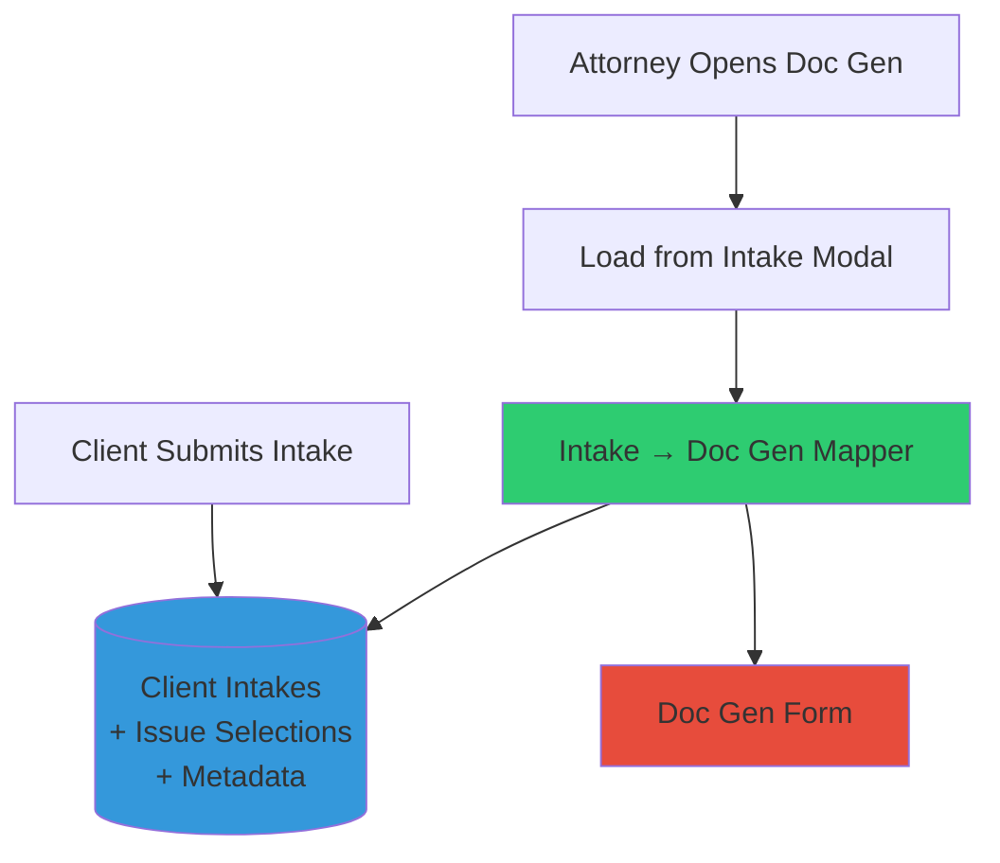

# INTAKE ↔ DOC GEN UNIFICATION PLAN
## Complete Architectural Refactor for Data Consistency

---

## EXECUTIVE SUMMARY

**Problem:** Client Intake and Doc Gen systems use different data structures and UIs, making the "load from intake" feature complex and error-prone.

**Solution:** Unify both systems around a shared issue taxonomy with mirrored UI, enabling seamless data flow from intake → doc gen with attorney verification.

**Outcome:**
- Single source of truth for issue categories
- Identical UI between intake and doc gen (visual consistency)
- Simple "load from intake" with zero transformation logic
- Intake-specific extensions (photos, dates, details) preserved

---

## ⛔ CRITICAL CONSTRAINTS - NON-NEGOTIABLE

### **Doc Generation System MUST NOT CHANGE**

The existing doc generation system is production-stable and generates legal documents. **ANY change that affects doc gen output is FORBIDDEN.**

**Protected Components:**
1. ✅ **Database Tables** - NO changes to:
   - `cases` table structure
   - `parties` table structure
   - `party_issue_selections` table structure
   - Existing `issue_categories` and `issue_options` (can only ADD, not modify)

2. ✅ **JSON Output Format** - NO changes to:
   - `raw_payload` structure in `cases` table
   - `latest_payload` structure in `cases` table
   - JSON returned by `FormTransformer.transformFormData()`
   - JSON returned by `FormTransformer.revertToOriginalFormat()`

3. ✅ **API Endpoints** - NO changes to:
   - `POST /api/form-entries` request/response format
   - `GET /api/form-entries/:id` response format
   - Document generation pipeline inputs

4. ✅ **Document Output** - NO changes to:
   - Docmosis template mappings
   - PDF field names or values
   - Generated document structure

**Testing Requirement:**
After EVERY phase, run a full doc gen regression test:
```bash
npm run test:docgen-regression
```
This test must generate identical documents before and after changes.

---

## GUIDING PRINCIPLES

1. **Doc Gen is Sacred** - Zero changes to existing doc gen system
2. **Parallel Architecture** - Intake uses separate tables, shared taxonomy
3. **Shared Database Schema** - Both use `issue_categories` and `issue_options` tables
4. **UI Consistency** - Checkboxes appear in identical positions and order
5. **Intake Extensions** - Extra metadata stored separately, doesn't pollute core structure
6. **Mapping at View Layer** - Transform intake → doc gen at read time, not write time
7. **Verification at Each Phase** - Human verification + automated tests before proceeding

---

## CURRENT STATE ANALYSIS

### Doc Gen Form Structure
```javascript
// Uses normalized taxonomy
issue_categories (vermin, insects, hvac, electrical, plumbing...)
  → issue_options (RatsMice, Bedbugs, Ants, Roaches...)
    → party_issue_selections (junction table)

// UI: Organized by category with specific checkboxes
☐ Vermin Issues
  ☐ Rats/Mice
  ☐ Skunks
  ☐ Bats
```

### Intake Form Structure (CURRENT - WRONG)
```sql
-- Flattened approach in intake_building_issues
has_pest_issues: boolean
pests_rodents: boolean       -- Different naming!
pests_cockroaches: boolean   -- Different naming!
pests_details: text          -- Extra field
pests_first_noticed: date    -- Extra field
```

### Mapping Document Analysis
From [INTAKE_TO_DOCGEN_MAPPING.MD](./INTAKE_TO_DOCGEN_MAPPING.MD):
- **20 category triggers** that map to doc gen toggles (→)
- **Exact 1:1 checkbox mappings** for all specific issues (→)
- **Additional fields** for intake only (⇢ view window)
  - Timeline: "When did [issue] start?"
  - Details: "Describe [issue] in detail"
  - Repair history: "Were any repairs made?"

### Field Count Analysis
From [CLIENT_INTAKE_COMPLETE_FIELD_LIST.md](./CLIENT_INTAKE_COMPLETE_FIELD_LIST.md):
- **346 total fields** in complete intake form
- **185 new fields** to be added
- **20 category triggers** control conditional display
- **High priority: 152 fields** (match doc gen)

---

## TARGET STATE ARCHITECTURE

### Unified Database Schema
```sql
-- SHARED TABLES (used by both intake and doc gen)
issue_categories (
  id, category_code, category_name, display_order
)

issue_options (
  id, category_id, option_code, option_name, display_order
)

-- DOC GEN: Links to parties table
party_issue_selections (
  party_id, issue_option_id
)

-- INTAKE: Links to client_intakes table
intake_issue_selections (
  intake_id, issue_option_id, created_at
)

-- INTAKE-SPECIFIC METADATA (separate table)
intake_issue_metadata (
  intake_id,
  category_code,              -- References issue_categories
  details TEXT,               -- "Describe in detail"
  first_noticed DATE,         -- "When did it start?"
  repair_history TEXT,        -- "Were repairs made?"
  photos JSONB,               -- Array of uploaded photo URLs
  severity VARCHAR(20),       -- mild/moderate/severe
  created_at TIMESTAMP
)
```

### Mirrored UI Structure
```tsx
// BOTH FORMS use identical component
<IssueCategory
  category="vermin"
  title="Vermin Issues"
  checkboxes={[
    { id: 'vermin-RatsMice', label: 'Rats/Mice' },
    { id: 'vermin-Skunks', label: 'Skunks' },
    { id: 'vermin-Bats', label: 'Bats' },
  ]}

  // INTAKE-ONLY: Extra fields below checkboxes
  showIntakeExtras={true}
  metadataFields={['details', 'firstNoticed', 'repairHistory', 'photos']}
/>
```

### Data Flow Diagram


---

## IMPLEMENTATION PHASES

---

## **PHASE 1: DATABASE FOUNDATION**
### Establish Shared Issue Taxonomy

**Goal:** Create a single source of truth for all issue categories and options.

### 1.1 Audit Existing Issue Categories
**Tasks:**
- [ ] Extract all issue categories from doc gen [form-transformer.js:290-300](../services/form-transformer.js#L290-L300)
- [ ] Compare with intake form requirements from [CLIENT_INTAKE_COMPLETE_FIELD_LIST.md:492-514](./CLIENT_INTAKE_COMPLETE_FIELD_LIST.md#L492-L514)
- [ ] Create master list of 20 categories:
  1. Vermin
  2. Insects
  3. HVAC
  4. Electrical
  5. Fire Hazard
  6. Appliances
  7. Plumbing
  8. Utility
  9. Flooring
  10. Windows
  11. Doors
  12. Cabinets
  13. Structure
  14. Common Areas
  15. Trash Problems
  16. Nuisance
  17. Health Hazard
  18. Government Entities
  19. Notices
  20. Safety

**Verification Checkpoint:**
```bash
# Run this to verify categories match both systems
node scripts/audit-issue-categories.js
```
**Expected Output:** Console table showing 20 categories with doc gen vs intake comparison

---

### 1.2 Create Shared Issue Options List
**Tasks:**
- [ ] For each category, list all checkbox options from INTAKE_TO_DOCGEN_MAPPING.MD
- [ ] Ensure exact label matching (e.g., "Rats/Mice" not "Rats / Mice")
- [ ] Document display order for UI consistency
- [ ] Create CSV file: `database/seed-data/issue-options-master.csv`

**CSV Format:**
```csv
category_code,option_code,option_name,display_order
vermin,RatsMice,Rats/Mice,1
vermin,Skunks,Skunks,2
vermin,Bats,Bats,3
insects,Ants,Ants,1
insects,Bedbugs,Bedbugs,2
```

**Verification Checkpoint:**
- [ ] CSV contains all checkbox options from section 5-9 of INTAKE_TO_DOCGEN_MAPPING.MD
- [ ] Option names match exactly between doc gen and intake
- [ ] Display order matches doc gen form visual order

---

### 1.3 Create Migration: Shared Tables
**File:** `database/migrations/002_create_shared_issue_taxonomy.sql`

**Tasks:**
- [ ] Create `issue_categories` table (if not exists)
- [ ] Create `issue_options` table (if not exists)
- [ ] Seed with master data from CSV
- [ ] Add indexes for performance

```sql
-- Migration Script
CREATE TABLE IF NOT EXISTS issue_categories (
    id UUID PRIMARY KEY DEFAULT gen_random_uuid(),
    category_code VARCHAR(50) NOT NULL UNIQUE,
    category_name VARCHAR(255) NOT NULL,
    display_order INTEGER NOT NULL,
    is_active BOOLEAN DEFAULT true,
    created_at TIMESTAMP WITH TIME ZONE DEFAULT CURRENT_TIMESTAMP
);

CREATE TABLE IF NOT EXISTS issue_options (
    id UUID PRIMARY KEY DEFAULT gen_random_uuid(),
    category_id UUID NOT NULL REFERENCES issue_categories(id) ON DELETE CASCADE,
    option_code VARCHAR(50) NOT NULL,
    option_name VARCHAR(255) NOT NULL,
    display_order INTEGER NOT NULL,
    is_active BOOLEAN DEFAULT true,
    created_at TIMESTAMP WITH TIME ZONE DEFAULT CURRENT_TIMESTAMP,
    CONSTRAINT unique_option_per_category UNIQUE (category_id, option_code)
);

-- Seed data from CSV
\copy issue_categories FROM 'database/seed-data/issue-categories.csv' CSV HEADER;
\copy issue_options FROM 'database/seed-data/issue-options-master.csv' CSV HEADER;
```

**Verification Checkpoint:**
```bash
# Run migration
psql $DATABASE_URL -f database/migrations/002_create_shared_issue_taxonomy.sql

# Verify data
psql $DATABASE_URL -c "SELECT category_code, COUNT(*) as option_count FROM issue_categories c JOIN issue_options o ON c.id = o.category_id GROUP BY category_code ORDER BY display_order;"
```
**Expected Output:** 20 rows showing each category with its option count

---

### 1.4 Create Intake-Specific Tables
**File:** `database/migrations/003_create_intake_issue_tables.sql`

**Tasks:**
- [ ] Create `intake_issue_selections` (links intake to options)
- [ ] Create `intake_issue_metadata` (extra fields per category)
- [ ] Add foreign keys and indexes

```sql
-- Intake Issue Selections (mirrors party_issue_selections)
CREATE TABLE intake_issue_selections (
    id UUID PRIMARY KEY DEFAULT gen_random_uuid(),
    intake_id UUID NOT NULL REFERENCES client_intakes(id) ON DELETE CASCADE,
    issue_option_id UUID NOT NULL REFERENCES issue_options(id) ON DELETE CASCADE,
    created_at TIMESTAMP WITH TIME ZONE DEFAULT CURRENT_TIMESTAMP,
    CONSTRAINT unique_intake_issue UNIQUE (intake_id, issue_option_id)
);

-- Intake Issue Metadata (intake-specific extensions)
CREATE TABLE intake_issue_metadata (
    id UUID PRIMARY KEY DEFAULT gen_random_uuid(),
    intake_id UUID NOT NULL REFERENCES client_intakes(id) ON DELETE CASCADE,
    category_code VARCHAR(50) NOT NULL REFERENCES issue_categories(category_code),

    -- Extra fields for intake
    details TEXT,                     -- "Describe [issue] in detail"
    first_noticed DATE,               -- "When did [issue] start?"
    repair_history TEXT,              -- "Were repairs made?"
    photos JSONB,                     -- Array of photo URLs
    severity VARCHAR(20),             -- mild/moderate/severe

    created_at TIMESTAMP WITH TIME ZONE DEFAULT CURRENT_TIMESTAMP,
    updated_at TIMESTAMP WITH TIME ZONE DEFAULT CURRENT_TIMESTAMP,

    CONSTRAINT unique_intake_category_metadata UNIQUE (intake_id, category_code),
    CONSTRAINT check_severity CHECK (severity IN ('mild', 'moderate', 'severe'))
);

-- Indexes
CREATE INDEX idx_intake_selections_intake ON intake_issue_selections(intake_id);
CREATE INDEX idx_intake_selections_option ON intake_issue_selections(issue_option_id);
CREATE INDEX idx_intake_metadata_intake ON intake_issue_metadata(intake_id);
CREATE INDEX idx_intake_metadata_category ON intake_issue_metadata(category_code);
```

**Verification Checkpoint:**
```bash
psql $DATABASE_URL -f database/migrations/003_create_intake_issue_tables.sql
psql $DATABASE_URL -c "\d intake_issue_selections"
psql $DATABASE_URL -c "\d intake_issue_metadata"
```

---

### 1.5 PHASE 1 VERIFICATION CHECKLIST

**Manual Verification Steps:**
- [ ] All 20 categories exist in `issue_categories` table
- [ ] Each category has correct `display_order` matching doc gen form
- [ ] All checkbox options exist in `issue_options` table
- [ ] Option names match exactly between doc gen transformer and database
- [ ] `intake_issue_selections` table created successfully
- [ ] `intake_issue_metadata` table created successfully
- [ ] Foreign keys properly reference existing tables
- [ ] Indexes created for performance

**Automated Tests:**
```bash
# Run Phase 1 verification script
node scripts/verify-phase1-database.js
```

**Sign-Off Required:** ✅ Database Architect + Product Owner

---

## **PHASE 2: SHARED UI COMPONENTS**
### Build Reusable Issue Category Components

**Goal:** Create UI components that work identically in both intake and doc gen forms.

### 2.1 Create Shared Config File
**File:** `shared/config/issue-categories-config.ts`

**Tasks:**
- [ ] Export TypeScript types for categories and options
- [ ] Create configuration object with all 20 categories
- [ ] Include metadata for conditional display
- [ ] Add validation rules

```typescript
// shared/config/issue-categories-config.ts
export interface IssueOption {
  id: string;              // e.g., "vermin-RatsMice"
  code: string;            // e.g., "RatsMice"
  label: string;           // e.g., "Rats/Mice"
  displayOrder: number;
}

export interface IssueCategory {
  id: string;              // e.g., "vermin"
  code: string;            // e.g., "vermin"
  title: string;           // e.g., "Vermin Issues"
  displayOrder: number;
  options: IssueOption[];

  // Intake-specific metadata fields
  hasDetails?: boolean;
  hasFirstNoticed?: boolean;
  hasRepairHistory?: boolean;
  hasPhotos?: boolean;
}

export const ISSUE_CATEGORIES: IssueCategory[] = [
  {
    id: 'vermin',
    code: 'vermin',
    title: 'Vermin Issues',
    displayOrder: 1,
    options: [
      { id: 'vermin-RatsMice', code: 'RatsMice', label: 'Rats/Mice', displayOrder: 1 },
      { id: 'vermin-Skunks', code: 'Skunks', label: 'Skunks', displayOrder: 2 },
      { id: 'vermin-Bats', code: 'Bats', label: 'Bats', displayOrder: 3 },
      { id: 'vermin-Raccoons', code: 'Raccoons', label: 'Raccoons', displayOrder: 4 },
      { id: 'vermin-Pigeons', code: 'Pigeons', label: 'Pigeons', displayOrder: 5 },
      { id: 'vermin-Opossums', code: 'Opossums', label: 'Opossums', displayOrder: 6 },
    ],
    hasDetails: true,
    hasFirstNoticed: true,
    hasRepairHistory: true,
    hasPhotos: true,
  },
  // ... 19 more categories
];
```

**Verification Checkpoint:**
- [ ] Config matches issue_options in database exactly
- [ ] All 20 categories defined
- [ ] Display order matches doc gen visual order
- [ ] TypeScript types compile without errors

---

### 2.2 Build Shared Checkbox Component
**File:** `shared/components/IssueCheckboxGroup.tsx`

**Tasks:**
- [ ] Create reusable checkbox group component
- [ ] Support controlled state (React)
- [ ] Handle select all / deselect all
- [ ] Match doc gen styling exactly

```tsx
// shared/components/IssueCheckboxGroup.tsx
import { IssueOption } from '../config/issue-categories-config';

interface IssueCheckboxGroupProps {
  category: string;
  options: IssueOption[];
  selectedOptions: string[];
  onChange: (optionId: string, checked: boolean) => void;
  disabled?: boolean;
}

export function IssueCheckboxGroup({
  category,
  options,
  selectedOptions,
  onChange,
  disabled = false
}: IssueCheckboxGroupProps) {
  return (
    <div className="issue-checkbox-group">
      <div className="checkbox-grid">
        {options.map(option => (
          <label key={option.id} className="checkbox-item">
            <input
              type="checkbox"
              name={option.id}
              checked={selectedOptions.includes(option.id)}
              onChange={(e) => onChange(option.id, e.target.checked)}
              disabled={disabled}
            />
            <span>{option.label}</span>
          </label>
        ))}
      </div>
    </div>
  );
}
```

**Verification Checkpoint:**
- [ ] Component renders in Storybook
- [ ] Checkboxes toggle correctly
- [ ] Visual styling matches doc gen form exactly
- [ ] Accessibility tests pass (keyboard navigation, screen reader)

---

### 2.3 Build Issue Category Section Component
**File:** `shared/components/IssueCategorySection.tsx`

**Tasks:**
- [ ] Create section with toggle + checkboxes + metadata fields
- [ ] Support intake-specific extras (details, dates, photos)
- [ ] Conditional display logic
- [ ] Validation integration

```tsx
// shared/components/IssueCategorySection.tsx
import { IssueCategory } from '../config/issue-categories-config';
import { IssueCheckboxGroup } from './IssueCheckboxGroup';

interface IssueCategorySectionProps {
  category: IssueCategory;
  hasIssue: boolean;
  onToggle: (hasIssue: boolean) => void;
  selectedOptions: string[];
  onOptionChange: (optionId: string, checked: boolean) => void;

  // Intake-specific props
  showIntakeExtras?: boolean;
  metadata?: {
    details?: string;
    firstNoticed?: string;
    repairHistory?: string;
  };
  onMetadataChange?: (field: string, value: string) => void;
}

export function IssueCategorySection({
  category,
  hasIssue,
  onToggle,
  selectedOptions,
  onOptionChange,
  showIntakeExtras = false,
  metadata,
  onMetadataChange
}: IssueCategorySectionProps) {
  return (
    <div className="issue-category-section">
      {/* Category Toggle */}
      <div className="category-header">
        <label>
          <input
            type="checkbox"
            checked={hasIssue}
            onChange={(e) => onToggle(e.target.checked)}
          />
          <span className="category-title">{category.title}</span>
        </label>
      </div>

      {/* Conditional: Show checkboxes if hasIssue */}
      {hasIssue && (
        <>
          <IssueCheckboxGroup
            category={category.code}
            options={category.options}
            selectedOptions={selectedOptions}
            onChange={onOptionChange}
          />

          {/* Intake-specific extras */}
          {showIntakeExtras && (
            <div className="intake-extras">
              {category.hasDetails && (
                <div className="form-field">
                  <label>Describe {category.title.toLowerCase()} in detail:</label>
                  <textarea
                    value={metadata?.details || ''}
                    onChange={(e) => onMetadataChange?.('details', e.target.value)}
                    rows={3}
                  />
                </div>
              )}

              {category.hasFirstNoticed && (
                <div className="form-field">
                  <label>When did {category.title.toLowerCase()} start?</label>
                  <input
                    type="date"
                    value={metadata?.firstNoticed || ''}
                    onChange={(e) => onMetadataChange?.('firstNoticed', e.target.value)}
                  />
                </div>
              )}

              {category.hasRepairHistory && (
                <div className="form-field">
                  <label>Were any repairs made? (how long, how many times)</label>
                  <textarea
                    value={metadata?.repairHistory || ''}
                    onChange={(e) => onMetadataChange?.('repairHistory', e.target.value)}
                    rows={2}
                  />
                </div>
              )}
            </div>
          )}
        </>
      )}
    </div>
  );
}
```

**Verification Checkpoint:**
- [ ] Toggle shows/hides checkboxes correctly
- [ ] Intake extras display only when `showIntakeExtras=true`
- [ ] State management works correctly
- [ ] Component matches doc gen layout pixel-perfect

---

### 2.4 PHASE 2 VERIFICATION CHECKLIST

**Visual Comparison Test:**
```bash
# Take screenshots of both forms side-by-side
npm run test:visual-regression
```

**Manual Verification:**
- [ ] Doc gen form: Toggle "Vermin Issues" → Checkboxes appear in correct order
- [ ] Intake form: Toggle "Vermin Issues" → Same checkboxes + extra fields
- [ ] Checkbox labels match exactly (e.g., "Rats/Mice" not "Rats / Mice")
- [ ] Visual spacing, fonts, colors match between forms
- [ ] All 20 categories render correctly in both forms

**Automated Tests:**
```bash
npm run test:shared-components
```

**Sign-Off Required:** ✅ Frontend Developer + UX Designer

---

## **PHASE 3: REFACTOR CLIENT INTAKE FORM**
### Replace Flattened Structure with Shared Components

**Goal:** Update intake form to use shared components and new database schema.

### 3.1 Backup & Deprecate Old Structure
**Tasks:**
- [ ] Create database backup before migration
- [ ] Rename old tables with `_deprecated` suffix
- [ ] Document migration path for existing data

```bash
# Backup production database
pg_dump $DATABASE_URL > backups/pre-unification-$(date +%Y%m%d).sql

# Rename old tables
psql $DATABASE_URL -c "ALTER TABLE intake_building_issues RENAME TO intake_building_issues_deprecated;"
psql $DATABASE_URL -c "ALTER TABLE intake_utilities_issues RENAME TO intake_utilities_issues_deprecated;"
```

**Verification Checkpoint:**
- [ ] Backup file exists and is valid
- [ ] Old tables renamed successfully
- [ ] Application still runs (reads from deprecated tables)

---

### 3.2 Update IntakeFormExpanded Component
**File:** `client-intake/src/components/IntakeFormExpanded.tsx`

**Tasks:**
- [ ] Remove old BuildingIssuesCompact component
- [ ] Import shared IssueCategorySection component
- [ ] Update state management to use new structure
- [ ] Add validation for issue selections

```tsx
// client-intake/src/components/IntakeFormExpanded.tsx
import { ISSUE_CATEGORIES } from '../../../shared/config/issue-categories-config';
import { IssueCategorySection } from '../../../shared/components/IssueCategorySection';

export function IntakeFormExpanded({ onSubmit }: IntakeFormProps) {
  // State: Which categories have issues
  const [categoryToggles, setCategoryToggles] = useState<Record<string, boolean>>({});

  // State: Which specific options are selected per category
  const [selectedOptions, setSelectedOptions] = useState<Record<string, string[]>>({});

  // State: Metadata per category (details, dates, etc.)
  const [categoryMetadata, setCategoryMetadata] = useState<Record<string, any>>({});

  return (
    <form onSubmit={handleSubmit}>
      {/* ... other form sections ... */}

      {/* Building Issues Section */}
      <section className="form-section">
        <h2>Building & Unit Condition Issues</h2>

        {ISSUE_CATEGORIES.map(category => (
          <IssueCategorySection
            key={category.code}
            category={category}
            hasIssue={categoryToggles[category.code] || false}
            onToggle={(hasIssue) => handleCategoryToggle(category.code, hasIssue)}
            selectedOptions={selectedOptions[category.code] || []}
            onOptionChange={(optionId, checked) => handleOptionChange(category.code, optionId, checked)}
            showIntakeExtras={true}
            metadata={categoryMetadata[category.code]}
            onMetadataChange={(field, value) => handleMetadataChange(category.code, field, value)}
          />
        ))}
      </section>

      {/* ... rest of form ... */}
    </form>
  );
}
```

**Verification Checkpoint:**
- [ ] Form renders without errors
- [ ] All 20 categories display correctly
- [ ] Checkboxes work as expected
- [ ] Intake extras (details, dates) save correctly

---

### 3.3 Update Backend API Route
**File:** `routes/intakes-jsonb.js`

**Tasks:**
- [ ] Update POST endpoint to save to new tables
- [ ] Save issue selections to `intake_issue_selections`
- [ ] Save metadata to `intake_issue_metadata`
- [ ] Maintain backward compatibility during transition

```javascript
// routes/intakes-jsonb.js
router.post('/', async (req, res) => {
  const { formData, issueSelections, issueMetadata } = req.body;

  // 1. Save main intake record
  const intake = await db.query(
    'INSERT INTO client_intakes (...) VALUES (...) RETURNING id',
    [formData]
  );
  const intakeId = intake.rows[0].id;

  // 2. Save issue selections (NEW)
  for (const optionId of issueSelections) {
    await db.query(
      'INSERT INTO intake_issue_selections (intake_id, issue_option_id) VALUES ($1, $2)',
      [intakeId, optionId]
    );
  }

  // 3. Save issue metadata (NEW)
  for (const [categoryCode, metadata] of Object.entries(issueMetadata)) {
    if (metadata.details || metadata.firstNoticed || metadata.repairHistory) {
      await db.query(
        'INSERT INTO intake_issue_metadata (intake_id, category_code, details, first_noticed, repair_history) VALUES ($1, $2, $3, $4, $5)',
        [intakeId, categoryCode, metadata.details, metadata.firstNoticed, metadata.repairHistory]
      );
    }
  }

  res.json({ success: true, intakeId });
});
```

**Verification Checkpoint:**
- [ ] POST request saves to all three tables correctly
- [ ] Data can be retrieved via GET endpoint
- [ ] No database errors in logs
- [ ] Test with sample intake submission

---

### 3.4 Data Migration Script
**File:** `scripts/migrate-existing-intakes.js`

**Tasks:**
- [ ] Query all records from deprecated tables
- [ ] Map old flattened structure to new normalized structure
- [ ] Insert into `intake_issue_selections` and `intake_issue_metadata`
- [ ] Verify count matches

```javascript
// scripts/migrate-existing-intakes.js
const { Pool } = require('pg');

async function migrateIntakes() {
  const pool = new Pool({ connectionString: process.env.DATABASE_URL });

  // Get all old intake building issues
  const oldIssues = await pool.query('SELECT * FROM intake_building_issues_deprecated');

  for (const row of oldIssues.rows) {
    const intakeId = row.intake_id;

    // Migrate pest issues
    if (row.has_pest_issues) {
      // Map old checkbox to new option_id
      if (row.pests_rodents) {
        const option = await pool.query(
          'SELECT id FROM issue_options WHERE category_id = (SELECT id FROM issue_categories WHERE category_code = $1) AND option_code = $2',
          ['vermin', 'RatsMice']
        );
        await pool.query(
          'INSERT INTO intake_issue_selections (intake_id, issue_option_id) VALUES ($1, $2) ON CONFLICT DO NOTHING',
          [intakeId, option.rows[0].id]
        );
      }

      // Save metadata
      if (row.pests_details || row.pests_first_noticed) {
        await pool.query(
          'INSERT INTO intake_issue_metadata (intake_id, category_code, details, first_noticed) VALUES ($1, $2, $3, $4) ON CONFLICT (intake_id, category_code) DO UPDATE SET details = EXCLUDED.details',
          [intakeId, 'vermin', row.pests_details, row.pests_first_noticed]
        );
      }
    }

    // ... repeat for all 20 categories
  }

  console.log('Migration complete!');
  await pool.end();
}

migrateIntakes();
```

**Verification Checkpoint:**
```bash
# Run migration
node scripts/migrate-existing-intakes.js

# Verify counts match
psql $DATABASE_URL -c "SELECT COUNT(*) FROM intake_building_issues_deprecated;"
psql $DATABASE_URL -c "SELECT COUNT(DISTINCT intake_id) FROM intake_issue_selections;"
```

---

### 3.5 PHASE 3 VERIFICATION CHECKLIST

**End-to-End Test:**
1. [ ] Submit new intake form with 5 different issue categories selected
2. [ ] Verify data saves to `intake_issue_selections` table
3. [ ] Verify metadata saves to `intake_issue_metadata` table
4. [ ] Retrieve intake via API and confirm all data present
5. [ ] Check photos upload correctly (if implemented)

**Manual Testing:**
- [ ] Fill out complete intake form (all 346 fields)
- [ ] Select issues from all 20 categories
- [ ] Add details, dates, repair history for at least 5 categories
- [ ] Submit form successfully
- [ ] View intake in admin panel - all data displays correctly

**Sign-Off Required:** ✅ Backend Developer + QA Engineer

---

## **PHASE 4: BUILD INTAKE → DOC GEN MAPPER**
### Create View Layer for Loading Intakes

**Goal:** Enable attorneys to load intake data into doc gen form with one click.

### 4.1 Create Database View
**File:** `database/views/v_intake_to_docgen.sql`

**Tasks:**
- [ ] Create view that transforms intake schema → doc gen schema
- [ ] Group issue selections by category
- [ ] Build arrays of selected options
- [ ] Include plaintiff/defendant info

```sql
-- database/views/v_intake_to_docgen.sql
CREATE OR REPLACE VIEW v_intake_to_docgen AS
SELECT
  i.id as intake_id,
  i.intake_number,

  -- Plaintiff Info (Form 1 → Form 2 direct mappings)
  i.first_name,
  i.last_name,
  CASE
    WHEN EXTRACT(YEAR FROM AGE(i.date_of_birth)) >= 18 THEN 'Adult'
    ELSE 'Child'
  END as age_category,
  i.is_head_of_household,

  -- Property Info
  i.property_street_address,
  i.property_city,
  i.property_state,
  i.property_zip_code,
  i.filing_county,

  -- Aggregate issue selections by category
  (
    SELECT jsonb_object_agg(
      cat.category_code,
      COALESCE(issue_data.selected_options, '[]'::jsonb)
    )
    FROM issue_categories cat
    LEFT JOIN (
      SELECT
        ic2.category_code,
        jsonb_agg(opt.option_code ORDER BY opt.display_order) as selected_options
      FROM intake_issue_selections iis
      JOIN issue_options opt ON iis.issue_option_id = opt.id
      JOIN issue_categories ic2 ON opt.category_id = ic2.id
      WHERE iis.intake_id = i.id
      GROUP BY ic2.category_code
    ) issue_data ON issue_data.category_code = cat.category_code
  ) as issue_selections,

  -- Include metadata for view window
  (
    SELECT jsonb_object_agg(
      category_code,
      jsonb_build_object(
        'details', details,
        'firstNoticed', first_noticed,
        'repairHistory', repair_history
      )
    )
    FROM intake_issue_metadata
    WHERE intake_id = i.id
  ) as issue_metadata

FROM client_intakes i;
```

**Verification Checkpoint:**
```bash
psql $DATABASE_URL -f database/views/v_intake_to_docgen.sql

# Test view with sample intake
psql $DATABASE_URL -c "SELECT intake_number, issue_selections FROM v_intake_to_docgen LIMIT 1;"
```

---

### 4.2 Create API Endpoint: Load Intake
**File:** `routes/forms.js`

**Tasks:**
- [ ] Add GET endpoint to fetch intake by ID
- [ ] Transform view data to doc gen form structure
- [ ] Return in format expected by frontend

```javascript
// routes/forms.js

/**
 * GET /api/form-entries/load-from-intake/:intakeId
 * Load intake data formatted for doc gen form
 */
router.get('/load-from-intake/:intakeId', asyncHandler(async (req, res) => {
  const { intakeId } = req.params;

  // Query the view
  const result = await pool.query(
    'SELECT * FROM v_intake_to_docgen WHERE intake_id = $1',
    [intakeId]
  );

  if (result.rows.length === 0) {
    return res.status(404).json({ error: 'Intake not found' });
  }

  const intake = result.rows[0];

  // Transform to doc gen format
  const docGenData = {
    // Basic info (direct mappings from INTAKE_TO_DOCGEN_MAPPING.MD)
    PlaintiffDetails: [{
      PlaintiffItemNumberName: {
        First: intake.first_name,
        Last: intake.last_name,
        FirstAndLast: `${intake.first_name} ${intake.last_name}`
      },
      PlaintiffItemNumberType: "Individual",
      PlaintiffItemNumberAgeCategory: [intake.age_category],
      HeadOfHousehold: intake.is_head_of_household,
      ItemNumber: 1,

      // Issue discovery (transformed from issue_selections)
      PlaintiffItemNumberDiscovery: transformIssueSelections(intake.issue_selections)
    }],

    Full_Address: {
      Line1: intake.property_street_address,
      Line2: null,
      City: intake.property_city,
      State: intake.property_state,
      Zip: intake.property_zip_code,
      County: intake.filing_county
    },

    FilingCity: intake.property_city,
    FilingCounty: intake.filing_county,

    // Metadata for view windows
    _intakeMetadata: intake.issue_metadata
  };

  res.json(docGenData);
}));

function transformIssueSelections(selections) {
  const discovery = {};

  // For each category, set flag + array
  for (const [categoryCode, optionCodes] of Object.entries(selections || {})) {
    const hasOptions = optionCodes && optionCodes.length > 0;

    switch(categoryCode) {
      case 'vermin':
        discovery.VerminIssue = hasOptions;
        discovery.Vermin = optionCodes.map(code => mapOptionCodeToLabel(code));
        break;
      case 'insects':
        discovery.InsectIssues = hasOptions;
        discovery.Insects = optionCodes.map(code => mapOptionCodeToLabel(code));
        break;
      // ... all 20 categories
    }
  }

  return discovery;
}

function mapOptionCodeToLabel(code) {
  // Map option codes to display labels
  const mapping = {
    'RatsMice': 'Rats/Mice',
    'Skunks': 'Skunks',
    'Bats': 'Bats',
    // ... all options
  };
  return mapping[code] || code;
}
```

**Verification Checkpoint:**
```bash
# Test API endpoint
curl http://localhost:3000/api/form-entries/load-from-intake/{intakeId}

# Verify response structure matches doc gen expected format
```

---

### 4.3 Create Load Intake Modal (Frontend)
**File:** `public/js/load-intake-modal.js`

**Tasks:**
- [ ] Create modal UI for attorneys
- [ ] List available intakes
- [ ] Preview intake data
- [ ] Confirm load action

```javascript
// public/js/load-intake-modal.js

function showLoadIntakeModal() {
  // Fetch available intakes
  fetch('/api/intakes-jsonb')
    .then(res => res.json())
    .then(intakes => {
      // Build modal HTML
      const modal = `
        <div class="modal" id="load-intake-modal">
          <div class="modal-content">
            <h2>Load from Client Intake</h2>
            <table class="intake-list">
              <thead>
                <tr>
                  <th>Intake #</th>
                  <th>Client Name</th>
                  <th>Property</th>
                  <th>Date</th>
                  <th>Actions</th>
                </tr>
              </thead>
              <tbody>
                ${intakes.map(intake => `
                  <tr>
                    <td>${intake.intake_number}</td>
                    <td>${intake.first_name} ${intake.last_name}</td>
                    <td>${intake.property_street_address}</td>
                    <td>${new Date(intake.intake_date).toLocaleDateString()}</td>
                    <td>
                      <button onclick="loadIntake('${intake.id}')">Load</button>
                      <button onclick="previewIntake('${intake.id}')">Preview</button>
                    </td>
                  </tr>
                `).join('')}
              </tbody>
            </table>
          </div>
        </div>
      `;

      document.body.insertAdjacentHTML('beforeend', modal);
    });
}

async function loadIntake(intakeId) {
  // Fetch transformed data
  const response = await fetch(`/api/form-entries/load-from-intake/${intakeId}`);
  const docGenData = await response.json();

  // Populate form fields
  populatePlaintiffFields(docGenData.PlaintiffDetails[0]);
  populateAddressFields(docGenData.Full_Address);
  populateIssueCheckboxes(docGenData.PlaintiffDetails[0].PlaintiffItemNumberDiscovery);

  // Show view windows with metadata
  displayIntakeMetadata(docGenData._intakeMetadata);

  // Close modal
  document.getElementById('load-intake-modal').remove();

  // Show success message
  alert('Intake loaded successfully! Please review and verify all information.');
}

function populateIssueCheckboxes(discovery) {
  // For each category with issues
  for (const [key, value] of Object.entries(discovery)) {
    if (key.endsWith('Issue') && value === true) {
      // Find category toggle and check it
      const categoryCode = key.replace('Issue', '').replace('Issues', '');
      const toggle = document.querySelector(`[data-category="${categoryCode}"]`);
      if (toggle) toggle.checked = true;
    }

    if (Array.isArray(value) && value.length > 0) {
      // Check individual options
      value.forEach(option => {
        const checkbox = document.querySelector(`[data-option="${option}"]`);
        if (checkbox) checkbox.checked = true;
      });
    }
  }
}

function displayIntakeMetadata(metadata) {
  // Create view windows showing intake extra fields
  for (const [categoryCode, data] of Object.entries(metadata || {})) {
    const viewWindow = `
      <div class="view-window" data-category="${categoryCode}">
        <h4>Client-Provided Information</h4>
        ${data.details ? `<p><strong>Details:</strong> ${data.details}</p>` : ''}
        ${data.firstNoticed ? `<p><strong>First Noticed:</strong> ${data.firstNoticed}</p>` : ''}
        ${data.repairHistory ? `<p><strong>Repair History:</strong> ${data.repairHistory}</p>` : ''}
      </div>
    `;

    // Insert after category checkboxes
    const categorySection = document.querySelector(`[data-category-section="${categoryCode}"]`);
    if (categorySection) {
      categorySection.insertAdjacentHTML('beforeend', viewWindow);
    }
  }
}
```

**Verification Checkpoint:**
- [ ] Modal displays list of intakes correctly
- [ ] Click "Load" → Form populates with intake data
- [ ] All checkboxes in correct categories are checked
- [ ] View windows show intake metadata (details, dates)
- [ ] Attorney can still edit all fields after loading

---

### 4.4 PHASE 4 VERIFICATION CHECKLIST

**End-to-End Test:**
1. [ ] Create intake with issues in 10 different categories
2. [ ] Open doc gen form
3. [ ] Click "Load from Intake" button
4. [ ] Select the intake from list
5. [ ] Verify all checkboxes light up in correct positions
6. [ ] Verify plaintiff info auto-fills correctly
7. [ ] Verify property address auto-fills
8. [ ] Verify filing county auto-fills
9. [ ] Verify view windows show intake metadata
10. [ ] Edit a checkbox → Form still works normally
11. [ ] Submit doc gen form → Documents generate correctly

**Visual Verification:**
```
Side-by-side comparison:
┌─────────────────────────────┬─────────────────────────────┐
│ INTAKE FORM (Client View)  │ DOC GEN FORM (Attorney)     │
├─────────────────────────────┼─────────────────────────────┤
│ ☑ Vermin Issues             │ ☑ Vermin Issues             │
│   ☑ Rats/Mice               │   ☑ Rats/Mice               │
│   ☐ Skunks                  │   ☐ Skunks                  │
│   ☑ Bats                    │   ☑ Bats                    │
│                             │                             │
│ Details: "Rats in kitchen"  │ [View Window]               │
│ First Noticed: 2024-01-15   │ Details: "Rats in kitchen"  │
│                             │ First Noticed: 2024-01-15   │
└─────────────────────────────┴─────────────────────────────┘
         ↓ LOAD FROM INTAKE ↓
```

**Sign-Off Required:** ✅ Full Stack Developer + Product Owner

---

## **PHASE 5: TESTING & VALIDATION**
### Comprehensive End-to-End Testing

### 5.1 Unit Tests
**Tasks:**
- [ ] Test shared components (IssueCheckboxGroup, IssueCategorySection)
- [ ] Test database views return correct data
- [ ] Test API endpoint transformations
- [ ] Test form validation logic

```bash
npm run test:unit
```

---

### 5.2 Integration Tests
**Tasks:**
- [ ] Test intake form submission → database
- [ ] Test load intake → doc gen form
- [ ] Test doc gen form submission → document generation
- [ ] Test data migration script

```bash
npm run test:integration
```

---

### 5.3 End-to-End User Flows
**Test Scenarios:**

**Scenario 1: New Intake → Load → Doc Gen**
1. Client submits intake with 10 issue categories
2. Attorney opens doc gen form
3. Loads intake from modal
4. Verifies all data transferred correctly
5. Edits defendant information
6. Generates discovery documents
7. Documents contain correct issues

**Scenario 2: Intake with All 20 Categories**
1. Fill out intake selecting issues from all 20 categories
2. Add details, dates, photos for each category
3. Submit intake
4. Load into doc gen
5. Verify all 20 categories populate correctly
6. Generate documents for multiple plaintiffs

**Scenario 3: Edit After Load**
1. Load intake into doc gen
2. Attorney unchecks 3 issue categories
3. Attorney adds 2 new issue categories
4. Attorney modifies plaintiff name
5. Generate documents
6. Verify changes reflected in output

---

### 5.4 Performance Testing
**Tasks:**
- [ ] Test with 1000+ intakes in database
- [ ] Measure load time for intake list modal
- [ ] Measure load time for populating doc gen form
- [ ] Ensure no N+1 queries

```bash
npm run test:performance
```

---

### 5.5 Accessibility Testing
**Tasks:**
- [ ] Keyboard navigation through all forms
- [ ] Screen reader compatibility
- [ ] Color contrast validation
- [ ] Focus indicators on all interactive elements

```bash
npm run test:accessibility
```

---

### 5.6 PHASE 5 VERIFICATION CHECKLIST

**Manual QA Checklist:**
- [ ] All unit tests pass
- [ ] All integration tests pass
- [ ] All E2E scenarios complete successfully
- [ ] Performance benchmarks met (load < 2s)
- [ ] Accessibility score 95%+
- [ ] No console errors in browser
- [ ] No SQL errors in server logs

**Sign-Off Required:** ✅ QA Lead + Engineering Manager

---

## **PHASE 6: DEPLOYMENT & MONITORING**

### 6.1 Staging Deployment
**Tasks:**
- [ ] Deploy database migrations to staging
- [ ] Deploy updated frontend code
- [ ] Deploy updated backend code
- [ ] Run data migration script
- [ ] Smoke test all flows

```bash
# Deploy to staging
./scripts/deploy-staging.sh
```

---

### 6.2 Production Deployment Plan
**Pre-Deployment:**
- [ ] Database backup completed
- [ ] Rollback plan documented
- [ ] Monitoring alerts configured

**Deployment Steps:**
1. **Maintenance Window:** Schedule 2-hour window
2. **Database Migration:**
   - Run Phase 1 migrations (shared tables)
   - Run Phase 3 migrations (intake tables)
   - Run data migration script
   - Verify counts match
3. **Code Deployment:**
   - Deploy backend (zero-downtime)
   - Deploy frontend (zero-downtime)
4. **Smoke Tests:**
   - Submit test intake
   - Load test intake into doc gen
   - Generate test documents
5. **Monitor:**
   - Watch error rates
   - Watch database query performance
   - Watch user feedback

---

### 6.3 Post-Deployment Monitoring
**Metrics to Track:**
- Intake submission success rate
- Load intake → doc gen success rate
- Document generation success rate
- Average time to complete intake form
- Database query performance
- User satisfaction (collect feedback)

**Alerting:**
- Alert if intake submission errors > 1%
- Alert if load intake fails
- Alert if database query time > 500ms

---

### 6.4 PHASE 6 VERIFICATION CHECKLIST

**Day 1 Post-Launch:**
- [ ] No critical errors reported
- [ ] Intake submission rate normal
- [ ] Doc gen loads working correctly
- [ ] User feedback positive

**Week 1 Post-Launch:**
- [ ] All metrics within normal ranges
- [ ] No data inconsistencies found
- [ ] Attorney feedback collected and addressed

**Sign-Off Required:** ✅ Engineering Manager + Product Owner

---

## ROLLBACK PLAN

If critical issues arise, follow this rollback procedure:

### Emergency Rollback Steps
1. **Code Rollback:**
   ```bash
   git revert <commit-hash>
   git push origin main
   ./scripts/deploy-production.sh
   ```

2. **Database Rollback:**
   ```bash
   # Restore from backup
   psql $DATABASE_URL < backups/pre-unification-YYYYMMDD.sql

   # Re-enable old tables
   ALTER TABLE intake_building_issues_deprecated RENAME TO intake_building_issues;
   ```

3. **Verification:**
   - [ ] Old intake form loads correctly
   - [ ] Old doc gen form works
   - [ ] No data loss

---

## SUCCESS METRICS

**Technical Metrics:**
- ✅ 100% data consistency between intake and doc gen
- ✅ Zero manual field transformation logic
- ✅ < 2 second load time for intake → doc gen
- ✅ Zero data loss during migration

**User Experience Metrics:**
- ✅ Attorney time to load intake reduced by 80%
- ✅ Zero visual discrepancies between forms
- ✅ 95%+ attorney satisfaction with load feature
- ✅ Client intake completion rate maintained

**Maintainability Metrics:**
- ✅ Add new issue category in 1 place (shared config)
- ✅ Code duplication reduced by 60%
- ✅ Bug fix time reduced by 50%

---

## FINAL SIGN-OFF

### Phase Completion Sign-Offs

| Phase | Description | Sign-Off Required | Status |
|-------|-------------|-------------------|--------|
| Phase 1 | Database Foundation | DB Architect + PO | ⏳ Pending |
| Phase 2 | Shared UI Components | Frontend Dev + UX | ⏳ Pending |
| Phase 3 | Refactor Intake Form | Backend Dev + QA | ⏳ Pending |
| Phase 4 | Build Mapper | Full Stack Dev + PO | ⏳ Pending |
| Phase 5 | Testing & Validation | QA Lead + Eng Manager | ⏳ Pending |
| Phase 6 | Deployment | Eng Manager + PO | ⏳ Pending |

### Final Approval

- [ ] **Engineering Manager:** All phases completed and tested
- [ ] **Product Owner:** User stories satisfied
- [ ] **QA Lead:** All test scenarios pass
- [ ] **UX Designer:** Visual consistency achieved

**Project Status:** 🚀 Ready to Begin Phase 1

---

## APPENDIX

### A. File Structure After Implementation
```
/Users/ryanhaines/Desktop/Lipton Webserver/
├── shared/
│   ├── config/
│   │   └── issue-categories-config.ts
│   └── components/
│       ├── IssueCheckboxGroup.tsx
│       └── IssueCategorySection.tsx
├── database/
│   ├── migrations/
│   │   ├── 002_create_shared_issue_taxonomy.sql
│   │   └── 003_create_intake_issue_tables.sql
│   ├── views/
│   │   └── v_intake_to_docgen.sql
│   └── seed-data/
│       ├── issue-categories.csv
│       └── issue-options-master.csv
├── client-intake/
│   └── src/
│       └── components/
│           └── IntakeFormExpanded.tsx (refactored)
├── routes/
│   ├── forms.js (updated with load endpoint)
│   └── intakes-jsonb.js (updated with new schema)
├── scripts/
│   ├── migrate-existing-intakes.js
│   └── verify-phase1-database.js
└── public/
    └── js/
        └── load-intake-modal.js
```

### B. Key Dependencies
- React 18+ (for shared components)
- TypeScript 4+ (for type safety)
- PostgreSQL 12+ (for JSONB support)
- Node.js 16+ (for ES modules)

### C. Estimated Timeline
- **Phase 1:** 3-5 days
- **Phase 2:** 5-7 days
- **Phase 3:** 7-10 days
- **Phase 4:** 5-7 days
- **Phase 5:** 7-10 days
- **Phase 6:** 2-3 days

**Total:** 5-7 weeks with human verification at each phase

---

**Document Version:** 1.0
**Created:** 2025-01-21
**Status:** Draft - Ready for Review
**Next Action:** Review with stakeholders, get approval to begin Phase 1
