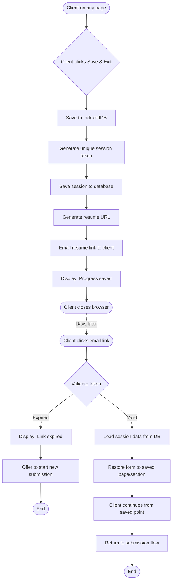
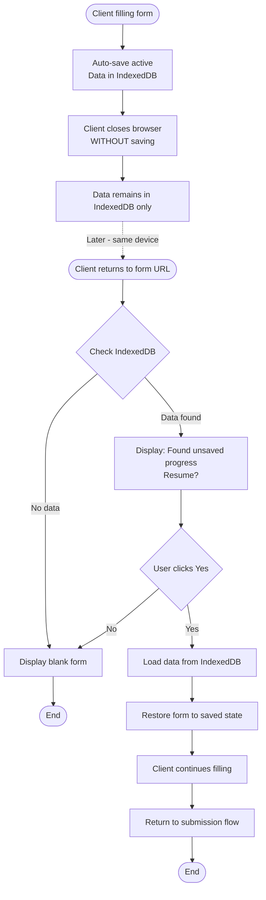
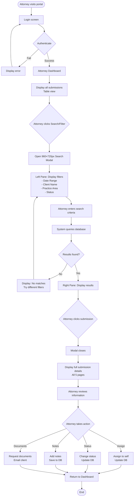
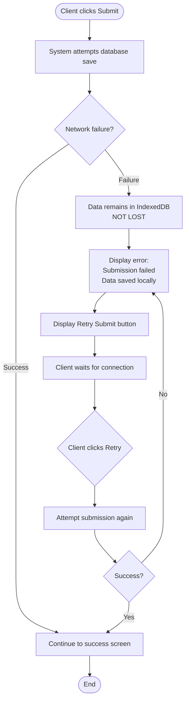
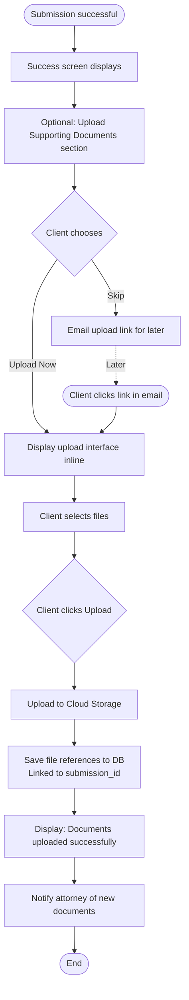

# Client Intake System - Visual Flow Diagrams (Mermaid)

## Diagram 1: Client Intake Happy Path

```mermaid
flowchart TD
    Start([Client receives form link]) --> Landing[Landing Page: Intake Form]
    Landing --> Page1[Page 1/5 - 5 Sections]
    Page1 --> Fill1[Client fills fields]
    Fill1 --> AutoSave1[Auto-save to IndexedDB]
    AutoSave1 --> Next1{Client clicks Next}
    Next1 --> Page2[Page 2/5]
    Page2 --> Fill2[Client fills fields]
    Fill2 --> AutoSave2[Auto-save to IndexedDB]
    AutoSave2 --> Next2{Client clicks Next}
    Next2 --> Page3[Page 3/5]
    Page3 --> Fill3[Client fills fields]
    Fill3 --> AutoSave3[Auto-save to IndexedDB]
    AutoSave3 --> Next3{Client clicks Next}
    Next3 --> Page4[Page 4/5]
    Page4 --> Fill4[Client fills fields]
    Fill4 --> AutoSave4[Auto-save to IndexedDB]
    AutoSave4 --> Next4{Client clicks Next}
    Next4 --> Page5[Page 5/5 - Final]
    Page5 --> Fill5[Client fills final fields]
    Fill5 --> Submit{Client clicks Submit}
    Submit --> Validate{Validate all fields}
    Validate -->|Errors found| ShowErrors[Display error messages<br/>Scroll to first error]
    ShowErrors --> FixErrors[Client fixes errors]
    FixErrors --> Submit
    Validate -->|Valid| SaveDB[Save to database]
    SaveDB --> CreateRecord[Create intake_submission record]
    CreateRecord --> CreatePages[Create 5 page_data records]
    CreatePages --> ConfNum[Generate confirmation number]
    ConfNum --> Email[Send confirmation email]
    Email --> Success[Display success screen]
    Success --> Upload[Optional: Upload documents]
    Upload --> End([Submission complete])
```

## Diagram 2: Save & Resume Flow

## Diagram 3: Auto-Save Recovery Flow

## Diagram 4: Attorney Portal - Search & Review

## Diagram 5: Network Failure & Retry

## Diagram 6: Document Upload Flow

---

## How to Use These Diagrams

### Option 1: Mermaid Live Editor
1. Copy any diagram code block
2. Go to https://mermaid.live
3. Paste the code
4. Export as PNG/SVG

### Option 2: Import to Figma
1. Use a Mermaid plugin for Figma
2. Or export from Mermaid Live as SVG
3. Import SVG into Figma for styling

### Option 3: Lucidchart/Miro
1. Recreate manually using the text flows as reference
2. Use the diagram structure as a guide

### Option 4: Include in Documentation
- These Mermaid diagrams render automatically in:
  - GitHub README files
  - Notion (with Mermaid support)
  - Many documentation tools

---

## Visual Design Recommendations

### Color Coding:
- **Client actions**: Blue rectangles
- **System processes**: Green rectangles
- **Decision points**: Yellow diamonds
- **Error states**: Red rounded rectangles
- **Database operations**: Purple cylinders
- **External events** (email, etc.): Orange parallelograms

### Swim Lanes:
Consider creating swim lane diagrams with:
- Lane 1: Client
- Lane 2: Browser (IndexedDB/localStorage)
- Lane 3: Backend System
- Lane 4: Database
- Lane 5: Attorney

This makes it clearer what happens where.
