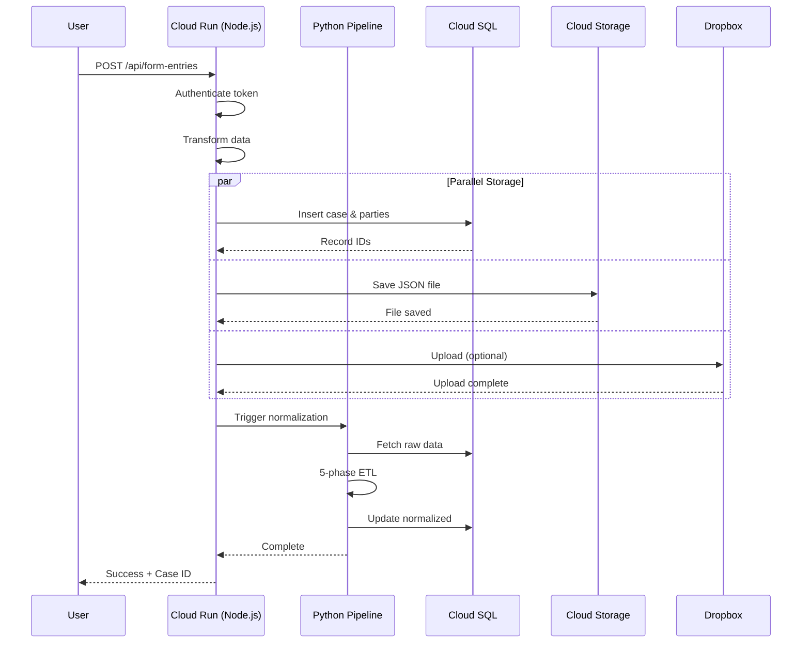

# GCP Cloud Run Deployment Guide
## Legal Form Application - Complete Deployment Documentation

**Version:** 2.0
**Last Updated:** October 23, 2025
**Status:** ✅ Production Ready

---

## Table of Contents

1. [Overview](#overview)
2. [Prerequisites](#prerequisites)
3. [Architecture](#architecture)
4. [Phase 1: Security Foundation](#phase-1-security-foundation)
5. [Phase 2: Database Setup](#phase-2-database-setup)
6. [Phase 3: Network Infrastructure](#phase-3-network-infrastructure)
7. [Phase 4: Python Pipeline Service](#phase-4-python-pipeline-service)
8. [Phase 5: Node.js API Service](#phase-5-nodejs-api-service)
9. [Phase 6: Cloud Storage Setup](#phase-6-cloud-storage-setup)
10. [Phase 7: Dropbox Integration](#phase-7-dropbox-integration)
11. [Validation & Testing](#validation--testing)
12. [Troubleshooting](#troubleshooting)
13. [Rollback Procedures](#rollback-procedures)
14. [Maintenance & Operations](#maintenance--operations)

---

## Overview

This guide provides a complete, production-ready deployment of the Legal Form Application to Google Cloud Platform (GCP) using Cloud Run. The deployment follows a phased approach with validation checkpoints at each stage.

### What You'll Deploy

- **Node.js Express API** - Form submission and management
- **Python FastAPI Pipeline** - Data normalization and processing
- **PostgreSQL Database** - Cloud SQL instance
- **Cloud Storage** - Persistent file storage
- **Dropbox Integration** - Optional cloud backup
- **VPC Networking** - Secure service communication
- **Secrets Manager** - Secure credential storage

### Deployment Principles

1. **Validate Early, Validate Often** - Each phase has explicit go/no-go checkpoints
2. **Fail Fast** - Stop immediately if validation fails and execute rollback
3. **Incremental Progress** - Each phase builds on validated previous work
4. **Rollback Ready** - Every phase has a documented rollback procedure

### Time Estimate

| Phase | Duration | Complexity |
|-------|----------|------------|
| Phase 1: Security | 15-20 min | Low |
| Phase 2: Database | 20-30 min | Medium |
| Phase 3: Network | 10-15 min | Low |
| Phase 4: Python Service | 20-30 min | Medium |
| Phase 5: Node.js Service | 20-30 min | Medium |
| Phase 6: Cloud Storage | 10-15 min | Low |
| Phase 7: Dropbox | 10-15 min | Low |
| **Total** | **2-3 hours** | **Medium** |

---

## Prerequisites

### Required Accounts & Tools

- [x] Google Cloud Platform account with billing enabled
- [x] GCP Project created (e.g., `docmosis-tornado`)
- [x] `gcloud` CLI installed and configured
- [x] Docker installed (for local testing)
- [x] PostgreSQL client (for database operations)
- [x] Git repository with latest code

### Required Permissions

Your GCP account needs these IAM roles:

```bash
# Check your current permissions
gcloud projects get-iam-policy YOUR_PROJECT_ID \
  --flatten="bindings[].members" \
  --filter="bindings.members:user:YOUR_EMAIL"
```

**Required Roles:**
- `roles/editor` or `roles/owner`
- `roles/cloudsql.admin`
- `roles/run.admin`
- `roles/secretmanager.admin`
- `roles/storage.admin`

### Enable Required APIs

```bash
# Set your project
gcloud config set project YOUR_PROJECT_ID

# Enable all required APIs
gcloud services enable \
  run.googleapis.com \
  sql-component.googleapis.com \
  sqladmin.googleapis.com \
  compute.googleapis.com \
  vpcaccess.googleapis.com \
  secretmanager.googleapis.com \
  cloudresourcemanager.googleapis.com \
  storage.googleapis.com

# Verify APIs are enabled
gcloud services list --enabled
```

### Environment Setup

Create a local `.env` file for reference:

```bash
# Copy example environment file
cp .env.example .env.gcp

# Edit with your values
nano .env.gcp
```

**.env.gcp Example:**
```env
# GCP Configuration
PROJECT_ID=docmosis-tornado
REGION=us-central1
ZONE=us-central1-a

# Database
DB_INSTANCE_NAME=legal-forms-db
DB_NAME=legal_forms_db
DB_USER=app-user
DB_PASSWORD=GENERATE_SECURE_PASSWORD

# Application
ACCESS_TOKEN=GENERATE_SECURE_TOKEN
NODE_ENV=production

# Docmosis
DOCMOSIS_ENDPOINT=http://10.128.0.3:8080/api/render
DOCMOSIS_KEY=YOUR_DOCMOSIS_KEY

# Dropbox (optional)
DROPBOX_ACCESS_TOKEN=YOUR_DROPBOX_TOKEN
DROPBOX_ENABLED=true
DROPBOX_BASE_PATH=/Apps/LegalFormApp
```

### Pre-Deployment Backup

**CRITICAL:** Back up your local database before proceeding:

```bash
# Create backup directory
mkdir -p backups

# Export local database
pg_dump -U YOUR_LOCAL_USER -h localhost legal_forms_db > backups/backup_$(date +%Y%m%d_%H%M%S).sql

# Verify backup
ls -lh backups/
```

---

## Architecture

### Production Architecture Diagram

```
┌─────────────────────────────────────────────────────────────┐
│                      Internet (HTTPS)                       │
└───────────────────────┬─────────────────────────────────────┘
                        │
                        ▼
┌─────────────────────────────────────────────────────────────┐
│                   Google Cloud Platform                      │
│                                                               │
│  ┌────────────────────────────────────────────────────────┐ │
│  │                  Cloud Run Services                    │ │
│  │                                                          │ │
│  │  ┌─────────────────────┐    ┌──────────────────────┐  │ │
│  │  │  Node.js Express    │    │  Python FastAPI      │  │ │
│  │  │  (node-server)      │───▶│  (python-pipeline)   │  │ │
│  │  │  Port: 3000         │    │  Port: 8000          │  │ │
│  │  │  • Form API         │    │  • Normalization     │  │ │
│  │  │  • Authentication   │    │  • 5-Phase ETL       │  │ │
│  │  └──────────┬──────────┘    └──────────┬───────────┘  │ │
│  │             │                            │              │ │
│  └─────────────┼────────────────────────────┼──────────────┘ │
│                │                            │                │
│                ▼                            ▼                │
│  ┌─────────────────────────────────────────────────────────┐│
│  │               Serverless VPC Connector                  ││
│  │               (us-central1 / 10.8.0.0/28)              ││
│  └─────────────────────────────────────────────────────────┘│
│                │                            │                │
│   ┌────────────▼──────────┐    ┌───────────▼────────────┐  │
│   │  Cloud SQL (Postgres) │    │  Cloud Storage         │  │
│   │  legal-forms-db       │    │  form-submissions      │  │
│   │  • Cases table        │    │  • JSON files          │  │
│   │  • Parties table      │    │  • 30-day lifecycle    │  │
│   │  • Issues table       │    └────────────────────────┘  │
│   └───────────────────────┘                                 │
│                │                                             │
│   ┌────────────▼──────────┐                                 │
│   │  Secret Manager       │                                 │
│   │  • DB credentials     │                                 │
│   │  • API tokens         │                                 │
│   │  • Docmosis keys      │                                 │
│   └───────────────────────┘                                 │
└─────────────────────────────────────────────────────────────┘
                        │
                        ▼
          ┌─────────────────────────┐
          │  Dropbox Cloud Storage  │
          │  (Optional Backup)      │
          └─────────────────────────┘
```

### Service Communication Flow



---

## Phase 1: Security Foundation

**Duration:** 15-20 minutes
**Purpose:** Create secure storage for credentials and API keys

### 1.1 Create GCP Secrets

```bash
# Navigate to project directory
cd /path/to/Lipton\ Webserver

# Set project context
export PROJECT_ID=docmosis-tornado
gcloud config set project $PROJECT_ID

# Generate secure passwords
export DB_PASSWORD=$(openssl rand -base64 32)
export ACCESS_TOKEN=$(openssl rand -hex 32)

echo "Generated Credentials (SAVE THESE):"
echo "DB_PASSWORD: $DB_PASSWORD"
echo "ACCESS_TOKEN: $ACCESS_TOKEN"

# Create database secrets
echo -n "app-user" | gcloud secrets create db-user \
  --data-file=- \
  --replication-policy="automatic"

echo -n "$DB_PASSWORD" | gcloud secrets create db-password \
  --data-file=- \
  --replication-policy="automatic"

# Create application secrets
echo -n "$ACCESS_TOKEN" | gcloud secrets create access-token \
  --data-file=- \
  --replication-policy="automatic"

# Create Docmosis secret (use your actual key)
echo -n "YOUR_DOCMOSIS_KEY_HERE" | gcloud secrets create docmosis-key \
  --data-file=- \
  --replication-policy="automatic"

# Optional: Create Dropbox secret
echo -n "YOUR_DROPBOX_TOKEN" | gcloud secrets create dropbox-token \
  --data-file=- \
  --replication-policy="automatic"
```

### 1.2 Validation Checkpoint ✓

```bash
# List all secrets
echo "=== Checking Secrets ==="
gcloud secrets list

# Verify each secret has a version
gcloud secrets versions access latest --secret=db-user
gcloud secrets versions access latest --secret=db-password
gcloud secrets versions access latest --secret=access-token
gcloud secrets versions access latest --secret=docmosis-key

# Optional: verify Dropbox
# gcloud secrets versions access latest --secret=dropbox-token
```

**Expected Output:**
- All secrets listed in `gcloud secrets list`
- Each secret returns its stored value
- No permission or access errors

**Success Criteria:**
- ✅ All required secrets created
- ✅ Secrets accessible via latest version
- ✅ Values match expected format

**Go/No-Go Decision:**
- **GO** ✅ All secrets exist and accessible → Proceed to Phase 2
- **NO-GO** ❌ Any secret missing → Review and fix

### 1.3 Rollback Procedure

```bash
# Delete all secrets to start over
gcloud secrets delete db-user --quiet
gcloud secrets delete db-password --quiet
gcloud secrets delete access-token --quiet
gcloud secrets delete docmosis-key --quiet
gcloud secrets delete dropbox-token --quiet
```

---

## Phase 2: Database Setup

**Duration:** 20-30 minutes
**Dependencies:** Phase 1 complete
**Purpose:** Deploy PostgreSQL Cloud SQL instance with schema

### 2.1 Create Cloud SQL Instance

```bash
# Create instance (takes 5-10 minutes)
gcloud sql instances create legal-forms-db \
  --database-version=POSTGRES_15 \
  --tier=db-f1-micro \
  --region=us-central1 \
  --root-password=$(gcloud secrets versions access latest --secret=db-password) \
  --storage-size=10GB \
  --storage-type=SSD \
  --storage-auto-increase \
  --backup-start-time=03:00 \
  --maintenance-window-day=SUN \
  --maintenance-window-hour=04 \
  --maintenance-release-channel=production \
  --availability-type=ZONAL \
  --enable-bin-log

# Wait for instance to be ready
echo "Waiting for instance to be ready..."
gcloud sql instances describe legal-forms-db --format="value(state)"
```

**Wait until output shows:** `RUNNABLE`

### 2.2 Create Database and User

```bash
# Create database
gcloud sql databases create legal_forms_db \
  --instance=legal-forms-db \
  --charset=UTF8 \
  --collation=en_US.UTF8

# Create application user
gcloud sql users create app-user \
  --instance=legal-forms-db \
  --password=$(gcloud secrets versions access latest --secret=db-password)

# Grant permissions
gcloud sql users set-password app-user \
  --instance=legal-forms-db \
  --password=$(gcloud secrets versions access latest --secret=db-password)
```

### 2.3 Import Schema

#### Option A: Using Cloud SQL Import (Recommended)

```bash
# Create temporary Cloud Storage bucket
export BUCKET_NAME=${PROJECT_ID}-db-migration
gsutil mb -l us-central1 gs://${BUCKET_NAME}

# Export schema from local database
pg_dump -U YOUR_LOCAL_USER -h localhost legal_forms_db \
  --schema-only \
  --no-owner \
  --no-acl \
  > schema_no_owner.sql

# Upload to Cloud Storage
gsutil cp schema_no_owner.sql gs://${BUCKET_NAME}/

# Import to Cloud SQL
gcloud sql import sql legal-forms-db \
  gs://${BUCKET_NAME}/schema_no_owner.sql \
  --database=legal_forms_db \
  --user=postgres

# Clean up bucket
gsutil rm gs://${BUCKET_NAME}/schema_no_owner.sql
gsutil rb gs://${BUCKET_NAME}
```

#### Option B: Using Direct Connection (Alternative)

```bash
# Connect to Cloud SQL
gcloud sql connect legal-forms-db --user=postgres --database=legal_forms_db

# In psql, run schema creation
\i schema_no_owner.sql

# Grant permissions to app-user
GRANT ALL PRIVILEGES ON ALL TABLES IN SCHEMA public TO "app-user";
GRANT ALL PRIVILEGES ON ALL SEQUENCES IN SCHEMA public TO "app-user";
GRANT USAGE ON SCHEMA public TO "app-user";

# Exit
\q
```

### 2.4 Validation Checkpoint ✓

```bash
# Check instance status
echo "=== Instance Status ==="
gcloud sql instances describe legal-forms-db --format="value(state)"

# List databases
echo "=== Databases ==="
gcloud sql databases list --instance=legal-forms-db

# List users
echo "=== Users ==="
gcloud sql users list --instance=legal-forms-db

# Connect and verify schema
echo "=== Connecting to verify schema ==="
gcloud sql connect legal-forms-db --user=app-user --database=legal_forms_db
```

**In psql session, run:**
```sql
-- List all tables
\dt

-- Expected output: cases, parties, party_issue_selections

-- Check table structure
\d cases
\d parties
\d party_issue_selections

-- Verify permissions
SELECT has_table_privilege('app-user', 'cases', 'INSERT');
SELECT has_table_privilege('app-user', 'parties', 'INSERT');

-- Exit
\q
```

**Success Criteria:**
- ✅ Instance state is `RUNNABLE`
- ✅ Database `legal_forms_db` exists
- ✅ User `app-user` exists
- ✅ All three tables exist
- ✅ app-user has INSERT/SELECT/UPDATE/DELETE permissions

**Common Issues:**

| Issue | Solution |
|-------|----------|
| "Instance not found" | Wait 5-10 min for creation to complete |
| "Authentication failed" | Verify password secret is correct |
| "Permission denied" | Run GRANT statements as postgres user |
| "Tables don't exist" | Re-run schema import |

### 2.5 Rollback Procedure

```bash
# Delete instance (WARNING: destroys all data)
gcloud sql instances delete legal-forms-db --quiet

# Or just delete database to start over
gcloud sql databases delete legal_forms_db --instance=legal-forms-db --quiet
```

---

## Phase 3: Network Infrastructure

**Duration:** 10-15 minutes
**Dependencies:** None
**Purpose:** Create VPC connector for secure Cloud Run ↔ Cloud SQL communication

### 3.1 Create VPC Connector

```bash
# Create Serverless VPC Access connector
gcloud compute networks vpc-access connectors create cloud-run-connector \
  --region=us-central1 \
  --network=default \
  --range=10.8.0.0/28 \
  --min-instances=2 \
  --max-instances=3 \
  --machine-type=e2-micro

# Wait for creation (3-5 minutes)
echo "Waiting for connector to be ready..."
gcloud compute networks vpc-access connectors describe cloud-run-connector \
  --region=us-central1 \
  --format="value(state)"
```

**Wait until output shows:** `READY`

### 3.2 Validation Checkpoint ✓

```bash
# Check connector status
echo "=== VPC Connector Status ==="
gcloud compute networks vpc-access connectors describe cloud-run-connector \
  --region=us-central1

# Verify IP range
gcloud compute networks vpc-access connectors describe cloud-run-connector \
  --region=us-central1 \
  --format="value(ipCidrRange)"
```

**Expected Output:**
- State: `READY`
- Network: `default`
- IP CIDR: `10.8.0.0/28`

**Success Criteria:**
- ✅ Connector state is `READY`
- ✅ Network is `default`
- ✅ IP range does not conflict with Cloud SQL

### 3.3 Rollback Procedure

```bash
# Delete VPC connector
gcloud compute networks vpc-access connectors delete cloud-run-connector \
  --region=us-central1 \
  --quiet
```

---

## Phase 4: Python Pipeline Service

**Duration:** 20-30 minutes
**Dependencies:** Phase 2, Phase 3 complete
**Purpose:** Deploy Python FastAPI normalization service

### 4.1 Prepare Python Service

```bash
# Navigate to Python service directory
cd server/python-pipeline

# Verify Dockerfile exists
ls -la Dockerfile

# Test Docker build locally (optional)
docker build -t python-pipeline:local .
```

### 4.2 Build and Deploy

```bash
# Build and deploy to Cloud Run
gcloud run deploy python-pipeline \
  --source . \
  --region=us-central1 \
  --platform=managed \
  --memory=512Mi \
  --cpu=1 \
  --timeout=300 \
  --concurrency=10 \
  --min-instances=0 \
  --max-instances=5 \
  --port=8000 \
  --allow-unauthenticated \
  --vpc-connector=cloud-run-connector \
  --vpc-egress=private-ranges-only \
  --set-env-vars="NODE_ENV=production" \
  --set-secrets="DB_USER=db-user:latest,DB_PASSWORD=db-password:latest" \
  --set-env-vars="DB_HOST=/cloudsql/docmosis-tornado:us-central1:legal-forms-db,DB_NAME=legal_forms_db,DB_PORT=5432"

# Get service URL
export PYTHON_URL=$(gcloud run services describe python-pipeline \
  --region=us-central1 \
  --format="value(status.url)")

echo "Python Pipeline URL: $PYTHON_URL"
```

### 4.3 Validation Checkpoint ✓

```bash
# Test health endpoint
echo "=== Testing Health Endpoint ==="
curl -s "$PYTHON_URL/health" | jq .

# Expected: {"status": "healthy"}

# Test database connectivity
echo "=== Testing Database Connection ==="
curl -s "$PYTHON_URL/api/health/db" | jq .

# Expected: {"database": "connected", ...}

# Check service logs
echo "=== Checking Logs ==="
gcloud run services logs read python-pipeline \
  --region=us-central1 \
  --limit=20
```

**Success Criteria:**
- ✅ Service deployed successfully
- ✅ Health endpoint returns 200
- ✅ Database health check passes
- ✅ No errors in logs

### 4.4 Rollback Procedure

```bash
# Delete service
gcloud run services delete python-pipeline \
  --region=us-central1 \
  --quiet
```

---

## Phase 5: Node.js API Service

**Duration:** 20-30 minutes
**Dependencies:** Phase 1, 2, 3, 4 complete
**Purpose:** Deploy main Express API service

### 5.1 Prepare Node.js Service

```bash
# Return to project root
cd /path/to/Lipton\ Webserver

# Build production assets
npm run build:prod

# Verify Dockerfile
ls -la Dockerfile
```

### 5.2 Build and Deploy

```bash
# Build and deploy to Cloud Run
gcloud run deploy node-server \
  --source . \
  --region=us-central1 \
  --platform=managed \
  --memory=512Mi \
  --cpu=1 \
  --timeout=60 \
  --concurrency=80 \
  --min-instances=0 \
  --max-instances=10 \
  --port=3000 \
  --allow-unauthenticated \
  --vpc-connector=cloud-run-connector \
  --vpc-egress=private-ranges-only \
  --set-env-vars="NODE_ENV=production,PIPELINE_URL=${PYTHON_URL}" \
  --set-secrets="ACCESS_TOKEN=access-token:latest,DB_USER=db-user:latest,DB_PASSWORD=db-password:latest,DOCMOSIS_KEY=docmosis-key:latest" \
  --set-env-vars="DB_HOST=/cloudsql/docmosis-tornado:us-central1:legal-forms-db,DB_NAME=legal_forms_db,DB_PORT=5432,DOCMOSIS_ENDPOINT=http://10.128.0.3:8080/api/render"

# Get service URL
export NODE_URL=$(gcloud run services describe node-server \
  --region=us-central1 \
  --format="value(status.url)")

echo "Node.js Service URL: $NODE_URL"
echo "Save this URL for testing!"
```

### 5.3 Configure Service-to-Service Authentication

```bash
# Allow Node.js service to invoke Python service
export PROJECT_NUMBER=$(gcloud projects describe $PROJECT_ID --format="value(projectNumber)")

gcloud run services add-iam-policy-binding python-pipeline \
  --region=us-central1 \
  --member="serviceAccount:${PROJECT_NUMBER}-compute@developer.gserviceaccount.com" \
  --role="roles/run.invoker"
```

### 5.4 Validation Checkpoint ✓

```bash
# Save access token for testing
export ACCESS_TOKEN=$(gcloud secrets versions access latest --secret=access-token)

# Test health endpoint (public)
echo "=== Testing Health Endpoint ==="
curl -s "$NODE_URL/health" | jq .

# Test authenticated API endpoint
echo "=== Testing Form Entries API ==="
curl -s -H "Authorization: Bearer $ACCESS_TOKEN" "$NODE_URL/api/form-entries" | jq .

# Test form submission
echo "=== Testing Form Submission ==="
curl -X POST "$NODE_URL/api/form-entries" \
  -H "Content-Type: application/json" \
  -H "Authorization: Bearer $ACCESS_TOKEN" \
  -d '{
    "caseNumber": "TEST-001",
    "caseTitle": "Deployment Test",
    "plaintiffName": "Test Plaintiff",
    "streetAddress": "123 Test St"
  }' | jq .

# Check service logs
echo "=== Checking Logs ==="
gcloud run services logs read node-server \
  --region=us-central1 \
  --limit=30
```

**Success Criteria:**
- ✅ Health endpoint returns 200
- ✅ Form entries API returns data (empty array initially)
- ✅ Form submission returns success with case ID
- ✅ No authentication errors in logs

### 5.5 Rollback Procedure

```bash
# Delete service
gcloud run services delete node-server \
  --region=us-central1 \
  --quiet
```

---

## Phase 6: Cloud Storage Setup

**Duration:** 10-15 minutes
**Dependencies:** Phase 5 complete
**Purpose:** Configure persistent file storage for form submissions

### 6.1 Create Storage Bucket

```bash
# Create bucket for form submissions
gsutil mb -l us-central1 -c STANDARD gs://${PROJECT_ID}-form-submissions

# Set lifecycle policy for 30-day retention
cat > lifecycle.json <<EOF
{
  "lifecycle": {
    "rule": [
      {
        "action": {
          "type": "Delete"
        },
        "condition": {
          "age": 30
        }
      }
    ]
  }
}
EOF

gsutil lifecycle set lifecycle.json gs://${PROJECT_ID}-form-submissions

# Verify lifecycle policy
gsutil lifecycle get gs://${PROJECT_ID}-form-submissions
```

### 6.2 Configure Service Permissions

```bash
# Grant Cloud Run service account access to bucket
gsutil iam ch \
  serviceAccount:${PROJECT_NUMBER}-compute@developer.gserviceaccount.com:objectCreator \
  gs://${PROJECT_ID}-form-submissions

gsutil iam ch \
  serviceAccount:${PROJECT_NUMBER}-compute@developer.gserviceaccount.com:objectViewer \
  gs://${PROJECT_ID}-form-submissions
```

### 6.3 Update Node.js Service

```bash
# Add Cloud Storage bucket environment variable
gcloud run services update node-server \
  --region=us-central1 \
  --set-env-vars="GCS_BUCKET=${PROJECT_ID}-form-submissions"
```

### 6.4 Validation Checkpoint ✓

```bash
# Test file upload via API
echo "=== Testing File Upload ==="
curl -X POST "$NODE_URL/api/form-entries" \
  -H "Content-Type: application/json" \
  -H "Authorization: Bearer $ACCESS_TOKEN" \
  -d '{
    "caseNumber": "STORAGE-TEST-001",
    "caseTitle": "Storage Test",
    "plaintiffName": "Storage Validator",
    "streetAddress": "456 Cloud St"
  }' | jq .

# Verify file in bucket
echo "=== Checking Cloud Storage ==="
gsutil ls gs://${PROJECT_ID}-form-submissions/

# Download and verify file
gsutil cat gs://${PROJECT_ID}-form-submissions/form-entry-STORAGE-TEST-001.json | jq .
```

**Success Criteria:**
- ✅ Bucket created successfully
- ✅ Lifecycle policy applied
- ✅ Form submission creates file in bucket
- ✅ File is readable and valid JSON

---

## Phase 7: Dropbox Integration

**Duration:** 10-15 minutes
**Dependencies:** Phase 5 complete
**Purpose:** Enable optional cloud backup to Dropbox

### 7.1 Configure Dropbox Secret

```bash
# Create Dropbox secret if not already done
echo -n "YOUR_DROPBOX_ACCESS_TOKEN" | gcloud secrets create dropbox-token \
  --data-file=- \
  --replication-policy="automatic"

# Update Node.js service with Dropbox configuration
gcloud run services update node-server \
  --region=us-central1 \
  --set-secrets="DROPBOX_ACCESS_TOKEN=dropbox-token:latest" \
  --set-env-vars="DROPBOX_ENABLED=true,DROPBOX_BASE_PATH=/Apps/LegalFormApp"
```

### 7.2 Validation Checkpoint ✓

```bash
# Test Dropbox integration
echo "=== Testing Dropbox Upload ==="
curl -X POST "$NODE_URL/api/form-entries" \
  -H "Content-Type: application/json" \
  -H "Authorization: Bearer $ACCESS_TOKEN" \
  -d '{
    "caseNumber": "DROPBOX-TEST-001",
    "caseTitle": "Dropbox Test",
    "plaintiffName": "Dropbox Validator",
    "streetAddress": "789 Dropbox Dr"
  }' | jq .

# Check logs for Dropbox upload confirmation
gcloud run services logs read node-server \
  --region=us-central1 \
  --limit=20 \
  | grep -i dropbox
```

**Success Criteria:**
- ✅ Form submission succeeds
- ✅ Logs show Dropbox upload success
- ✅ File appears in Dropbox folder structure
- ✅ Shared link generated

**Optional: Disable Dropbox**
```bash
gcloud run services update node-server \
  --region=us-central1 \
  --set-env-vars="DROPBOX_ENABLED=false"
```

---

## Validation & Testing

### End-to-End Testing

Run this comprehensive test script:

```bash
#!/bin/bash
# save as: test-deployment.sh

# Configuration
export NODE_URL=$(gcloud run services describe node-server \
  --region=us-central1 --format="value(status.url)")
export ACCESS_TOKEN=$(gcloud secrets versions access latest --secret=access-token)

echo "========================================="
echo "DEPLOYMENT VALIDATION TEST SUITE"
echo "========================================="
echo ""

# Test 1: Health Checks
echo "Test 1: Health Endpoints"
echo "-------------------------"
curl -s "$NODE_URL/health" | jq -r '.status' | grep -q "healthy" && echo "✅ Node.js health" || echo "❌ Node.js health"

export PYTHON_URL=$(gcloud run services describe python-pipeline \
  --region=us-central1 --format="value(status.url)")
curl -s "$PYTHON_URL/health" | jq -r '.status' | grep -q "healthy" && echo "✅ Python health" || echo "❌ Python health"

# Test 2: Database Connectivity
echo ""
echo "Test 2: Database Connectivity"
echo "------------------------------"
curl -s "$NODE_URL/api/health/db" | jq -r '.database' | grep -q "connected" && echo "✅ Database connection" || echo "❌ Database connection"

# Test 3: Authentication
echo ""
echo "Test 3: Authentication"
echo "----------------------"
curl -s -o /dev/null -w "%{http_code}" "$NODE_URL/api/form-entries" | grep -q "401" && echo "✅ Auth required (unauthenticated)" || echo "❌ Auth check failed"
curl -s -H "Authorization: Bearer $ACCESS_TOKEN" "$NODE_URL/api/form-entries" -o /dev/null -w "%{http_code}" | grep -q "200" && echo "✅ Auth working (authenticated)" || echo "❌ Auth failed"

# Test 4: Form Submission
echo ""
echo "Test 4: Form Submission"
echo "-----------------------"
RESPONSE=$(curl -s -X POST "$NODE_URL/api/form-entries" \
  -H "Content-Type: application/json" \
  -H "Authorization: Bearer $ACCESS_TOKEN" \
  -d '{
    "caseNumber": "E2E-TEST-'$(date +%s)'",
    "caseTitle": "End-to-End Validation Test",
    "plaintiffName": "Test Validator",
    "streetAddress": "123 Test Avenue"
  }')

echo "$RESPONSE" | jq -r '.success' | grep -q "true" && echo "✅ Form submission" || echo "❌ Form submission"

CASE_ID=$(echo "$RESPONSE" | jq -r '.dbCaseId')
echo "   Case ID: $CASE_ID"

# Test 5: Data Retrieval
echo ""
echo "Test 5: Data Retrieval"
echo "----------------------"
curl -s -H "Authorization: Bearer $ACCESS_TOKEN" "$NODE_URL/api/form-entries/$CASE_ID" -o /dev/null -w "%{http_code}" | grep -q "200" && echo "✅ Case retrieval" || echo "❌ Case retrieval"

# Test 6: Cloud Storage
echo ""
echo "Test 6: Cloud Storage"
echo "---------------------"
gsutil ls gs://${PROJECT_ID}-form-submissions/ | grep -q "form-entry" && echo "✅ Files in GCS" || echo "❌ No files in GCS"

# Test 7: Pipeline Integration
echo ""
echo "Test 7: Pipeline Integration"
echo "----------------------------"
curl -s "$PYTHON_URL/api/health/db" | jq -r '.database' | grep -q "connected" && echo "✅ Pipeline DB connection" || echo "❌ Pipeline DB connection"

echo ""
echo "========================================="
echo "VALIDATION COMPLETE"
echo "========================================="
```

Run the test:
```bash
chmod +x test-deployment.sh
./test-deployment.sh
```

### Manual UI Testing

1. **Open the application:**
   ```bash
   echo "Visit: $NODE_URL"
   ```

2. **Fill out the form** with test data

3. **Submit and verify:**
   - Success page appears
   - Case ID is displayed
   - Database record created
   - File saved to Cloud Storage
   - (Optional) File uploaded to Dropbox

### Performance Testing

```bash
# Install Apache Bench (if needed)
# brew install httpd (macOS)

# Test API performance
ab -n 100 -c 10 \
  -H "Authorization: Bearer $ACCESS_TOKEN" \
  "$NODE_URL/api/form-entries"

# Expected results:
# - Requests per second: >50
# - Mean time per request: <200ms
# - Failed requests: 0
```

---

## Troubleshooting

### Common Deployment Issues

#### Issue: "Permission Denied" During Deployment

**Symptoms:**
- `ERROR: (gcloud.run.deploy) User ... does not have permission`

**Solution:**
```bash
# Check your IAM roles
gcloud projects get-iam-policy $PROJECT_ID \
  --flatten="bindings[].members" \
  --filter="bindings.members:user:YOUR_EMAIL"

# Add required role
gcloud projects add-iam-policy-binding $PROJECT_ID \
  --member="user:YOUR_EMAIL" \
  --role="roles/run.admin"
```

#### Issue: Cloud SQL Connection Timeout

**Symptoms:**
- Health checks fail with "Connection refused"
- Logs show `ECONNREFUSED` or timeout errors

**Solution:**
```bash
# Verify VPC connector is READY
gcloud compute networks vpc-access connectors describe cloud-run-connector \
  --region=us-central1

# Check Cloud SQL instance is RUNNABLE
gcloud sql instances describe legal-forms-db --format="value(state)"

# Verify Cloud Run has correct DB_HOST format
gcloud run services describe node-server \
  --region=us-central1 \
  --format="value(spec.template.spec.containers[0].env)"

# Correct format: /cloudsql/PROJECT_ID:REGION:INSTANCE_NAME
```

#### Issue: Authentication Errors (401 Unauthorized)

**Symptoms:**
- All API calls return 401
- Token is correct but still fails

**Solution:**
```bash
# Verify secret is accessible
gcloud secrets versions access latest --secret=access-token

# Check service has access to secret
gcloud run services describe node-server \
  --region=us-central1 \
  --format="yaml(spec.template.spec.containers[0].env)"

# Update service with correct secret
gcloud run services update node-server \
  --region=us-central1 \
  --set-secrets="ACCESS_TOKEN=access-token:latest"
```

#### Issue: Out of Memory Errors

**Symptoms:**
- Service crashes under load
- Logs show `JavaScript heap out of memory`

**Solution:**
```bash
# Increase memory allocation
gcloud run services update node-server \
  --region=us-central1 \
  --memory=1Gi

# Or scale down concurrency
gcloud run services update node-server \
  --region=us-central1 \
  --concurrency=40
```

#### Issue: Dropbox Upload Failures

**Symptoms:**
- Form submission succeeds but no Dropbox file
- Logs show Dropbox API errors

**Solution:**
```bash
# Test Dropbox token locally
node test-dropbox-connection.js

# Verify token in secret
gcloud secrets versions access latest --secret=dropbox-token

# Check for expired token (tokens can expire after 90 days)
# Generate new long-lived token from Dropbox App Console

# Update secret with new token
echo -n "NEW_TOKEN_HERE" | gcloud secrets versions add dropbox-token --data-file=-

# Restart service to pick up new token
gcloud run services update node-server \
  --region=us-central1 \
  --update-env-vars="FORCE_RESTART=$(date +%s)"
```

### Debugging Commands

```bash
# View real-time logs
gcloud run services logs tail node-server --region=us-central1

# View specific error logs
gcloud run services logs read node-server \
  --region=us-central1 \
  --filter="severity>=ERROR" \
  --limit=50

# Check service configuration
gcloud run services describe node-server \
  --region=us-central1 \
  --format=yaml

# Test database connection from Cloud Shell
gcloud sql connect legal-forms-db --user=app-user --database=legal_forms_db

# Monitor Cloud Run metrics
gcloud monitoring time-series list \
  --filter='resource.type="cloud_run_revision"' \
  --format=json
```

---

## Rollback Procedures

### Emergency Rollback (All Services)

If deployment fails critically, rollback to previous state:

```bash
#!/bin/bash
# save as: emergency-rollback.sh

echo "⚠️  EMERGENCY ROLLBACK - This will destroy deployed resources"
read -p "Are you sure? (type 'yes' to continue): " confirm

if [ "$confirm" != "yes" ]; then
  echo "Rollback cancelled"
  exit 0
fi

# Delete Cloud Run services
echo "Deleting Cloud Run services..."
gcloud run services delete node-server --region=us-central1 --quiet
gcloud run services delete python-pipeline --region=us-central1 --quiet

# Delete VPC connector
echo "Deleting VPC connector..."
gcloud compute networks vpc-access connectors delete cloud-run-connector \
  --region=us-central1 --quiet

# Delete Cloud SQL instance (optional - comment out to preserve data)
# echo "Deleting Cloud SQL instance..."
# gcloud sql instances delete legal-forms-db --quiet

# Delete secrets (optional - comment out to preserve)
# echo "Deleting secrets..."
# gcloud secrets delete access-token --quiet
# gcloud secrets delete db-password --quiet
# gcloud secrets delete db-user --quiet
# gcloud secrets delete docmosis-key --quiet

echo "✅ Rollback complete"
```

### Rollback to Previous Revision

```bash
# List revisions
gcloud run revisions list \
  --service=node-server \
  --region=us-central1

# Rollback to specific revision
gcloud run services update-traffic node-server \
  --region=us-central1 \
  --to-revisions=node-server-00001-xyz=100
```

---

## Maintenance & Operations

### Monitoring

```bash
# View service status
gcloud run services describe node-server --region=us-central1

# Check resource utilization
gcloud monitoring time-series list \
  --filter='metric.type="run.googleapis.com/container/cpu/utilizations"'

# Set up alerting (example)
gcloud alpha monitoring policies create \
  --notification-channels=CHANNEL_ID \
  --display-name="High Error Rate" \
  --condition-display-name="Error rate > 5%" \
  --condition-threshold-value=0.05
```

### Backup & Recovery

```bash
# Export Cloud SQL database
gcloud sql export sql legal-forms-db \
  gs://${PROJECT_ID}-backups/backup-$(date +%Y%m%d-%H%M%S).sql \
  --database=legal_forms_db

# Restore from backup
gcloud sql import sql legal-forms-db \
  gs://${PROJECT_ID}-backups/backup-TIMESTAMP.sql \
  --database=legal_forms_db
```

### Scaling Configuration

```bash
# Update autoscaling
gcloud run services update node-server \
  --region=us-central1 \
  --min-instances=1 \
  --max-instances=20 \
  --concurrency=100

# Monitor scaling
gcloud run services describe node-server \
  --region=us-central1 \
  --format="value(status.conditions)"
```

### Cost Optimization

```bash
# Set minimum instances to 0 for low traffic
gcloud run services update node-server \
  --region=us-central1 \
  --min-instances=0

# Reduce Cloud SQL instance size
gcloud sql instances patch legal-forms-db \
  --tier=db-f1-micro

# Enable budget alerts
gcloud billing budgets create \
  --billing-account=BILLING_ACCOUNT_ID \
  --display-name="Monthly Budget" \
  --budget-amount=100USD
```

---

## Appendix

### Environment Variables Reference

| Variable | Description | Example |
|----------|-------------|---------|
| `NODE_ENV` | Environment mode | `production` |
| `DB_HOST` | Cloud SQL connection | `/cloudsql/project:region:instance` |
| `DB_NAME` | Database name | `legal_forms_db` |
| `DB_USER` | Database username (from secret) | `app-user` |
| `DB_PASSWORD` | Database password (from secret) | `****` |
| `ACCESS_TOKEN` | API authentication token (from secret) | `****` |
| `DOCMOSIS_ENDPOINT` | Docmosis API URL | `http://10.128.0.3:8080/api/render` |
| `DOCMOSIS_KEY` | Docmosis API key (from secret) | `****` |
| `PIPELINE_URL` | Python service URL | `https://python-pipeline-...run.app` |
| `GCS_BUCKET` | Cloud Storage bucket | `project-form-submissions` |
| `DROPBOX_ENABLED` | Enable Dropbox uploads | `true` / `false` |
| `DROPBOX_ACCESS_TOKEN` | Dropbox API token (from secret) | `****` |
| `DROPBOX_BASE_PATH` | Dropbox folder path | `/Apps/LegalFormApp` |

### Useful Commands Cheat Sheet

```bash
# Quick status check
gcloud run services list --region=us-central1

# View all logs
gcloud logging read "resource.type=cloud_run_revision" --limit=100

# Update environment variable
gcloud run services update SERVICE_NAME \
  --region=us-central1 \
  --set-env-vars="KEY=VALUE"

# Scale service
gcloud run services update SERVICE_NAME \
  --region=us-central1 \
  --min-instances=N --max-instances=M

# Enable/disable public access
gcloud run services add-iam-policy-binding SERVICE_NAME \
  --region=us-central1 \
  --member="allUsers" \
  --role="roles/run.invoker"
```

### Related Documentation

- **[Operations Guide](OPERATIONS_GUIDE.md)** - Day-to-day maintenance procedures
- **[API Reference](../API_REFERENCE.md)** - Complete API documentation
- **[Architecture](../ARCHITECTURE.md)** - System architecture details
- **[Troubleshooting](../TROUBLESHOOTING.md)** - Common issues and solutions

---

## Support & Resources

### Documentation
- [Google Cloud Run Docs](https://cloud.google.com/run/docs)
- [Cloud SQL for PostgreSQL](https://cloud.google.com/sql/docs/postgres)
- [Secret Manager](https://cloud.google.com/secret-manager/docs)

### Community
- [Stack Overflow - google-cloud-run](https://stackoverflow.com/questions/tagged/google-cloud-run)
- [Google Cloud Community](https://www.googlecloudcommunity.com/)

### Project Repository
- GitHub: [Your Repository URL]
- Issues: [Your Issues URL]

---

**Document Version:** 2.0
**Last Reviewed:** October 23, 2025
**Next Review:** January 2026

---

## Quick Reference Card

```
┌─────────────────────────────────────────────────────────┐
│             DEPLOYMENT QUICK REFERENCE                   │
├─────────────────────────────────────────────────────────┤
│ 1. Enable APIs                                           │
│    gcloud services enable run.googleapis.com ...        │
│                                                          │
│ 2. Create Secrets (Phase 1)                             │
│    echo -n "value" | gcloud secrets create name         │
│                                                          │
│ 3. Create Cloud SQL (Phase 2)                           │
│    gcloud sql instances create legal-forms-db ...       │
│                                                          │
│ 4. Create VPC Connector (Phase 3)                       │
│    gcloud compute networks vpc-access connectors ...    │
│                                                          │
│ 5. Deploy Python Service (Phase 4)                      │
│    gcloud run deploy python-pipeline --source ...       │
│                                                          │
│ 6. Deploy Node.js Service (Phase 5)                     │
│    gcloud run deploy node-server --source ...           │
│                                                          │
│ 7. Test Deployment                                       │
│    ./test-deployment.sh                                  │
└─────────────────────────────────────────────────────────┘
```
