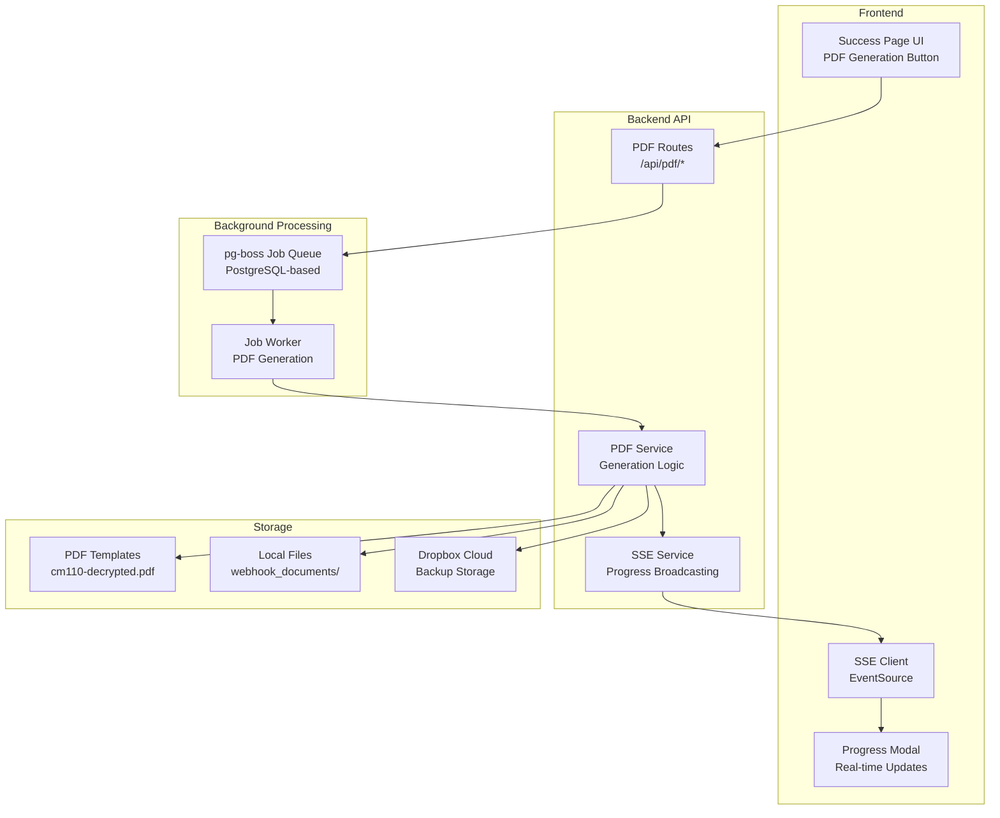

# CM-110 PDF Generation Feature

**Status:** ✅ Active
**Version:** 1.0.0
**Last Updated:** 2025-11-14

## Overview

The CM-110 PDF Generation feature automatically fills California court form CM-110 (Case Management Statement) with data from legal form submissions. This feature provides:

- **Automated PDF filling** using pdf-lib library
- **Real-time progress tracking** via Server-Sent Events
- **Asynchronous processing** with pg-boss job queue
- **Automatic Dropbox upload** for cloud backup
- **Field validation** and error handling
- **204 PDF fields** mapped from form data

## Table of Contents

- [Architecture](#architecture)
- [User Workflow](#user-workflow)
- [Technical Implementation](#technical-implementation)
- [API Reference](#api-reference)
- [Configuration](#configuration)
- [Troubleshooting](#troubleshooting)
- [Future Enhancements](#future-enhancements)

## Architecture

### System Components



### Data Flow

1. **User Initiates**: Clicks "Generate CM-110 PDF" button on success page
2. **Job Creation**: Backend creates job in pg-boss queue, returns jobId
3. **SSE Connection**: Frontend establishes Server-Sent Events connection
4. **Background Processing**: Worker picks up job and starts PDF generation
5. **Progress Updates**: Each phase broadcasts progress via SSE (10%, 20%, 40%, etc.)
6. **PDF Generation**: pdf-lib fills 204 form fields with mapped data
7. **File Storage**: Saves PDF to local filesystem with proper folder structure
8. **Dropbox Upload**: Uploads to Dropbox maintaining folder hierarchy
9. **Completion**: Frontend receives completion event, enables download button
10. **Download**: User downloads generated PDF file

## User Workflow

### Success Page Experience

After form submission, users see:

1. **Success confirmation** with case information
2. **"Generate CM-110 PDF" button**
3. Click button → **Progress modal appears**
4. **Real-time progress updates:**
   - Loading PDF template... (10%)
   - Parsing PDF structure... (20%)
   - Mapping form data to PDF fields... (40%)
   - Filling PDF fields... (60%)
   - Saving PDF... (80%)
   - Uploading to Dropbox... (90%)
   - Complete! (100%)
5. **Download button** becomes active
6. Click download → PDF file downloads to device

### Progress Modal

The modal displays:
- **Progress bar** with percentage
- **Current phase** text description
- **Animated spinner** during processing
- **Success checkmark** on completion
- **Error message** if generation fails
- **Retry button** for failed jobs

## Technical Implementation

### Phase 1: Template Loading (10% Progress)

```javascript
// Load PDF template from disk
const templatePath = path.join(
  __dirname,
  '../../normalization work/pdf_templates/cm110-decrypted.pdf'
);
const templateBytes = await fs.readFile(templatePath);
```

**Why decrypted template?**
The original CM-110.pdf is encrypted, which prevents pdf-lib from modifying it. We use a decrypted version created with qpdf:

```bash
qpdf --decrypt cm110.pdf cm110-decrypted.pdf
```

### Phase 2: PDF Parsing (20% Progress)

```javascript
// Load PDF with pdf-lib
const pdfDoc = await PDFDocument.load(templateBytes, {
  ignoreEncryption: true,
  updateMetadata: false
});

const form = pdfDoc.getForm();
const formFields = form.getFields(); // 204 fields total
```

### Phase 3: Field Mapping (40% Progress)

Maps form submission data to PDF field names using `cm110-field-mapping.json`:

```javascript
const pdfFieldValues = mapFormDataToPdfFields(formData);

// Example mappings:
{
  "CM-110[0].Page1[0].P1Caption[0].captionSub[0].CaseNumber[0].caseNumber[0]": "CV-2024-001234",
  "CM-110[0].Page1[0].P1Caption[0].AttyPartyInfo[0].Name[0]": "John Doe, Esq.",
  "CM-110[0].Page1[0].P1Caption[0].AttyPartyInfo[0].Address[0]": "123 Main St",
  // ... 201 more fields
}
```

**Field Discovery Process:**
1. Used `pdftk cm110.pdf dump_data_fields` to extract all field names
2. Created JSON mapping configuration (204 fields)
3. Organized by section: case number (5 pages), attorney info, parties, etc.

### Phase 4: Filling Fields (60% Progress)

```javascript
// Fill each PDF field
for (const [fieldName, fieldValue] of Object.entries(pdfFieldValues)) {
  try {
    const field = form.getTextField(fieldName);
    field.setText(String(fieldValue || ''));
  } catch (error) {
    logger.warn('Field not found or incompatible', { fieldName });
  }
}
```

**Field Types Supported:**
- Text fields (most common)
- Checkboxes (Yes/No fields)
- Date fields (formatted as MM/DD/YYYY)

### Phase 5: Saving PDF (80% Progress)

```javascript
// Flatten form (make fields non-editable) and save
form.flatten();
const pdfBytes = await pdfDoc.save();

// Generate filename: CM-110_ClarkKent_20251114.pdf
const filename = `CM-110_${headOfHousehold}_${dateStr}.pdf`;
const outputPath = path.join(
  process.cwd(),
  'webhook_documents',
  streetAddress,
  headOfHousehold,
  'Discovery Propounded',
  filename
);

await fs.writeFile(outputPath, pdfBytes);
```

**File Naming Convention:**
- `CM-110_{PlaintiffName}_{YYYYMMDD}.pdf`
- Example: `CM-110_ClarkKent_20251114.pdf`

**Folder Structure:**
```
webhook_documents/
└── 1331 Yorkshire Place NW/
    └── Clark Kent/
        └── Discovery Propounded/
            └── CM-110_ClarkKent_20251114.pdf
```

### Phase 6: Dropbox Upload (90% Progress)

```javascript
const dropboxPath = `/Current Clients/${streetAddress}/${headOfHousehold}/Discovery Propounded/${filename}`;

await dropboxService.uploadFile(outputPath, dropboxPath);
```

**Dropbox Integration:**
- Uses existing Dropbox service
- Same folder structure as local files
- Creates folders automatically if they don't exist
- Non-blocking (continues even if upload fails)

### Phase 7: Completion (100% Progress)

```javascript
// Update job status
jobs.set(jobId, {
  ...currentJob,
  status: 'completed',
  progress: 100,
  phase: 'complete',
  filename,
  filePath: outputPath,
  completedAt: new Date().toISOString()
});

// Broadcast completion via SSE
updateStatus('pdf', jobId, {
  status: 'completed',
  progress: 100,
  message: 'PDF generation completed successfully',
  filename
});
```

## API Reference

### Quick Reference

| Endpoint | Method | Purpose |
|----------|--------|---------|
| `/api/pdf/generate` | POST | Start PDF generation job |
| `/api/pdf/status/:jobId` | GET | Check job status |
| `/api/pdf/download/:jobId` | GET | Download completed PDF |
| `/api/pdf/retry/:jobId` | POST | Retry failed job |
| `/api/pdf/events/:jobId` | GET | SSE progress stream |

**Full API documentation:** [API_REFERENCE.md](../API_REFERENCE.md#pdf-generation)

## Configuration

### Environment Variables

No additional environment variables required. Uses existing:

- `DROPBOX_ENABLED` - Enable Dropbox uploads (default: true)
- `DROPBOX_ACCESS_TOKEN` - Dropbox API token
- `DROPBOX_BASE_PATH` - Base path in Dropbox (e.g., `/Apps/LegalFormApp`)

### Field Mapping Configuration

**Location:** `server/config/cm110-field-mapping.json`

**Structure:**
```json
{
  "$schema": "http://json-schema.org/draft-07/schema#",
  "title": "CM-110 PDF Field Mapping Configuration",
  "version": "2.0.0",

  "caseNumberFields": {
    "page1": { "pdfField": "...", "source": "caseNumber" },
    "page2": { "pdfField": "...", "source": "caseNumber" },
    // ... pages 3-5
  },

  "attorneyFields": {
    "barNumber": { "pdfField": "...", "source": "attorneyBarNumber" },
    "name": { "pdfField": "...", "source": "attorneyName" },
    // ... more attorney fields
  },

  "plaintiffFields": {
    // ... plaintiff mappings
  },

  "defendantFields": {
    // ... defendant mappings
  }
}
```

**Updating Field Mappings:**
1. Modify `cm110-field-mapping.json`
2. Test with sample form data
3. Verify PDF output with Adobe Acrobat or similar
4. Deploy updated configuration

### PDF Templates

**Location:** `normalization work/pdf_templates/`

**Files:**
- `cm110.pdf` - Original encrypted template (reference only)
- `cm110-decrypted.pdf` - **Active template** used by pdf-lib

**Updating Templates:**
If California updates the CM-110 form:

1. Download new PDF from California Courts website
2. Decrypt it: `qpdf --decrypt cm110-new.pdf cm110-decrypted.pdf`
3. Extract field names: `pdftk cm110-decrypted.pdf dump_data_fields > fields.txt`
4. Update `cm110-field-mapping.json` with new field names
5. Test thoroughly with sample data
6. Deploy updated template and mappings

## Troubleshooting

### Common Issues

#### 1. PDF Generation Fails at Field Mapping (40%)

**Symptom:** Job status shows `failed` at `mapping_fields` phase

**Cause:** Missing required field in form data

**Solution:**
```javascript
// Check error in job status
GET /api/pdf/status/:jobId
// Response will show: "error": "Missing required field: caseNumber"

// Ensure form data includes all required fields:
{
  "caseNumber": "CV-2024-001234",  // REQUIRED
  "Full_Address": { ... },          // REQUIRED
  "PlaintiffDetails": [ ... ],      // At least 1 required
  "DefendantDetails2": [ ... ]      // At least 1 required
}
```

#### 2. PDF Fields Not Filling

**Symptom:** PDF generates successfully but fields are blank

**Cause:** Field name mismatch between mapping config and actual PDF

**Solution:**
```bash
# Verify PDF field names
pdftk normalization\ work/pdf_templates/cm110-decrypted.pdf dump_data_fields

# Compare with cm110-field-mapping.json
# Update mapping if field names changed
```

#### 3. Dropbox Upload Fails

**Symptom:** PDF generates but Dropbox upload shows error

**Cause:** Invalid token or insufficient permissions

**Solution:**
```bash
# Test Dropbox connection
node test-dropbox-upload.js

# Verify environment variables
echo $DROPBOX_ACCESS_TOKEN
echo $DROPBOX_ENABLED

# Check Dropbox app permissions:
# - Files and folders: Read and write
# - Account info: Read
```

#### 4. SSE Connection Drops

**Symptom:** Progress modal stops updating mid-generation

**Cause:** Network timeout or proxy interference

**Solution:**
```javascript
// Frontend automatically reconnects on error
// Manual reconnection:
if (eventSource.readyState === EventSource.CLOSED) {
  eventSource = new EventSource(`/api/pdf/events/${jobId}?token=xxx`);
}

// Check server logs for SSE errors:
grep "SSE connection" logs/combined.log
```

#### 5. Job Queue Stuck

**Symptom:** Jobs remain in `processing` state indefinitely

**Cause:** pg-boss worker not running or crashed

**Solution:**
```bash
# Check pg-boss queue status
psql legal_forms_db -c "SELECT * FROM pgboss.job WHERE state = 'active';"

# Restart job worker (server restart)
npm start

# Clear stuck jobs (development only)
psql legal_forms_db -c "UPDATE pgboss.job SET state = 'failed' WHERE state = 'active' AND createdon < NOW() - INTERVAL '1 hour';"
```

### Debugging Tips

**Enable debug logging:**
```javascript
// In pdf-service.js
logger.level = 'debug';

// View detailed logs
tail -f logs/combined.log | grep PDF
```

**Test PDF generation manually:**
```bash
# Create test form data
cat > test-form.json <<EOF
{
  "caseNumber": "TEST-001",
  "Full_Address": { "StreetAddress": "123 Test St" },
  "PlaintiffDetails": [{"PlaintiffItemNumberName": {"FirstAndLast": "Test User"}}],
  "DefendantDetails2": [{"DefendantItemNumberName": {"FirstAndLast": "Test Defendant"}}]
}
EOF

# Generate PDF via API
curl -X POST http://localhost:3000/api/pdf/generate \
  -H "Content-Type: application/json" \
  -d @test-form.json
```

## Future Enhancements

### Planned Features

1. **Multiple Form Templates**
   - Support for additional court forms (CM-111, CM-120, etc.)
   - Template selection in UI
   - Dynamic field mapping per template

2. **PDF Preview**
   - Preview generated PDF in browser before download
   - Inline PDF viewer with annotations
   - Edit and regenerate if needed

3. **Batch Generation**
   - Generate multiple PDFs for a case
   - ZIP file download for batch
   - Progress tracking for multiple jobs

4. **Field Validation**
   - Pre-generation validation of field data
   - Length limits, format checks
   - Warning messages for missing optional fields

5. **Email Delivery**
   - Option to email generated PDF
   - Integration with existing email notification system
   - Delivery confirmation

6. **PDF Signatures**
   - Digital signature support
   - E-signature workflow
   - Certificate validation

### Technical Improvements

1. **Database Job Storage**
   - Move from in-memory to database job tracking
   - Job history and analytics
   - Cleanup of old completed jobs

2. **Caching**
   - Cache loaded PDF template in memory
   - Reduce disk I/O for high-volume generation
   - Template versioning

3. **Performance Optimization**
   - Parallel field filling
   - Worker pool for concurrent jobs
   - Resource limits and throttling

4. **Monitoring**
   - Prometheus metrics for PDF generation
   - Alert on high failure rate
   - Performance dashboards

## Related Documentation

- **[API Reference](../API_REFERENCE.md#pdf-generation)** - Full API documentation
- **[Architecture](../ARCHITECTURE.md)** - System architecture overview
- **[Deployment](../DEPLOYMENT.md)** - Deployment configuration
- **[Dropbox Setup](../setup/DROPBOX_SETUP.md)** - Dropbox integration guide

---

**Version:** 1.0.0
**Last Updated:** 2025-11-14
**Maintained By:** Development Team
**Questions?** Review [ARCHITECTURE.md](../ARCHITECTURE.md) or check [API_REFERENCE.md](../API_REFERENCE.md)
