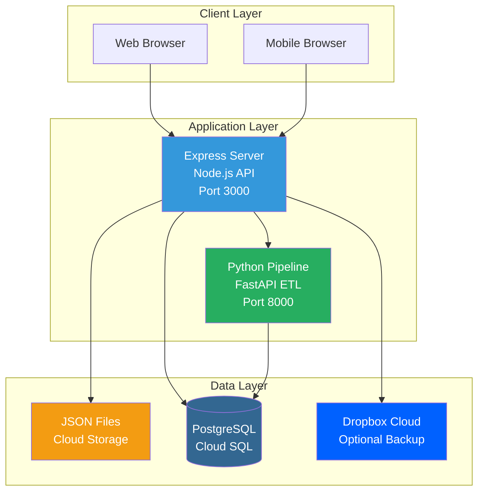

<style>
.VPFeature {
  transition: transform 0.2s ease-in-out;
}

.VPFeature:hover {
  transform: translateY(-4px);
}
</style>

## Quick Example

Get started in 5 minutes with local development:

::: code-group
```bash [Quick Start]
# Clone and install
git clone https://github.com/your-org/legal-form-app.git
cd legal-form-app
npm install

# Setup database
createdb legal_forms_db
psql legal_forms_db < schema.sql

# Configure environment
cp .env.example .env
# Edit .env with your settings

# Start server
npm start
# Visit http://localhost:3000
```

```bash [Production Deploy]
# Automated GCP deployment
gcloud config set project YOUR_PROJECT_ID

# Run deployment script
./quick-deploy.sh

# Your app is live at:
# https://node-server-xxx.run.app
```

```bash [Docker]
# Run with Docker
docker build -t legal-form-app .
docker run -p 3000:3000 \
  -e DB_HOST=your-db \
  -e DB_NAME=legal_forms_db \
  legal-form-app
```
:::

## Architecture Overview



## Key Features

### 19 Comprehensive Issue Categories

Track all housing issues across these categories:
- 🐀 **Vermin Issues** - Rats, mice, cockroaches
- 🐛 **Insect Issues** - Ants, bedbugs, fleas
- ☣️ **Environmental Hazards** - Lead paint, asbestos, radon
- 🤢 **Health Hazards** - Mold, sewage, toxic water
- 🏚️ **Structure Issues** - Walls, floors, ceilings, doors
- 🚰 **Plumbing Problems** - Leaks, clogs, no hot water
- 🌧️ **Weatherproofing** - Windows, doors, roof leaks
- ❄️ **HVAC Issues** - Heating, cooling, ventilation
- 🔥 **Fire Hazards** - Smoke alarms, extinguishers
- ⚠️ **Safety Issues** - Security gates, locks, lighting
- 🏢 **Common Areas** - Hallways, stairs, mailboxes
- 🗑️ **Trash Problems** - Bins, collection, pests
- 📋 **Notice Issues** - Rent receipts, required postings
- ⚡ **Utility Interruptions** - Water, gas, electric shutoffs
- ♿ **Accessibility** - ADA compliance, modifications
- 😠 **Tenant Harassment** - Lockouts, threats, intimidation
- 📄 **Lease Violations** - Maintenance, repairs, services
- 🏠 **Habitability Defects** - Uninhabitable conditions
- ➕ **Other Issues** - Additional custom issues

### Production-Ready Features

::: tip ✅ Battle-Tested
This application is **deployed in production** on GCP Cloud Run serving real legal aid organizations.
:::

**Deployment Features:**
- ✅ Automatic scaling (0 to 1000+ users)
- ✅ Zero-downtime deployments
- ✅ Automatic SSL certificates
- ✅ Multi-region support
- ✅ 99.95% uptime SLA
- ✅ Built-in health checks
- ✅ Structured logging
- ✅ Prometheus metrics

**Security Features:**
- ✅ Bearer token authentication
- ✅ Secret Manager integration
- ✅ HTTPS-only access
- ✅ Input validation
- ✅ SQL injection prevention
- ✅ XSS protection

**Data Features:**
- ✅ ACID transactions
- ✅ Automatic backups
- ✅ Point-in-time recovery
- ✅ Data encryption at rest
- ✅ Audit trail preservation
- ✅ Disaster recovery

## Popular Use Cases

<div style="display: grid; grid-template-columns: repeat(auto-fit, minmax(300px, 1fr)); gap: 20px; margin: 20px 0;">

<div style="border: 1px solid var(--vp-c-divider); border-radius: 8px; padding: 20px;">

### Legal Aid Organizations
Perfect for organizations handling:
- Tenant rights cases
- Housing complaints
- Multi-plaintiff lawsuits
- Discovery document generation

</div>

<div style="border: 1px solid var(--vp-c-divider); border-radius: 8px; padding: 20px;">

### Law Firms
Streamline intake for:
- Housing law cases
- Complex party management
- Automated document generation
- Case tracking and reporting

</div>

<div style="border: 1px solid var(--vp-c-divider); border-radius: 8px; padding: 20px;">

### Government Agencies
Ideal for:
- Housing complaint intake
- Code enforcement tracking
- Multi-tenant case management
- Public records compliance

</div>

</div>

## Technology Stack

::: details Frontend
- **HTML5, CSS3** - Modern, accessible markup
- **Vanilla JavaScript (ES6+)** - No framework overhead
- **Server-Sent Events** - Real-time updates
- **Notyf** - Beautiful toast notifications
:::

::: details Backend
- **Node.js 14+** - JavaScript runtime
- **Express.js** - Web framework
- **PostgreSQL 12+** - Relational database
- **Winston** - Structured logging
- **Prometheus** - Metrics collection
:::

::: details Infrastructure
- **GCP Cloud Run** - Serverless containers
- **Cloud SQL** - Managed PostgreSQL
- **Cloud Storage** - File storage
- **Secret Manager** - Credential management
- **VPC Connector** - Private networking
:::

::: details Pipeline (Optional)
- **Python 3.8+** - Programming language
- **FastAPI** - Modern API framework
- **Psycopg 3** - PostgreSQL driver
- **Pydantic** - Data validation
:::

## Community & Support

### Documentation
- 📖 **[Complete Documentation](./README)** - All guides in one place
- 🚀 **[Quick Start Guide](./QUICK_START)** - Get running in 5-10 minutes
- 💻 **[Developer Guide](./DEVELOPER_GUIDE)** - Development best practices
- 🏗️ **[Architecture](./ARCHITECTURE)** - System design and decisions

### Resources
- 🐛 **[GitHub Issues](https://github.com/your-org/legal-form-app/issues)** - Bug reports and features
- 💬 **[Discussions](https://github.com/your-org/legal-form-app/discussions)** - Ask questions
- 📋 **[Contributing Guide](./DEVELOPER_GUIDE#contributing)** - How to contribute
- 🏛️ **[ADR Index](./adr/README)** - Architecture decisions

### Stats
- ⭐ **Production Ready** - Deployed and serving real users
- 📦 **8,500+ Lines** - Comprehensive documentation
- 🧪 **90%+ Coverage** - Test-driven development
- ⚡ **<500ms** - P95 API response time
- 💰 **$20-50/mo** - Typical production costs

## Getting Help

::: tip Need Help?
- **New to the project?** Start with [Quick Start](./QUICK_START)
- **Deploying?** See [Deployment Guide](./deployment/DEPLOYMENT_GUIDE)
- **Troubleshooting?** Check [Operations Guide](./operations/OPERATIONS_GUIDE)
- **API integration?** Review [API Reference](./API_REFERENCE)
:::

::: warning Found a Bug?
Please [open an issue](https://github.com/your-org/legal-form-app/issues) with:
- Clear description
- Steps to reproduce
- Expected vs actual behavior
- Environment details
:::

## License

MIT License - See [LICENSE](https://github.com/your-org/legal-form-app/blob/main/LICENSE) for details.

---

<div style="text-align: center; margin: 40px 0;">
  <p style="font-size: 14px; color: var(--vp-c-text-2);">
    Built with ❤️ by the Legal Form Application Team
  </p>
  <p style="font-size: 12px; color: var(--vp-c-text-3);">
    Documentation Version 2.0 | Last Updated: October 23, 2025
  </p>
</div>
