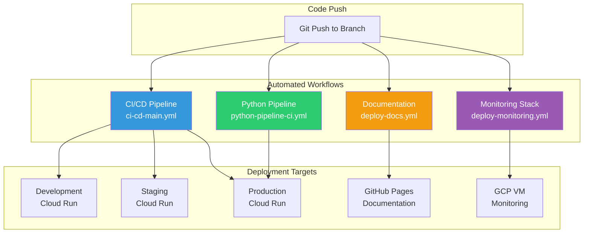
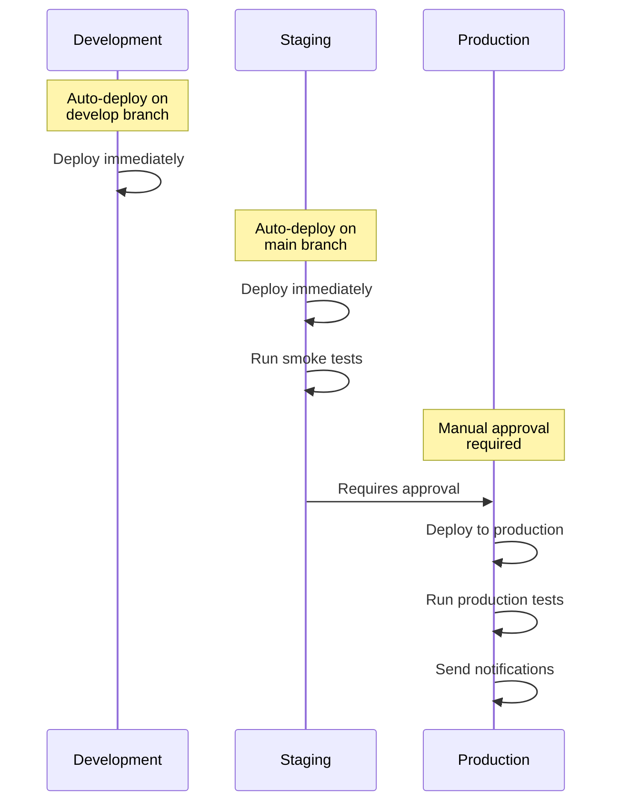

# CI/CD Workflows Guide

Complete guide to the automated CI/CD workflows for the Legal Form Application.

## Table of Contents
- [Overview](#overview)
- [Available Workflows](#available-workflows)
- [Workflow Triggers](#workflow-triggers)
- [Setup Requirements](#setup-requirements)
- [Workflow Details](#workflow-details)
- [Manual Deployment](#manual-deployment)
- [Monitoring & Alerts](#monitoring--alerts)
- [Troubleshooting](#troubleshooting)

## Overview

The Legal Form Application uses GitHub Actions for comprehensive CI/CD automation. All workflows are located in `.github/workflows/` and handle everything from code quality checks to production deployments.

### Workflow Architecture



## Available Workflows

### 1. Main CI/CD Pipeline (`ci-cd-main.yml`)

**Purpose**: Comprehensive testing, building, and deployment for Node.js application

**Triggers**:
- Push to `main` or `develop` branches
- Pull requests to `main`
- Manual dispatch

**Stages**:
1. **Code Quality** - Linting, formatting, complexity analysis
2. **Testing** - Playwright E2E tests with PostgreSQL
3. **Security** - Vulnerability scanning, secret detection, Docker scanning
4. **Build** - Multi-environment builds (dev, staging, prod)
5. **Deploy Development** - Auto-deploy on `develop` branch
6. **Deploy Staging** - Auto-deploy on `main` branch
7. **Deploy Production** - Manual approval required

### 2. Python Pipeline CI/CD (`python-pipeline-ci.yml`)

**Purpose**: Testing and deployment for Python FastAPI normalization pipeline

**Triggers**:
- Push to `main` or `develop` with changes in `api/` or `normalization work/`
- Pull requests affecting Python code
- Manual dispatch

**Stages**:
1. **Python Quality** - Black formatting, Flake8 linting, mypy type checking
2. **Python Testing** - pytest with PostgreSQL integration
3. **Build Pipeline** - Docker image building
4. **Deploy Pipeline** - Deploy to Cloud Run

### 3. Documentation Deployment (`deploy-docs.yml`)

**Purpose**: Build and deploy VitePress interactive documentation

**Triggers**:
- Push to `main` with changes in `docs/`, code files, or package.json
- Manual dispatch

**Stages**:
1. **Validation** - Check documentation structure, validate Mermaid diagrams
2. **Generate API Docs** - Extract JSDoc comments from code
3. **Build VitePress** - Build interactive documentation site
4. **Deploy to GitHub Pages** - Publish to GitHub Pages

### 4. Monitoring Stack Deployment (`deploy-monitoring.yml`)

**Purpose**: Deploy Prometheus monitoring stack to GCP VM

**Triggers**:
- Push to `main` with changes in `monitoring/`
- Manual dispatch

**Stages**:
1. **Validate Config** - Check Prometheus and Docker Compose configs
2. **Deploy to VM** - Copy files and start services via SSH
3. **Validate Deployment** - Health checks for Prometheus and exporters

## Workflow Triggers

### Automatic Triggers

| Event | Workflow | Condition |
|-------|----------|-----------|
| Push to `main` | All workflows | Matching file paths |
| Push to `develop` | ci-cd-main.yml | Node.js deployment only |
| Pull Request to `main` | ci-cd-main.yml, python-pipeline-ci.yml | Quality checks only |
| Push to `docs/` | deploy-docs.yml | Documentation rebuild |
| Push to `monitoring/` | deploy-monitoring.yml | Monitoring update |

### Manual Triggers

All workflows can be triggered manually from the GitHub Actions tab:

1. Go to **Actions** tab in GitHub
2. Select the workflow
3. Click **Run workflow**
4. Choose branch and options
5. Click **Run workflow** button

## Setup Requirements

### Required GitHub Secrets

Configure these secrets in **Settings → Secrets and variables → Actions**:

```bash
# Google Cloud Platform
GCP_SA_KEY              # Service account JSON key
GCP_PROJECT_ID          # Project ID (docmosis-tornado)

# Optional: Notifications
SLACK_WEBHOOK_URL       # For deployment notifications
```

### Required Repository Permissions

**Settings → Actions → General → Workflow permissions**:
- ✅ Read and write permissions
- ✅ Allow GitHub Actions to create and approve pull requests

**Settings → Pages**:
- ✅ Source: GitHub Actions
- ✅ Build and deployment: GitHub Actions

### Service Account Permissions

The GCP service account needs these roles:

```yaml
Required Roles:
  - Cloud Run Admin
  - Service Account User
  - Storage Admin
  - Cloud SQL Client
  - Compute Instance Admin
  - Artifact Registry Writer
```

## Workflow Details

### Main CI/CD Pipeline

#### Code Quality Stage

Runs linting and code analysis:

```bash
# What it checks:
- npm audit (security vulnerabilities)
- Prettier (code formatting)
- ESLint (code quality)
- Code complexity analysis
```

**Configuration Files**:
- `.eslintrc.js` or `.eslintrc.json` (ESLint)
- `.prettierrc` or `prettier.config.js` (Prettier)

#### Testing Stage

Runs Playwright E2E tests with PostgreSQL:

```bash
# Test execution:
1. Spins up PostgreSQL container
2. Loads schema.sql
3. Runs `npm run test`
4. Uploads test results and reports
```

**Test Commands**:
```json
{
  "scripts": {
    "test": "playwright test",
    "test:headed": "playwright test --headed",
    "test:debug": "playwright test --debug"
  }
}
```

#### Security Stage

Comprehensive security scanning:

```bash
# Scans performed:
- npm audit (dependency vulnerabilities)
- Secret detection (exposed keys/tokens)
- Trivy (Docker image vulnerabilities)
- SARIF upload to GitHub Security
```

#### Build Stage

Multi-environment builds:

```bash
# Build matrix:
- development
- staging
- production

# Artifacts generated:
- Docker images (tagged by environment and commit SHA)
- Build artifacts (dist/, server.js, package files)
```

#### Deployment Stages



### Python Pipeline CI/CD

#### Python Quality Checks

```bash
# Tools used:
black --check .          # Code formatting
flake8 .                 # Linting
mypy .                   # Type checking
```

#### Python Testing

```bash
# Test execution:
pytest -v --cov=. --cov-report=xml --cov-report=html

# Coverage reports uploaded as artifacts
```

### Documentation Deployment

#### Build Process

```bash
# Steps:
1. Validate documentation structure
2. Generate API docs from JSDoc
3. Validate Mermaid diagrams
4. Build VitePress (npm run docs:build)
5. Generate build report
6. Deploy to GitHub Pages
```

#### VitePress Configuration

Location: `docs/.vitepress/config.mjs`

```javascript
export default defineConfig({
  title: 'Legal Form Application',
  outDir: '../dist/docs',
  cleanUrls: true,
  // ... full config in file
})
```

## Manual Deployment

### Deploy to Development

```bash
# Option 1: Push to develop branch
git checkout develop
git merge your-feature
git push origin develop

# Option 2: Manual workflow dispatch
# GitHub → Actions → CI/CD Pipeline → Run workflow → develop
```

### Deploy to Staging

```bash
# Option 1: Merge PR to main
gh pr merge your-pr --merge

# Option 2: Push to main
git checkout main
git merge develop
git push origin main
```

### Deploy to Production

Production deployments require manual approval:

1. **Trigger**: Push to `main` or manual dispatch
2. **Wait**: Staging deployment completes and passes tests
3. **Review**: Check staging environment
4. **Approve**: Go to Actions → Production deployment → Review deployments → Approve
5. **Deploy**: Production deployment starts automatically after approval

### Deploy Documentation

```bash
# Documentation auto-deploys when you:
- Update files in docs/
- Change server.js, api/, or *.js files
- Modify package.json

# Manual trigger:
# GitHub → Actions → Deploy Documentation → Run workflow
```

### Deploy Monitoring

```bash
# Auto-deploys when you:
- Update monitoring/ directory

# Manual trigger:
# GitHub → Actions → Deploy Monitoring Stack → Run workflow
```

## Monitoring & Alerts

### Workflow Status

View workflow status:
- **GitHub Actions Tab**: Real-time workflow runs
- **Commit Status Checks**: Status badges on commits/PRs
- **Email Notifications**: Workflow failures (if enabled)

### Build Status Badges

Add to README.md:

```markdown


```

### Deployment Notifications

Configure Slack notifications:

1. Create Slack webhook URL
2. Add to GitHub Secrets as `SLACK_WEBHOOK_URL`
3. Uncomment notification steps in workflows

## Troubleshooting

### Common Issues

#### Workflow Fails on Code Quality

**Problem**: ESLint or Prettier checks fail

**Solution**:
```bash
# Fix locally:
npx eslint --fix "**/*.js"
npx prettier --write "**/*.{js,json,md,yml}"

# Then commit:
git add .
git commit -m "fix: code quality issues"
git push
```

#### Tests Fail in CI

**Problem**: Tests pass locally but fail in GitHub Actions

**Solution**:
```bash
# Check database setup:
1. Verify schema.sql exists in repo root
2. Check PostgreSQL service configuration in workflow
3. Review test logs in Actions → Test results artifact

# Debug locally with Docker:
docker run -e POSTGRES_PASSWORD=postgres -p 5432:5432 postgres:14
psql -h localhost -U postgres -f schema.sql
npm test
```

#### Docker Build Fails

**Problem**: Docker image build fails

**Solution**:
```bash
# Test build locally:
docker build -t test-image .

# Common fixes:
- Check Dockerfile exists
- Verify COPY paths are correct
- Check .dockerignore doesn't exclude needed files
- Ensure node_modules is excluded
```

#### Deployment Fails

**Problem**: Cloud Run deployment fails

**Solution**:
```bash
# Check GCP credentials:
1. Verify GCP_SA_KEY secret is set
2. Check service account has required roles
3. Verify project ID is correct

# Manual deployment to test:
gcloud auth activate-service-account --key-file=key.json
gcloud config set project docmosis-tornado
gcloud run deploy node-server --region=us-central1 --image=...
```

#### Documentation Build Fails

**Problem**: VitePress build fails

**Solution**:
```bash
# Test locally:
npm run docs:build

# Common issues:
- Missing docs/.vitepress/config.mjs
- Broken Mermaid diagram syntax
- Invalid markdown frontmatter
- Broken internal links

# Validate docs:
npm run docs:dev  # Check for errors in dev mode
```

### Viewing Workflow Logs

1. Go to **Actions** tab
2. Click on workflow run
3. Click on job name
4. Expand steps to see logs
5. Use search to find errors

### Debugging Tips

#### Enable Debug Logging

Add to GitHub Secrets:
```bash
ACTIONS_STEP_DEBUG=true
ACTIONS_RUNNER_DEBUG=true
```

#### Test Workflows Locally

Use [act](https://github.com/nektos/act):

```bash
# Install act:
brew install act  # macOS
# or
curl https://raw.githubusercontent.com/nektos/act/master/install.sh | sudo bash

# Run workflows locally:
act push                           # Simulate push event
act -j quality                     # Run specific job
act -l                            # List available jobs
```

#### Skip CI for Commits

Add to commit message:

```bash
git commit -m "docs: update README [skip ci]"
# or
git commit -m "chore: formatting [ci skip]"
```

## Dependency Updates

### Automated with Renovate

Renovate automatically creates PRs for dependency updates.

**Configuration**: `renovate.json` in repo root

**Schedule**:
- Weekday nights (10pm-5am)
- Weekends

**Auto-merge Rules**:
- ✅ devDependencies
- ✅ TypeScript types (@types/*)
- ✅ ESLint packages
- ✅ Patch updates for dependencies
- ❌ Major updates (require manual review)

### Manual Dependency Updates

```bash
# Update all dependencies:
npm update

# Check for outdated packages:
npm outdated

# Update to latest versions:
npx npm-check-updates -u
npm install

# Security updates:
npm audit fix
```

## Best Practices

### Commit Messages

Use conventional commits for automated changelog:

```bash
feat: add user authentication
fix: resolve database connection issue
docs: update API reference
chore: update dependencies
test: add integration tests
refactor: improve error handling
perf: optimize database queries
ci: update workflow configuration
```

### Branch Strategy

```
main (production)
├── develop (staging)
│   ├── feature/add-authentication
│   ├── feature/improve-ui
│   └── bugfix/fix-form-validation
└── hotfix/critical-security-patch
```

### Pull Request Process

1. **Create Feature Branch**:
   ```bash
   git checkout -b feature/your-feature
   ```

2. **Make Changes and Push**:
   ```bash
   git add .
   git commit -m "feat: add your feature"
   git push origin feature/your-feature
   ```

3. **Create Pull Request**:
   - CI/CD pipeline runs automatically
   - Wait for all checks to pass
   - Request review from team

4. **Merge**:
   - Squash commits (recommended)
   - Delete branch after merge

### Testing Before Push

Always test locally before pushing:

```bash
# Run tests:
npm test

# Build application:
npm run build

# Check code quality:
npm run lint  # if configured

# Build documentation:
npm run docs:build
```

## Additional Resources

- [GitHub Actions Documentation](https://docs.github.com/en/actions)
- [VitePress Documentation](https://vitepress.dev/)
- [Renovate Documentation](https://docs.renovatebot.com/)
- [Google Cloud Run Documentation](https://cloud.google.com/run/docs)

---

**Document Version**: 1.0.0
**Last Updated**: 2025-10-23
**Maintained By**: DevOps Team
