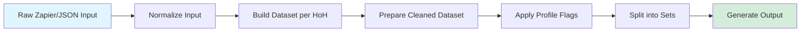
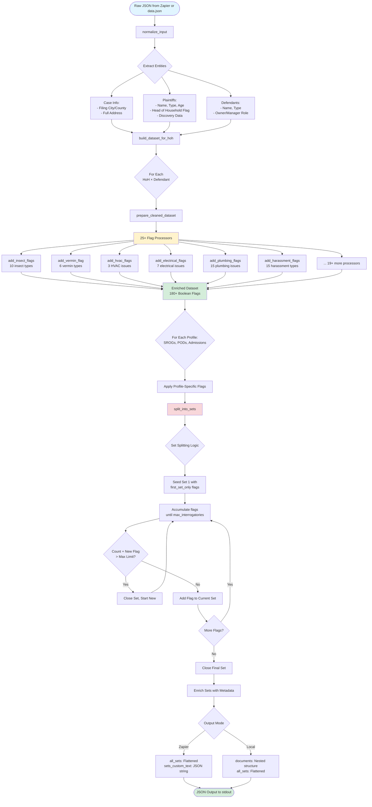
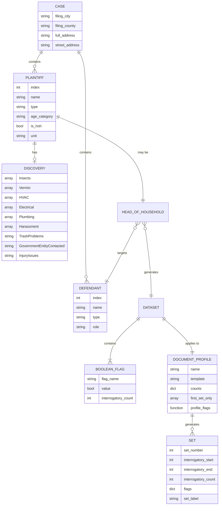
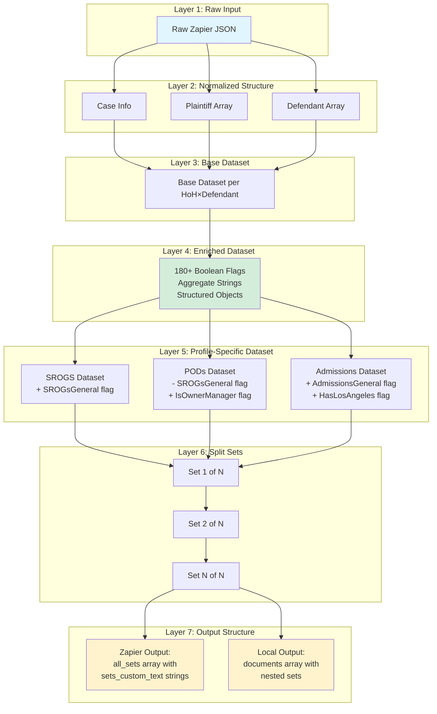
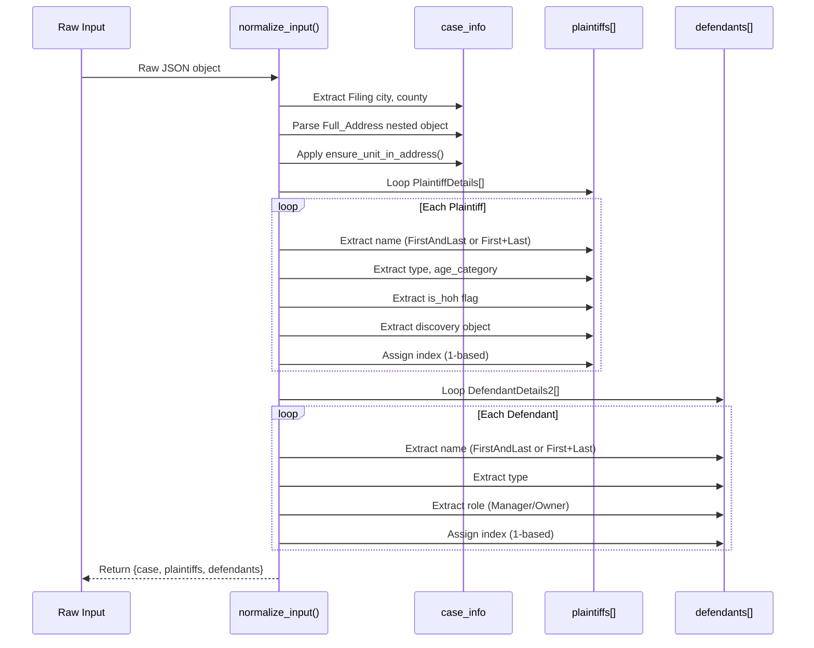
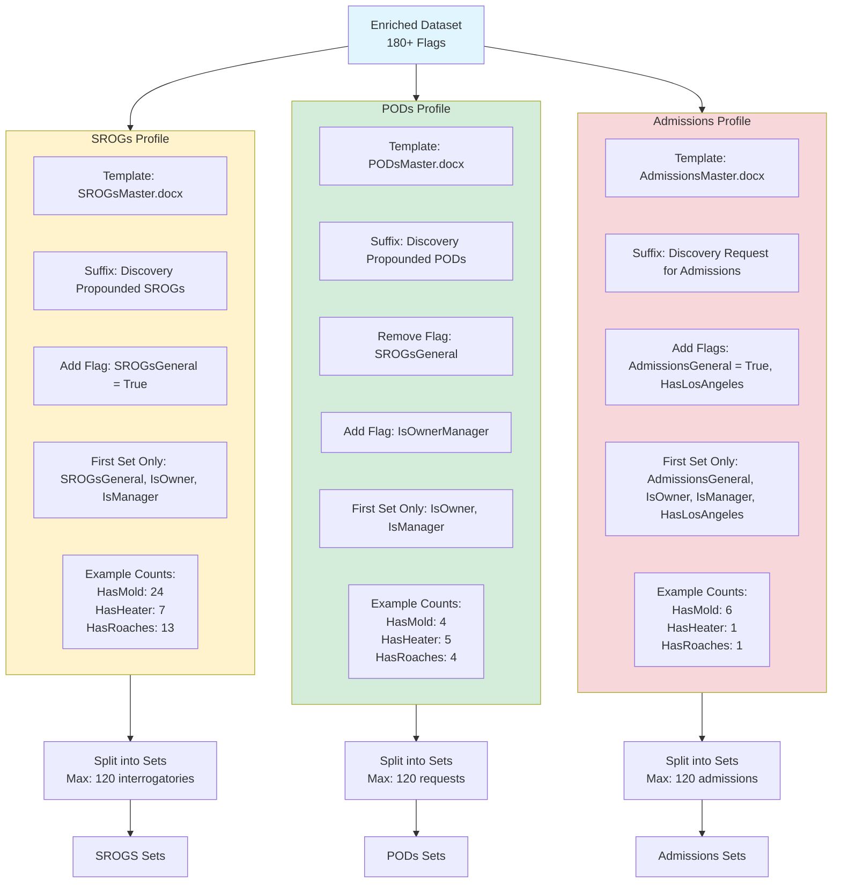

# Data Model Documentation

## Table of Contents
1. [High-Level Architecture](#high-level-architecture)
2. [End-to-End Data Flow](#end-to-end-data-flow)
3. [Entity Relationship Model](#entity-relationship-model)
4. [Input Data Structure](#input-data-structure)
5. [Normalization Process](#normalization-process)
6. [Flag Processing System](#flag-processing-system)
7. [Document Profiles](#document-profiles)
8. [Set Splitting Algorithm](#set-splitting-algorithm)
9. [Output Structure](#output-structure)
10. [Complete Flag Reference](#complete-flag-reference)

---

## High-Level Architecture

The script is a **Legal Discovery Document Data Processor** that transforms case data into structured datasets for generating three types of California discovery documents:

- **SROGs** - Special Interrogatories (questions to opposing party)
- **PODs** - Requests for Production of Documents
- **Admissions** - Requests for Admissions

### Core Design Pattern: Pipeline Architecture



---

## End-to-End Data Flow

### Complete Pipeline Diagram



---

## Entity Relationship Model

### Core Entities and Relationships



### Data Transformation Layers



---

## Input Data Structure

### Zapier Input Format

```json
{
  "Filing city": "Los Angeles",
  "Filing county": "Los Angeles",
  "Full_Address": {
    "FullAddress": "123 Main Street, Los Angeles, CA 90001",
    "StreetAddress": "123 Main Street",
    "Line1": "123 Main Street",
    "City": "Los Angeles",
    "State": "CA",
    "Zip": "90001"
  },
  "Unit": "5",
  "PlaintiffDetails": [
    {
      "PlaintiffItemNumberName": {
        "First": "John",
        "Last": "Doe",
        "FirstAndLast": "John Doe"
      },
      "PlaintiffItemNumberType": "an individual",
      "PlaintiffItemNumberAgeCategory": "Adult",
      "HeadOfHousehold": true,
      "PlaintiffItemNumberDiscovery": {
        "Insects": ["Roaches", "Bedbugs"],
        "Vermin": ["rats/mice"],
        "HVAC": ["Heater"],
        "Plumbing": ["Leaks", "No hot water"],
        "TrashProblems": true,
        "GovernmentEntityContacted": "Yes",
        "Specific Government Entity Contacted": ["Health Department"],
        "Unit": "5"
      }
    }
  ],
  "DefendantDetails2": [
    {
      "DefendantItemNumberName": {
        "FirstAndLast": "ABC Property Management"
      },
      "DefendantItemNumberType": "a corporation",
      "DefendantItemNumberManagerOwner": "Owner"
    }
  ]
}
```

### Key Input Fields

| Field Path | Type | Purpose | Example |
|------------|------|---------|---------|
| `Filing city` | string | Jurisdiction for filing | "Los Angeles" |
| `Filing county` | string | County jurisdiction | "Los Angeles" |
| `Full_Address.FullAddress` | string | Complete address | "123 Main St, LA, CA 90001" |
| `Unit` | string | Unit number (idempotent insertion) | "5" |
| `PlaintiffDetails[].PlaintiffItemNumberName` | object | Plaintiff name parts | `{First, Last, FirstAndLast}` |
| `PlaintiffDetails[].HeadOfHousehold` | boolean | HoH designation | `true` |
| `PlaintiffDetails[].PlaintiffItemNumberDiscovery` | object | Issue data | Multi-select arrays + booleans |
| `DefendantDetails2[].DefendantItemNumberName` | object | Defendant name | `{FirstAndLast}` |
| `DefendantDetails2[].DefendantItemNumberManagerOwner` | string | Role | "Owner", "Manager", "Both" |

---

## Normalization Process

### normalize_input() Function Flow



### Unit Address Idempotency

**Function**: `ensure_unit_in_address(address, unit)`

**Purpose**: Ensures "Unit X" appears exactly once in the address, preventing duplicates.

```python
# Examples:
ensure_unit_in_address("123 Main St, LA, CA", "5")
# → "123 Main St Unit 5, LA, CA"

ensure_unit_in_address("123 Main St Unit 5, LA, CA", "5")
# → "123 Main St Unit 5, LA, CA" (unchanged, already present)

ensure_unit_in_address("123 MAIN ST UNIT 5, LA, CA", "5")
# → "123 MAIN ST UNIT 5, LA, CA" (case-insensitive check)
```

**Algorithm**:
1. Case-insensitive check: Does `" unit {unit}"` exist in address?
2. If yes → return unchanged
3. If no and comma present → insert before first comma
4. If no and no comma → append at end

---

## Flag Processing System

### Flag Processor Pipeline

The script applies **25+ flag processors** in sequence. Each processor:
1. Reads from raw multi-select arrays or Yes/No strings
2. Creates boolean flags with `Has` prefix
3. May create aggregate flags (e.g., `HasClogs` if any clog type is true)

```mermaid
graph TD
    Start[Cleaned Dataset] --> P1[add_insect_flags]
    P1 --> P2[add_insects_flag]
    P2 --> P3[add_vermin_flag]
    P3 --> P4[add_hvac_flags]
    P4 --> P5[add_electrical_flags]
    P5 --> P6[add_firehazard_flags]
    P6 --> P7[add_govcontact_flag]
    P7 --> P8[add_appliance_flags]
    P8 --> P9[add_plumbing_flags]
    P9 --> P10[add_cabinet_flags]
    P10 --> P11[add_flooring_flags]
    P11 --> P12[add_window_flags]
    P12 --> P13[add_door_flags]
    P13 --> P14[add_structure_flags]
    P14 --> P15[add_commonarea_flags]
    P15 --> P16[add_nuisance_flags]
    P16 --> P17[add_healthhazard_flags]
    P17 --> P18[add_harassment_flags]
    P18 --> P19[add_notices_flag]
    P19 --> P20[add_select_notices_flags]
    P20 --> P21[add_checkbox44n6i_flags]
    P21 --> P22[add_injury_flag]
    P22 --> P23[add_misc_flags]
    P23 --> P24[add_select_safety_flags]
    P24 --> P25[add_discrimination_flags]
    P25 --> P26[add_trash_flags]
    P26 --> P27[build_case_structure]
    P27 --> P28[add_city_flags]
    P28 --> P29[add_defendant_role_flags]
    P29 --> P30[generate_agency_paragraph]
    P30 --> End[Enriched Dataset<br/>180+ Boolean Flags]

    style Start fill:#e1f5ff
    style End fill:#d4edda
```



### Flag Processor Categories

| Category | Processor Function | Input Field | Output Flags | Count |
|----------|-------------------|-------------|--------------|-------|
| **Insects** | `add_insect_flags()` | `Insects[]` | HasAnts, HasRoaches, HasFlies, HasBedbugs, HasBees, HasWasps, HasHornets, HasSpiders, HasTermites, HasMosquitos | 10 |
| **Vermin** | `add_vermin_flag()` | `Vermin[]` | HasRatsMice, HasSkunks, HasBats, HasRacoons, HasPigeons, HasOpossums, **HasVermin** (aggregate) | 7 |
| **HVAC** | `add_hvac_flags()` | `HVAC[]` | HasHeater, HasAC, HasVentilation, **HasHvac** (aggregate) | 4 |
| **Electrical** | `add_electrical_flags()` | `Electrical[]` | HasOutlets, HasPanel, HasWallSwitches, HasExteriorLighting, HasInteriorLighting, HasLightFixtures, HasFans, **HasElectrical** (aggregate) | 8 |
| **Plumbing** | `add_plumbing_flags()` | `Plumbing[]` | HasToilet, HasShower, HasBath, HasFixtures, HasLeaks, HasInsufficientWaterPressure, HasNoHotWater, HasSewageComingOut, HasCloggedToilet, HasCloggedBath, HasCloggedSink, HasCloggedShower, HasNoCleanWaterSupply, HasNoColdWater, HasUnsanitaryWater, **HasClogs** (aggregate), **HasPlumbing** (aggregate) | 17 |
| **Fire Hazard** | `add_firehazard_flags()` | `Fire Hazard[]` | HasSmokeAlarms, HasFireExtinguisher, HasNoncompliantElectricity, HasNonGfiElectricalOutlets, HasCarbonmonoxideDetectors, **HasFireHazard** (aggregate) | 6 |
| **Government Contact** | `add_govcontact_flag()` | `Government Entity Contacted` + `Specific Government Entity Contacted[]` | HasDepartmentOfEnvironmentalHealth, HasDepartmentOfPublicHealth, HasDepartmentOfHealthServices, HasFireDepartment, HasPoliceDepartment, HasCodeEnforcement, **HasGovContact** (aggregate) | 7 |
| **Appliances** | `add_appliance_flags()` | `Appliances[]` | HasStove, HasDishwasher, HasWasherDryer, HasOven, HasMicrowave, HasGarbageDisposal, HasRefrigerator, **HasAppliances** (aggregate) | 8 |
| **Cabinets** | `add_cabinet_flags()` | `Cabinets Issues` + `Cabinets[]` | HasCabinets, HasCabinetsBroken, HasCabinetHinges, HasCabinetAlignment | 4 |
| **Flooring** | `add_flooring_flags()` | `Flooring[]` | HasUnevenFlooring, HasCarpet, HasTiles, HasNailsStickingOut, **HasFloors** (aggregate) | 5 |
| **Windows** | `add_window_flags()` | `Windows[]` | HasBrokenWindows, HasWindowScreens, HasWindowLeaks, HasWindowsDoNotLock, HasMissingWindows, HasBrokenMissingScreens, **HasWindows** (aggregate) | 7 |
| **Doors** | `add_door_flags()` | `Doors[]` | HasBrokenDoors, HasDoorKnobs, HasDoorLocks, HasBrokenHinges, HasSlidingGlassDoors, HasIneffectiveWaterproofing, HasWaterIntrusionInsects, HasDoorsDoNotCloseProperly, **HasDoors** (aggregate) | 9 |
| **Structure** | `add_structure_flags()` | `Structure[]` | HasHoleInCeiling, HasBumpsInCeiling, HasWaterStainsOnCeiling, HasWaterStainsOnWall, HasHoleInWall, HasPaint, HasExteriorDeckPorch, HasWaterproofToilet, HasWaterproofTub, HasStaircase, HasBasementFlood, HasLeaksInGarage, HasIneffectiveWeatherproofingOfAnyWindowsDoors, HasIneffectiveWaterproofingOfTheTubsToilet, HasSoftSpotsDueToLeaks, **HasHolesInCeilingWalls** (aggregate), **HasWaterStainsOnCeilingWalls** (aggregate), **HasStructure** (aggregate) | 18 |
| **Common Areas** | `add_commonarea_flags()` | `Common areas[]` | HasMailboxBroken, HasParkingAreaIssues, HasDamageToCars, HasFlooding, HasEntrancesBlocked, HasSwimmingPool, HasJacuzzi, HasLaundryRoom, HasRecreationRoom, HasGym, HasBlockedAreasDoors, HasElevator, HasFilthRubbishGarbage, HasCommonAreaVermin, HasBrokenGate, HasCommonAreaInsects, **HasCommonArea** (aggregate) | 17 |
| **Nuisance** | `add_nuisance_flags()` | `Nuisance[]` | HasDrugs, HasSmoking, HasNoisyNeighbors, HasGangs, **HasNuisance** (aggregate) | 5 |
| **Health Hazards** | `add_healthhazard_flags()` | `Health hazard[]` | HasMold, HasMildew, HasMushrooms, HasRawSewageOnExterior, HasNoxiousFumes, HasChemicalsPaintContamination, HasToxicWaterPollution, HasOffensiveOdors, **HasHealthHazards** (aggregate) | 9 |
| **Harassment** | `add_harassment_flags()` | `Harassment[]` | HasUnlawfulDetainer, HasEvictionThreat, HasHarrassmentByDefendants, HasHarrassmentMaintenanceManWorkers, HasHarrassmentManagerStaff, HasHarrassmentByOwnerAndTheirGuests, HasHarrassmentOtherTenants, HasIllegitimateNotices, HasRefusalToMakeTimelyRepairs, HasWrittenThreats, HasAggressiveInappropriateLanguage, HasPhysicalThreatsOrTouching, HasNoticesSinglingOutOneTenant, HasDuplicativeNotices, HasUntimelyResponseFromLandlord, **HasHarassment** (aggregate) | 16 |
| **Notices** | `add_notices_flag()` + `add_select_notices_flags()` | `Notices Issues` + `Select Notices Issues:[]` | HasNotices, Has24HourNotices, Has3DayNotices, Has30DayNotices, Has60DayNotices, HasToQuitNotices, HasPerformOrQuit | 7 |
| **Utilities** | `add_checkbox44n6i_flags()` | `Checkbox 44n6i[]` | HasWaterShutoffs, HasGasLeaks, HasElectricityShutoffs, HasHeatShutoff, HasGasShutoff | 5 |
| **Safety** | `add_misc_flags()` + `add_select_safety_flags()` | `Safety` + `Select Safety Issues:[]` | HasSafety, HasInoperableLocks, HasBrokenSecurityGate, HasSecurityCameras, HasBrokenBuzzerToGetIn | 5 |
| **Miscellaneous** | `add_misc_flags()` + `add_injury_flag()` | Various Yes/No fields | HasInjury, HasNonresponsiveLandlord, HasUnauthorizedEntries, HasStolenItems, HasDamagedItems | 5 |
| **Discrimination** | `add_discrimination_flags()` | Yes/No strings | HasAgeDiscrimination, HasDisabilityDiscrimination, HasRacialDiscrimination, HasSecurityDeposit | 4 |
| **Trash** | `add_trash_flags()` | `Trash Problems` + `Select Trash Problems[]` | HasTrashProblems, HasInadequateNumberOfTrashReceptacles, HasInadequateServicingAndEmptyingTrashReceptacles | 3 |
| **City** | `add_city_flags()` | `Filing city` | HasLosAngeles | 1 |
| **Defendant Role** | `add_defendant_role_flags()` | Defendant role strings | IsOwner, IsManager, IsOwnerManager | 3 |

**Total Flags Generated**: **180+ boolean flags**

### Example: Plumbing Flag Processing

```python
# Input data:
data = {
    "Plumbing": ["Leaks", "No hot water", "Clogged toilets", "Clogged sinks"]
}

# After add_plumbing_flags():
data = {
    "Plumbing": ["Leaks", "No hot water", "Clogged toilets", "Clogged sinks"],
    "HasLeaks": True,
    "HasNoHotWater": True,
    "HasCloggedToilet": True,
    "HasCloggedSink": True,
    "HasCloggedBath": False,
    "HasCloggedShower": False,
    "HasToilet": False,
    "HasShower": False,
    "HasBath": False,
    "HasFixtures": False,
    "HasInsufficientWaterPressure": False,
    "HasSewageComingOut": False,
    "HasNoCleanWaterSupply": False,
    "HasNoColdWater": False,
    "HasUnsanitaryWater": False,
    "HasClogs": True,  # AGGREGATE: True because any clog flag is True
    "HasPlumbing": True  # AGGREGATE: True because Plumbing[] is non-empty
}
```

### Aggregate Flags

Some processors create **aggregate flags** that roll up multiple related flags:

| Aggregate Flag | Derived From | Logic |
|----------------|--------------|-------|
| `HasInsects` | Insects array length | `True` if any insect selected |
| `HasVermin` | Individual vermin flags | `True` if any vermin flag is True |
| `HasClogs` | HasCloggedToilet, HasCloggedBath, HasCloggedSink, HasCloggedShower | `True` if any clog flag is True |
| `HasHvac` | HVAC array length | `True` if any HVAC issue selected |
| `HasElectrical` | Electrical array length | `True` if any electrical issue selected |
| `HasFireHazard` | Fire Hazard array length | `True` if any fire hazard selected |
| `HasGovContact` | Government Entity Contacted + specific agencies | `True` if general yes or any specific agency |
| `HasAppliances` | Appliances array length | `True` if any appliance issue selected |
| `HasPlumbing` | Plumbing array length | `True` if any plumbing issue selected |
| `HasFloors` | Flooring array length | `True` if any flooring issue selected |
| `HasWindows` | Windows array length | `True` if any window issue selected |
| `HasDoors` | Doors array length | `True` if any door issue selected |
| `HasStructure` | Structure array length | `True` if any structure issue selected |
| `HasHolesInCeilingWalls` | Hole in ceiling OR Hole in wall | `True` if either hole type exists |
| `HasWaterStainsOnCeilingWalls` | Water stains on ceiling OR wall | `True` if either stain type exists |
| `HasCommonArea` | Common areas array length | `True` if any common area issue selected |
| `HasNuisance` | Nuisance array length | `True` if any nuisance selected |
| `HasHealthHazards` | Health hazard array length | `True` if any health hazard selected |
| `HasHarassment` | Harassment array length | `True` if any harassment type selected |
| `IsOwnerManager` | IsOwner OR IsManager | `True` if defendant is owner, manager, or both |

---

## Document Profiles

### Three Profile Types

The script generates three types of discovery documents, each with different interrogatory count mappings and processing rules.



### Profile Comparison Table

| Aspect | SROGs | PODs | Admissions |
|--------|-------|------|------------|
| **Template File** | `SROGsMaster.docx` | `PODsMaster.docx` | `AdmissionsMaster.docx` |
| **Suffix** | "Discovery Propounded SROGs" | "Discovery Propounded PODs" | "Discovery Request for Admissions" |
| **Profile-Specific Flags** | `SROGsGeneral: True` | Remove `SROGsGeneral`, add `IsOwnerManager` | `AdmissionsGeneral: True`, `HasLosAngeles` |
| **First Set Only Flags** | SROGsGeneral, IsOwner, IsManager | IsOwner, IsManager | AdmissionsGeneral, IsOwner, IsManager, HasLosAngeles |
| **Count Map Size** | 140+ flags | 150+ flags | 130+ flags |
| **Typical Count Range** | 4-56 per flag | 1-40 per flag | 1-24 per flag |
| **Example: HasMold** | 24 interrogatories | 4 requests | 6 admissions |
| **Example: HasHeater** | 7 interrogatories | 5 requests | 1 admission |
| **Example: IsOwner** | 22 interrogatories | 6 requests | 1 admission |
| **Example: SROGsGeneral** | 56 interrogatories (Set 1 only) | N/A | N/A |
| **Example: AdmissionsGeneral** | N/A | N/A | 24 admissions (Set 1 only) |

### Profile-Specific Count Mappings (Sample)

#### SROGs Counts (lines 373-511)
```python
INTERROGATORY_COUNTS_SROGS = {
    "SROGsGeneral": 56,              # General questions (Set 1 only)
    "IsOwner": 22,                    # Owner-specific questions
    "IsManager": 20,                  # Manager-specific questions
    "HasMold": 24,                    # Mold investigation
    "HasHeater": 7,                   # Heater issues
    "HasAC": 7,                       # AC issues
    "HasRoaches": 13,                 # Roach infestation
    "HasBedbugs": 13,                 # Bedbug infestation
    "HasBrokenDoors": 17,             # Door issues
    "HasElevator": 18,                # Elevator issues
    "HasSecurityDeposit": 20,         # Security deposit disputes
    # ... 140+ more flags
}
```

#### PODs Counts (lines 535-691)
```python
DOCUMENT_PROFILES["PODs"]["counts"] = {
    "IsOwner": 6,                     # Owner documents
    "IsManager": 1,                   # Manager documents
    "IsOwnerManager": 40,             # Combined owner/manager documents
    "HasMold": 4,                     # Mold-related documents
    "HasHeater": 5,                   # Heater documents
    "HasAC": 5,                       # AC documents
    "HasRoaches": 4,                  # Roach documents
    "HasBedbugs": 4,                  # Bedbug documents
    "HasBrokenDoors": 10,             # Door documents
    "HasElevator": 4,                 # Elevator documents
    "HasSecurityDeposit": 22,         # Security deposit documents
    # ... 150+ more flags
}
```

#### Admissions Counts (lines 699-886)
```python
DOCUMENT_PROFILES["Admissions"]["counts"] = {
    "AdmissionsGeneral": 24,          # General admissions (Set 1 only)
    "HasLosAngeles": 1,               # LA-specific admission
    "IsOwner": 1,                     # Owner admission
    "IsManager": 1,                   # Manager admission
    "HasMold": 6,                     # Mold admissions
    "HasHeater": 1,                   # Heater admission
    "HasAC": 1,                       # AC admission
    "HasRoaches": 1,                  # Roach admission
    "HasBedbugs": 1,                  # Bedbug admission
    "HasBrokenDoors": 2,              # Door admissions
    "HasElevator": 2,                 # Elevator admissions
    "HasSecurityDeposit": 16,         # Security deposit admissions
    # ... 130+ more flags
}
```

### Profile Flag Lambda Functions

Each profile has a `profile_flags` lambda that modifies the dataset:

```python
# SROGs: Add SROGsGeneral flag
"profile_flags": lambda d: (d.update({"SROGsGeneral": True}) or d)

# PODs: Remove SROGsGeneral flag (since it doesn't apply to PODs)
"profile_flags": lambda d: (d.pop("SROGsGeneral", None) or d)

# Admissions: Add AdmissionsGeneral flag
"profile_flags": lambda d: (d.update({"AdmissionsGeneral": True}) or d)
```

---

## Set Splitting Algorithm

### Purpose

California Code of Civil Procedure limits special interrogatories to 35 by default. Extended limits (typically 120) require court permission. The splitting algorithm divides interrogatories into sets that respect these limits while maintaining logical grouping.

### Algorithm Flow

```mermaid
flowchart TD
    Start([Start Split Algorithm]) --> Init[Initialize:<br/>current_set_flags = &#123;&#125;<br/>current_total = 0<br/>set_index = 1<br/>interrogatory_start = 1]

    Init --> Seed{Seed Set 1 with<br/>first_set_only flags}

    Seed --> SeedLoop[For each flag in first_set_only]
    SeedLoop --> CheckPresent{Flag present<br/>in data?}
    CheckPresent -->|Yes| AddSeed[Add to current_set_flags<br/>Increment current_total]
    CheckPresent -->|No| NextSeed
    AddSeed --> NextSeed{More first_set_only<br/>flags?}
    NextSeed -->|Yes| SeedLoop
    NextSeed -->|No| MainLoop

    MainLoop[For each flag in counts dict] --> SkipFirst{Is flag in<br/>first_set_only?}
    SkipFirst -->|Yes| Skip[Skip - already added]
    SkipFirst -->|No| CheckFlag{Flag = True<br/>in data?}

    Skip --> NextFlag
    CheckFlag -->|No| NextFlag
    CheckFlag -->|Yes| WouldExceed{current_total + flag_count<br/>> max_interrogatories<br/>AND current_total > 0?}

    WouldExceed -->|Yes| CloseSet[Close Current Set]
    CloseSet --> BuildSet[Build full_set dict with:<br/>- SetNumber<br/>- InterrogatoryStart<br/>- Case, Plaintiffs, Defendants<br/>- All current_set_flags]
    BuildSet --> AppendSet[Append to sets array]
    AppendSet --> ResetCounters[interrogatory_start += current_total<br/>set_index += 1<br/>current_set_flags = &#123;&#125;<br/>current_total = 0]
    ResetCounters --> AddToNew[Add flag to NEW set]

    WouldExceed -->|No| AddToCurrent[Add flag to current set]
    AddToNew --> Increment[current_set_flags[flag] = True<br/>current_total += flag_count]
    AddToCurrent --> Increment

    Increment --> NextFlag{More flags<br/>in counts dict?}
    NextFlag -->|Yes| MainLoop
    NextFlag -->|No| CloseLastSet

    CloseLastSet[Close Last Set] --> BuildLastSet[Build full_set dict<br/>with remaining flags]
    BuildLastSet --> AppendLastSet[Append to sets array]

    AppendLastSet --> EnrichSets[Enrich all sets with metadata]
    EnrichSets --> SetLabels[Add to each set:<br/>- TotalSets<br/>- SetLabel<br/>- SetNoWrite<br/>- SetStart, SetEnd<br/>- InterrogatoryCount]

    SetLabels --> WriteFiles{write_files = True?}
    WriteFiles -->|Yes| WriteJSON[Write each set to<br/>prefix_setN.json]
    WriteFiles -->|No| ReturnSets
    WriteJSON --> ReturnSets[Return sets array]

    ReturnSets --> End([End])

    style Start fill:#e1f5ff
    style Seed fill:#fff3cd
    style WouldExceed fill:#f8d7da
    style CloseSet fill:#d4edda
    style End fill:#d4edda
```

### Key Algorithm Properties

1. **First-Set-Only Seeding**: Certain flags (like `SROGsGeneral`, `IsOwner`, `IsManager`) appear ONLY in Set 1
2. **Greedy Accumulation**: Flags are added to the current set until adding the next would exceed the limit
3. **No Re-seeding**: After closing Set 1, subsequent sets do NOT re-add first-set-only flags
4. **Stable Ordering**: Flags are processed in the order they appear in the `counts` dictionary
5. **Minimum Set Guarantee**: Each set has at least one flag (unless no flags are True)

### Example: Splitting with max_interrogatories=120

```python
# Scenario: Dataset with the following True flags
flags_with_counts = {
    "SROGsGeneral": 56,  # First set only
    "IsOwner": 22,       # First set only
    "IsManager": 20,     # First set only
    "HasMold": 24,
    "HasHeater": 7,
    "HasRoaches": 13,
    "HasBedbugs": 13,
    "HasLeaks": 7,
    "HasBrokenDoors": 17,
}

# Algorithm execution:
#
# Set 1 (Seed phase):
#   - Add SROGsGeneral: 56 (total: 56)
#   - Add IsOwner: 22 (total: 78)
#   - Add IsManager: 20 (total: 98)
#
# Set 1 (Main loop):
#   - Skip SROGsGeneral (already added)
#   - Skip IsOwner (already added)
#   - Skip IsManager (already added)
#   - Check HasMold (24): 98 + 24 = 122 > 120? YES → Close Set 1
#
# Set 1 Final: {SROGsGeneral, IsOwner, IsManager} = 98 interrogatories (1-98)
#
# Set 2:
#   - Add HasMold: 24 (total: 24)
#   - Add HasHeater: 7 (total: 31)
#   - Add HasRoaches: 13 (total: 44)
#   - Add HasBedbugs: 13 (total: 57)
#   - Add HasLeaks: 7 (total: 64)
#   - Add HasBrokenDoors: 17 (total: 81)
#   - No more flags
#
# Set 2 Final: {HasMold, HasHeater, HasRoaches, HasBedbugs, HasLeaks, HasBrokenDoors} = 81 interrogatories (99-179)
#
# Result: 2 sets generated
```

### Set Metadata Enrichment

After splitting, each set is enriched with metadata:

```python
{
    "SetNumber": 1,                                      # 1-based set index
    "TotalSets": 2,                                      # Total number of sets
    "SetLabel": "Set 1 of 2",                            # Display label
    "SetNoWrite": "ONE",                                 # Number as word (uppercase)
    "InterrogatoryStart": 1,                             # First interrogatory number
    "InterrogatoryCount": 98,                            # Count in this set
    "SetStart": 1,                                       # Same as InterrogatoryStart
    "SetEnd": 98,                                        # Last interrogatory number
    "CumulativeInterrogatoryEnd": 98,                    # Running total end
    "Case": {...},                                       # Case metadata
    "Plaintiffs": [...],                                 # Plaintiff array
    "Defendants": [...],                                 # Defendant array
    "AllPlaintiffs": "John Doe, Jane Doe",               # Comma-separated names
    "AllDefendants": "ABC Corp, XYZ LLC",                # Comma-separated names
    "AllPlaintiffsUpperWithTypes": "JOHN DOE, an individual; JANE DOE, an individual",
    "AllDefendantsUpperWithTypes": "ABC CORP, a corporation; XYZ LLC, a limited liability company",
    "HeadOfHousehold": "John Doe",                       # HoH name
    "TargetDefendant": "ABC Corp",                       # Target defendant name
    "AgencyParagraph": "Los Angeles Health Department...", # Generated agency text
    "Street Address": "123 Main St Unit 5, LA, CA 90001", # Full address with unit
    "SROGsGeneral": true,                                # Flag present in this set
    "IsOwner": true,                                     # Flag present in this set
    "IsManager": true                                    # Flag present in this set
}
```

---

## Output Structure

### Zapier Mode Output

When running in Zapier mode (`_is_zapier = True`), the script outputs a flattened structure optimized for Zapier's document generation:

```json
{
  "all_sets": [
    {
      "DocType": "SROGs",
      "Template": "SROGsMaster.docx",
      "FileName": "John Doe vs ABC Corp - Discovery Propounded SROGs Set 1 of 3",
      "HeadOfHousehold": "John Doe",
      "TargetDefendant": "ABC Corp",
      "SetEnd": 120,
      "InterrogatoryCount": 120,
      "sets_custom_text": "{\"SetNumber\":1,\"InterrogatoryStart\":1,...}"
    },
    {
      "DocType": "SROGs",
      "Template": "SROGsMaster.docx",
      "FileName": "John Doe vs ABC Corp - Discovery Propounded SROGs Set 2 of 3",
      "HeadOfHousehold": "John Doe",
      "TargetDefendant": "ABC Corp",
      "SetEnd": 240,
      "InterrogatoryCount": 120,
      "sets_custom_text": "{\"SetNumber\":2,\"InterrogatoryStart\":121,...}"
    }
  ],
  "HeadOfHouseholds": ["John Doe"],
  "Defendants": ["ABC Corp", "XYZ LLC"],
  "Plaintiff1Name": "John Doe",
  "Street Address": "123 Main Street"
}
```

**Key Properties**:
- `all_sets`: Array of flattened sets, one per document to generate
- `sets_custom_text`: JSON string containing the full dataset for Word template merge
- Each array element represents one document generation task
- Supports multiple plaintiffs (HoH) × defendants combinations

### Local Mode Output

When running locally (`_is_zapier = False`), the script outputs a nested structure for debugging:

```json
{
  "documents": [
    {
      "DocType": "SROGs",
      "Template": "SROGsMaster.docx",
      "FileName": "John Doe vs ABC Corp - Discovery Propounded SROGs",
      "HeadOfHousehold": "John Doe",
      "TargetDefendant": "ABC Corp",
      "Sets": [
        {
          "SetNumber": 1,
          "InterrogatoryStart": 1,
          "InterrogatoryCount": 120,
          "SetEnd": 120,
          "Case": {...},
          "Plaintiffs": [...],
          "Defendants": [...],
          "SROGsGeneral": true,
          "IsOwner": true,
          "HasMold": true
        },
        {
          "SetNumber": 2,
          "InterrogatoryStart": 121,
          "InterrogatoryCount": 98,
          "SetEnd": 218,
          "HasHeater": true,
          "HasRoaches": true
        }
      ],
      "SetLabels": "Set 1 of 2|Set 2 of 2"
    }
  ],
  "all_sets": [...],  // Same as Zapier mode
  "HeadOfHouseholds": ["John Doe"],
  "Defendants": ["ABC Corp", "XYZ LLC"],
  "Plaintiff1Name": "John Doe",
  "Street Address": "123 Main Street"
}
```

**Key Differences**:
- Includes `documents` array with nested `Sets` structure
- Easier to debug and inspect individual sets
- `all_sets` array is still included for compatibility

### Output Field Glossary

| Field | Type | Description | Example |
|-------|------|-------------|---------|
| `DocType` | string | Document profile name | "SROGs", "PODs", "Admissions" |
| `Template` | string | Word template filename | "SROGsMaster.docx" |
| `FileName` | string | Generated filename for output document | "John Doe vs ABC Corp - Discovery Propounded SROGs Set 1 of 3" |
| `HeadOfHousehold` | string | Name of head of household plaintiff | "John Doe" |
| `TargetDefendant` | string | Name of target defendant (if multi-defendant) | "ABC Corp" |
| `SetEnd` | integer | Last interrogatory number in this set | 120 |
| `InterrogatoryCount` | integer | Number of interrogatories in this set | 98 |
| `sets_custom_text` | string | JSON string of full dataset for Word merge | "{\"SetNumber\":1,...}" |
| `Sets` | array | (Local mode only) Array of set objects | `[{SetNumber: 1, ...}]` |
| `SetLabels` | string | Pipe-separated set labels | "Set 1 of 2\|Set 2 of 2" |
| `HeadOfHouseholds` | array | List of all HoH names | `["John Doe"]` |
| `Defendants` | array | List of all defendant names | `["ABC Corp", "XYZ LLC"]` |
| `Plaintiff1Name` | string | Primary plaintiff name | "John Doe" |
| `Street Address` | string | Primary street address | "123 Main Street" |

---

## Complete Flag Reference

### All 180+ Boolean Flags

This table lists every boolean flag generated by the script, organized by category.

#### Role Flags (3)

| Flag | Source Processor | Input Field | Description |
|------|-----------------|-------------|-------------|
| `IsOwner` | `add_defendant_role_flags()` | Defendant Manager/Owner | True if target defendant is an owner |
| `IsManager` | `add_defendant_role_flags()` | Defendant Manager/Owner | True if target defendant is a manager |
| `IsOwnerManager` | `add_defendant_role_flags()` | Defendant Manager/Owner | True if defendant is owner OR manager |

#### Profile-Specific Flags (3)

| Flag | Source | Description |
|------|--------|-------------|
| `SROGsGeneral` | SROGs profile lambda | True for all SROGs documents (Set 1 only) |
| `AdmissionsGeneral` | Admissions profile lambda | True for all Admissions documents (Set 1 only) |
| `HasLosAngeles` | `add_city_flags()` | True if filing city contains "los angeles" |

#### Insect Flags (11)

| Flag | Source Array | Multi-Select Value |
|------|--------------|-------------------|
| `HasInsects` | `Insects[]` | Aggregate: True if array non-empty |
| `HasAnts` | `Insects[]` | "Ants" |
| `HasRoaches` | `Insects[]` | "Roaches" |
| `HasFlies` | `Insects[]` | "Flies" |
| `HasBedbugs` | `Insects[]` | "Bedbugs" |
| `HasBees` | `Insects[]` | "Bees" |
| `HasWasps` | `Insects[]` | "Wasps" |
| `HasHornets` | `Insects[]` | "Hornets" |
| `HasSpiders` | `Insects[]` | "Spiders" |
| `HasTermites` | `Insects[]` | "Termites" |
| `HasMosquitos` | `Insects[]` | "Mosquitos" |

#### Vermin Flags (7)

| Flag | Source Array | Multi-Select Value |
|------|--------------|-------------------|
| `HasVermin` | `Vermin[]` | Aggregate: True if any vermin flag is True |
| `HasRatsMice` | `Vermin[]` | "rats/mice" |
| `HasSkunks` | `Vermin[]` | "skunks" |
| `HasBats` | `Vermin[]` | "bats" |
| `HasRacoons` | `Vermin[]` | "racoons" |
| `HasPigeons` | `Vermin[]` | "pigeons" |
| `HasOpossums` | `Vermin[]` | "opossum" |

#### HVAC Flags (4)

| Flag | Source Array | Multi-Select Value |
|------|--------------|-------------------|
| `HasHvac` | `HVAC[]` | Aggregate: True if array non-empty |
| `HasHeater` | `HVAC[]` | "Heater" |
| `HasAC` | `HVAC[]` | "Air Conditioner" |
| `HasVentilation` | `HVAC[]` | "Venitlation" (sic) |

#### Electrical Flags (8)

| Flag | Source Array | Multi-Select Value |
|------|--------------|-------------------|
| `HasElectrical` | `Electrical[]` | Aggregate: True if array non-empty |
| `HasOutlets` | `Electrical[]` | "Outlets" |
| `HasPanel` | `Electrical[]` | "Panel" |
| `HasWallSwitches` | `Electrical[]` | "Wall Switches" |
| `HasExteriorLighting` | `Electrical[]` | "Exterior Lighting" |
| `HasInteriorLighting` | `Electrical[]` | "Interior Lighting" |
| `HasLightFixtures` | `Electrical[]` | "Light Fixtures" |
| `HasFans` | `Electrical[]` | "Fans" |

#### Fire Hazard Flags (6)

| Flag | Source Array | Multi-Select Value |
|------|--------------|-------------------|
| `HasFireHazard` | `Fire Hazard[]` | Aggregate: True if array non-empty |
| `HasSmokeAlarms` | `Fire Hazard[]` | "Smoke Alarms" |
| `HasFireExtinguisher` | `Fire Hazard[]` | "Fire Extinguisher" |
| `HasNoncompliantElectricity` | `Fire Hazard[]` | "Non-compliant electricity" |
| `HasNonGfiElectricalOutlets` | `Fire Hazard[]` | "Non-gfi electrical outlets by water" |
| `HasCarbonmonoxideDetectors` | `Fire Hazard[]` | "Carbon monoxide detectors" |

#### Government Contact Flags (7)

| Flag | Source Field | Multi-Select Value |
|------|--------------|-------------------|
| `HasGovContact` | `Government Entity Contacted` + array | Aggregate: True if yes OR any agency selected |
| `HasDepartmentOfEnvironmentalHealth` | `Specific Government Entity Contacted[]` | "Department of Environmental Health" |
| `HasDepartmentOfPublicHealth` | `Specific Government Entity Contacted[]` | "Health Department" |
| `HasDepartmentOfHealthServices` | `Specific Government Entity Contacted[]` | "Department of Health Services" |
| `HasFireDepartment` | `Specific Government Entity Contacted[]` | "Fire Department" |
| `HasPoliceDepartment` | `Specific Government Entity Contacted[]` | "Police Department" |
| `HasCodeEnforcement` | `Specific Government Entity Contacted[]` | "Code Enforcement" |

#### Appliance Flags (8)

| Flag | Source Array | Multi-Select Value |
|------|--------------|-------------------|
| `HasAppliances` | `Appliances[]` | Aggregate: True if array non-empty |
| `HasStove` | `Appliances[]` | "Stove" |
| `HasDishwasher` | `Appliances[]` | "Dishwasher" |
| `HasWasherDryer` | `Appliances[]` | "Washer/dryer" |
| `HasOven` | `Appliances[]` | "Oven" |
| `HasMicrowave` | `Appliances[]` | "Microwave" |
| `HasGarbageDisposal` | `Appliances[]` | "Garbage disposal" |
| `HasRefrigerator` | `Appliances[]` | "Refrigerator" |

#### Plumbing Flags (17)

| Flag | Source Array | Multi-Select Value |
|------|--------------|-------------------|
| `HasPlumbing` | `Plumbing[]` | Aggregate: True if array non-empty |
| `HasClogs` | Computed | Aggregate: True if any clog flag is True (HasCloggedToilet, HasCloggedBath, HasCloggedSink, HasCloggedShower)|
| `HasToilet` | `Plumbing[]` | "Toilet" |
| `HasShower` | `Plumbing[]` | "Shower" |
| `HasBath` | `Plumbing[]` | "Bath" |
| `HasFixtures` | `Plumbing[]` | "Fixtures" |
| `HasLeaks` | `Plumbing[]` | "Leaks" |
| `HasInsufficientWaterPressure` | `Plumbing[]` | "Insufficient water pressure" |
| `HasNoHotWater` | `Plumbing[]` | "No hot water" |
| `HasSewageComingOut` | `Plumbing[]` | "Sewage coming out" |
| `HasCloggedToilet` | `Plumbing[]` | "Clogged toilets" |
| `HasCloggedBath` | `Plumbing[]` | "Clogged bath" |
| `HasCloggedSink` | `Plumbing[]` | "Clogged sinks" |
| `HasCloggedShower` | `Plumbing[]` | "Clogged shower" |
| `HasNoCleanWaterSupply` | `Plumbing[]` | "No Clean Water Supply" |
| `HasNoColdWater` | `Plumbing[]` | "No cold water" |
| `HasUnsanitaryWater` | `Plumbing[]` | "Unsanitary water" |

#### Cabinet Flags (4)

| Flag | Source | Multi-Select Value |
|------|--------|-------------------|
| `HasCabinets` | `Cabinets Issues` (Yes/No) | True if "Yes" |
| `HasCabinetsBroken` | `Cabinets[]` | "Broken" |
| `HasCabinetHinges` | `Cabinets[]` | "Hinges" |
| `HasCabinetAlignment` | `Cabinets[]` | "Alignment" |

#### Flooring Flags (5)

| Flag | Source Array | Multi-Select Value |
|------|--------------|-------------------|
| `HasFloors` | `Flooring[]` | Aggregate: True if array non-empty |
| `HasUnevenFlooring` | `Flooring[]` | "Uneven" |
| `HasCarpet` | `Flooring[]` | "Carpet" |
| `HasTiles` | `Flooring[]` | "Tiles" |
| `HasNailsStickingOut` | `Flooring[]` | "Nails sticking out" |

#### Window Flags (7)

| Flag | Source Array | Multi-Select Value |
|------|--------------|-------------------|
| `HasWindows` | `Windows[]` | Aggregate: True if array non-empty |
| `HasBrokenWindows` | `Windows[]` | "Broken" |
| `HasWindowScreens` | `Windows[]` | "Screens" |
| `HasWindowLeaks` | `Windows[]` | "Leaks" |
| `HasWindowsDoNotLock` | `Windows[]` | "Do not lock" |
| `HasMissingWindows` | `Windows[]` | "Missing Windows" |
| `HasBrokenMissingScreens` | `Windows[]` | "Broken or Missing screens" |

#### Door Flags (9)

| Flag | Source Array | Multi-Select Value |
|------|--------------|-------------------|
| `HasDoors` | `Doors[]` | Aggregate: True if array non-empty |
| `HasBrokenDoors` | `Doors[]` | "Broken" |
| `HasDoorKnobs` | `Doors[]` | "Knobs" |
| `HasDoorLocks` | `Doors[]` | "Locks" |
| `HasBrokenHinges` | `Doors[]` | "Broken hinges" |
| `HasSlidingGlassDoors` | `Doors[]` | "Sliding glass doors" |
| `HasIneffectiveWaterproofing` | `Doors[]` | "Ineffective waterproofing" |
| `HasWaterIntrusionInsects` | `Doors[]` | "Water intrusion and/or insects" |
| `HasDoorsDoNotCloseProperly` | `Doors[]` | "Do Not Close Properly" |

#### Structure Flags (18)

| Flag | Source Array | Multi-Select Value |
|------|--------------|-------------------|
| `HasStructure` | `Structure[]` | Aggregate: True if array non-empty |
| `HasHolesInCeilingWalls` | Computed | Aggregate: True if hole in ceiling OR wall |
| `HasWaterStainsOnCeilingWalls` | Computed | Aggregate: True if water stains on ceiling OR wall |
| `HasHoleInCeiling` | `Structure[]` | "Hole in ceiling" |
| `HasBumpsInCeiling` | `Structure[]` | "Bumps in ceiling" |
| `HasWaterStainsOnCeiling` | `Structure[]` | "Water stains on ceiling" |
| `HasWaterStainsOnWall` | `Structure[]` | "Water stains on wall" |
| `HasHoleInWall` | `Structure[]` | "Hole in wall" |
| `HasPaint` | `Structure[]` | "Paint" |
| `HasExteriorDeckPorch` | `Structure[]` | "Exterior deck/porch" |
| `HasWaterproofToilet` | `Structure[]` | "Waterproof toilet" |
| `HasWaterproofTub` | `Structure[]` | "Waterproof tub" |
| `HasStaircase` | `Structure[]` | "Staircase" |
| `HasBasementFlood` | `Structure[]` | "Basement flood" |
| `HasLeaksInGarage` | `Structure[]` | "Leaks in garage" |
| `HasIneffectiveWeatherproofingOfAnyWindowsDoors` | `Structure[]` | "Ineffective Weatherproofing of any windows doors" |
| `HasIneffectiveWaterproofingOfTheTubsToilet` | `Structure[]` | "Uneffective Waterproofing of the tubs or toilet" |
| `HasSoftSpotsDueToLeaks` | `Structure[]` | "Soft Spots due to Leaks" |

#### Common Area Flags (17)

| Flag | Source Array | Multi-Select Value |
|------|--------------|-------------------|
| `HasCommonArea` | `Common areas[]` | Aggregate: True if array non-empty |
| `HasMailboxBroken` | `Common areas[]` | "Mailbox broken" |
| `HasParkingAreaIssues` | `Common areas[]` | "Parking area issues" |
| `HasDamageToCars` | `Common areas[]` | "Damage to cars" |
| `HasFlooding` | `Common areas[]` | "Flooding" |
| `HasEntrancesBlocked` | `Common areas[]` | "Entrances blocked" |
| `HasSwimmingPool` | `Common areas[]` | "Swimming pool" |
| `HasJacuzzi` | `Common areas[]` | "Jacuzzi" |
| `HasLaundryRoom` | `Common areas[]` | "Laundry room" |
| `HasRecreationRoom` | `Common areas[]` | "Recreation room" |
| `HasGym` | `Common areas[]` | "Gym" |
| `HasBlockedAreasDoors` | `Common areas[]` | "Blocked areas/doors" |
| `HasElevator` | `Common areas[]` | "Elevator" |
| `HasFilthRubbishGarbage` | `Common areas[]` | "Filth Rubbish Garbage" |
| `HasCommonAreaVermin` | `Common areas[]` | "Vermin" |
| `HasBrokenGate` | `Common areas[]` | "Broken Gate" |
| `HasCommonAreaInsects` | `Common areas[]` | "Insects" |

#### Trash Flags (3)

| Flag | Source | Multi-Select Value |
|------|--------|-------------------|
| `HasTrashProblems` | `Trash Problems` (Yes/No) | True if "Yes" |
| `HasInadequateNumberOfTrashReceptacles` | `Select Trash Problems[]` | "Inadequate number of receptacles" |
| `HasInadequateServicingAndEmptyingTrashReceptacles` | `Select Trash Problems[]` | "Properly servicing and emptying receptacles" |

#### Nuisance Flags (5)

| Flag | Source Array | Multi-Select Value |
|------|--------------|-------------------|
| `HasNuisance` | `Nuisance[]` | Aggregate: True if array non-empty |
| `HasDrugs` | `Nuisance[]` | "Drugs" |
| `HasSmoking` | `Nuisance[]` | "Smoking" |
| `HasNoisyNeighbors` | `Nuisance[]` | "Noisy neighbors" |
| `HasGangs` | `Nuisance[]` | "Gangs" |

#### Health Hazard Flags (9)

| Flag | Source Array | Multi-Select Value |
|------|--------------|-------------------|
| `HasHealthHazards` | `Health hazard[]` | Aggregate: True if array non-empty |
| `HasMold` | `Health hazard[]` | "Mold" |
| `HasMildew` | `Health hazard[]` | "Mildew" |
| `HasMushrooms` | `Health hazard[]` | "Mushrooms" |
| `HasRawSewageOnExterior` | `Health hazard[]` | "Raw sewage on exterior" |
| `HasNoxiousFumes` | `Health hazard[]` | "Noxious fumes" |
| `HasChemicalsPaintContamination` | `Health hazard[]` | "Chemicals/paint contamination" |
| `HasToxicWaterPollution` | `Health hazard[]` | "Toxic Water Pollution" |
| `HasOffensiveOdors` | `Health hazard[]` | "Offensive Odors" |

#### Harassment Flags (16)

| Flag | Source Array | Multi-Select Value |
|------|--------------|-------------------|
| `HasHarassment` | `Harassment[]` | Aggregate: True if array non-empty |
| `HasUnlawfulDetainer` | `Harassment[]` | "Unlawful Detainer" |
| `HasEvictionThreat` | `Harassment[]` | "Eviction threats" |
| `HasHarrassmentByDefendants` | `Harassment[]` | "By defendant" |
| `HasHarrassmentMaintenanceManWorkers` | `Harassment[]` | "By maintenance man/workers" |
| `HasHarrassmentManagerStaff` | `Harassment[]` | "By manager/building staff" |
| `HasHarrassmentByOwnerAndTheirGuests` | `Harassment[]` | "By owner" |
| `HasHarrassmentOtherTenants` | `Harassment[]` | "Other tenants" |
| `HasIllegitimateNotices` | `Harassment[]` | "Illegitimate notices" |
| `HasRefusalToMakeTimelyRepairs` | `Harassment[]` | "Refusal to make timely repairs" |
| `HasWrittenThreats` | `Harassment[]` | "Written threats" |
| `HasAggressiveInappropriateLanguage` | `Harassment[]` | "Aggressive/inappropriate language" |
| `HasPhysicalThreatsOrTouching` | `Harassment[]` | "Physical threats or touching" |
| `HasNoticesSinglingOutOneTenant` | `Harassment[]` | "Notices singling out one tenant, but not uniformly given to all tenants" |
| `HasDuplicativeNotices` | `Harassment[]` | "Duplicative notices" |
| `HasUntimelyResponseFromLandlord` | `Harassment[]` | "Untimely Response from Landlord" |

#### Notices Flags (7)

| Flag | Source | Multi-Select Value |
|------|--------|-------------------|
| `HasNotices` | `Notices Issues` (Yes/No) | True if "Yes" |
| `Has24HourNotices` | `Select Notices Issues:[]` | "24-hour" |
| `Has3DayNotices` | `Select Notices Issues:[]` | "3-day" |
| `Has30DayNotices` | `Select Notices Issues:[]` | "30-day" |
| `Has60DayNotices` | `Select Notices Issues:[]` | "60-day" |
| `HasToQuitNotices` | `Select Notices Issues:[]` | "To quit" |
| `HasPerformOrQuit` | `Select Notices Issues:[]` | "Perform or Quit" |

#### Utility Flags (5)

| Flag | Source Array | Multi-Select Value |
|------|--------------|-------------------|
| `HasWaterShutoffs` | `Checkbox 44n6i[]` | "Water shutoffs" |
| `HasGasLeaks` | `Checkbox 44n6i[]` | "Gas leak" |
| `HasElectricityShutoffs` | `Checkbox 44n6i[]` | "Electricity shutoffs" |
| `HasHeatShutoff` | `Checkbox 44n6i[]` | "Heat Shutoff" |
| `HasGasShutoff` | `Checkbox 44n6i[]` | "Gas Shutoff" |

#### Safety Flags (5)

| Flag | Source | Multi-Select Value |
|------|--------|-------------------|
| `HasSafety` | `Safety` (Yes/No) | True if "Yes" |
| `HasInoperableLocks` | `Select Safety Issues:[]` | "Inoperable locks" |
| `HasBrokenSecurityGate` | `Select Safety Issues:[]` | "Broken/inoperable security gate" |
| `HasSecurityCameras` | `Select Safety Issues:[]` | "Security cameras" |
| `HasBrokenBuzzerToGetIn` | `Select Safety Issues:[]` | "Broken buzzer to get in" |

#### Miscellaneous Flags (5)

| Flag | Source (Yes/No) | Description |
|------|----------------|-------------|
| `HasInjury` | `Injury Issues` | True if "Yes" |
| `HasNonresponsiveLandlord` | `Nonresponsive landlord Issues` | True if "Yes" |
| `HasUnauthorizedEntries` | `Unauthorized entries` | True if "Yes" |
| `HasStolenItems` | `Stolen items` | True if "Yes" |
| `HasDamagedItems` | `Damaged items` | True if "Yes" |

#### Discrimination & Deposit Flags (4)

| Flag | Source (Yes/No) | Description |
|------|----------------|-------------|
| `HasAgeDiscrimination` | `Age discrimination` | True if "Yes" |
| `HasDisabilityDiscrimination` | `Disability discrimination` | True if "Yes" |
| `HasRacialDiscrimination` | `Racial Discrimination` | True if "Yes" |
| `HasSecurityDeposit` | `Security Deposit` | True if "Yes" |

---

## Summary Statistics

### Data Transformation Summary

| Metric | Count |
|--------|-------|
| **Input Fields Processed** | 40+ nested fields |
| **Flag Processors** | 25+ functions |
| **Boolean Flags Generated** | 180+ flags |
| **Document Profiles** | 3 (SROGs, PODs, Admissions) |
| **Interrogatory Count Mappings** | 140+ (SROGs), 150+ (PODs), 130+ (Admissions) |
| **Aggregate Flags** | 20+ flags |
| **Set Splitting Logic** | Greedy accumulation with first-set-only seeding |
| **Output Formats** | 2 (Zapier flattened, Local nested) |
| **Lines of Code** | ~2000 lines |
| **Key Functions** | 35+ functions |

### Processing Complexity

```
Time Complexity: O(P × D × F × S)
  where P = plaintiffs, D = defendants, F = flags, S = sets

Typical Case: 2 plaintiffs × 2 defendants × 180 flags × 3 sets
  = ~2,160 flag checks per execution

Space Complexity: O(P × D × S)
  = Number of dataset copies stored in memory
```
